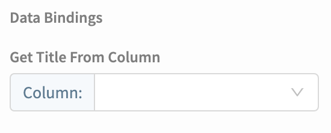
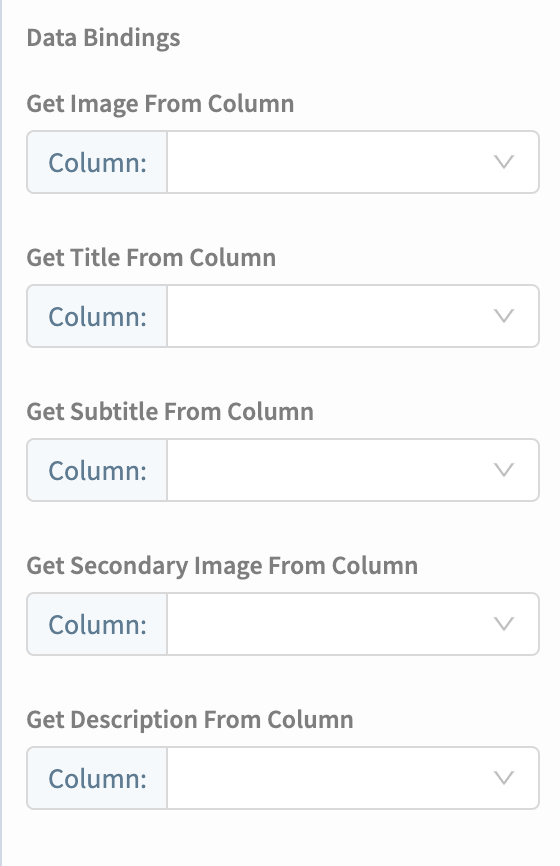
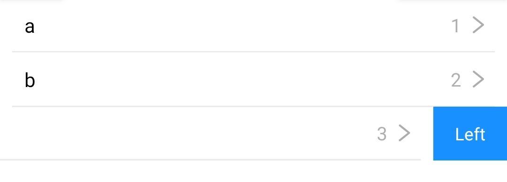
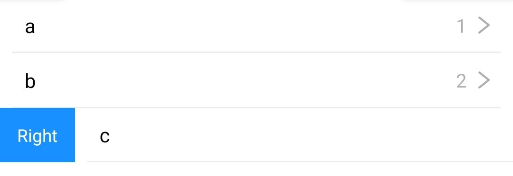

# Data Viewer List


This component is currently in beta. To sign up to test the Data Viewer please follow [these instructions](https://community.thunkable.com/t/what-are-data-sources/469342?u=domhnallohanlon).


## Overview

The data viewer components allow you to create beautiful user interfaces for your data. All of this is done in just 3 steps, no blocks required!

1. Pick your Data Source
2. Choose your Item Layout
3. Set your Data Bindings

## Data Source

When setting up the Data Viewer, you need to specify the source of your data. You can choose to connect to cloud-based data such as Google Sheets or Airtable, or you can create your own table if you want offline access to your data.

### Create your own Table

Start by naming your data source.

The next thing to do is edit the placeholder data that is automatically generated. Select the Data Viewer component and click on the link that says `Click here to edit the data` 

### Airtable 

In Airtable, a base in considered to be the data source. Adding an [Airtable](spreadsheet.md) is really simple. 

To get started, copy your API key from your [account page](https://airtable.com/account). An Airtable API key is a 14 character code that begins with the three letters "key". Paste this key into Thunkable and hit `Refresh` to see a list of your Airtable bases. 

Choose the one you want to use as your data source and click `Create`.

### Google Sheets

In Google Sheets, the entire document is considered to be the data source.

## Selected Collection

In Google Sheets, an individual sheet i.e. `Sheet1` is considered a collection.

In Airtable, an individual table, i.e. `Table 1` is considered a collection.

## List Item Layout

Once you have specified a [data source](data-viewer-list.md#data-source) and a [selected collection](data-viewer-list.md#selected-collection) you can choose your List Item Layout. There are 7 options to choose from. Depending on that raw data you have you can choose a layout that best fits your particular needs

### Title

### Title Subtitle

### Image Title 

### Image Title Subtitle

### Image Title Subtitle Text

### Image Title Subtitle Secondary Image Description

### Image Title Subtitle Description

## Data Bindings

You can now manually specify which columns in your data source correspond with the placeholders in your chosen layout. Each layout will have it's own specific set of data bindings. Two examples are included below for reference.

## Left Swipe

You can set a customisable, clickable button to appear when the list item is swiped to the left.

## Right Swipe

You can also set a customisable, clickable button to appear when the list item is swiped to the right.

