# Data Viewer List


 If you have any feedback for us about the Data Viewer components please let us know over in the [Thunkable Community](https://community.thunkable.com/t/latest-thunkable-release-new-components-data-viewer-list-and-data-viewer-grid-2020-05-05/564204?u=domhnallohanlon).


## Overview

The data viewer components allow you to create beautiful user interfaces for your data. All of this is done in just 3 steps, no blocks required!

1. [Pick your Data Source](data-viewer-list.md#data-source)
2. [Choose your Item Layout](data-viewer-list.md#list-item-layout)
3. [Set your Data Bindings](data-viewer-list.md#data-bindings)

You can add additional functionality to the Data Viewer List by using the included [component blocks](data-viewer-list.md#blocks) or you can work directly with your raw data by using the [Data Sources blocks](data-sources.md).

## Data Source

To begin using the Data Viewer you need to specify where your data are stored. Thunkable gives you three different storage options. 

You can use [Google Sheets](data-viewer-list.md#google-sheets) or [Airtable](data-viewer-list.md#airtable) to store data in the cloud. Alternatively, you can [create your own table](data-viewer-list.md#create-your-own-table). This is ideal if you want local, offline access to your data. Creating your own table is also the fastest and easiest way to get started with the data viewer.

In the Data\_Viewer\_List component properties, click the `Add` button. In the pop-up modal you can choose an existing data source. If this is your first time using the Data Viewer you can create a new one by clicking on the `Create New` button.

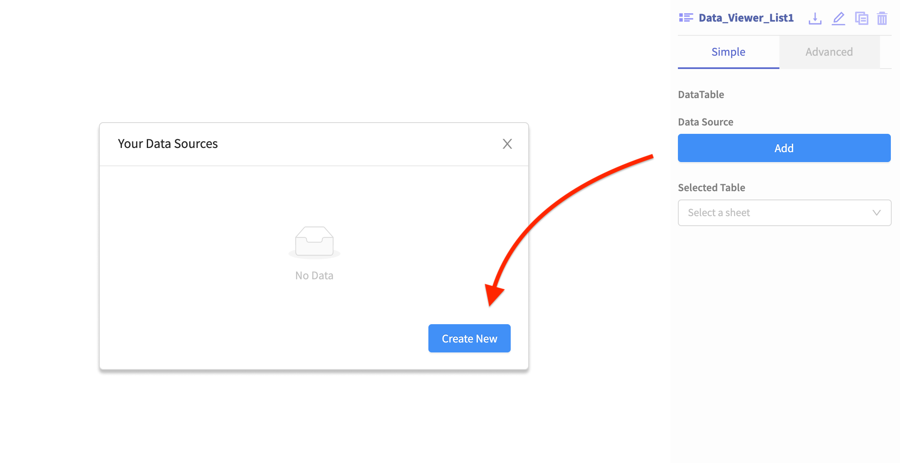

In the next modal, choose between [Create your own table](data-viewer-list.md#create-your-own-table), [Airtable](data-viewer-list.md#airtable) or [Google Sheets](data-viewer-list.md#google-sheets) as the source of your data.

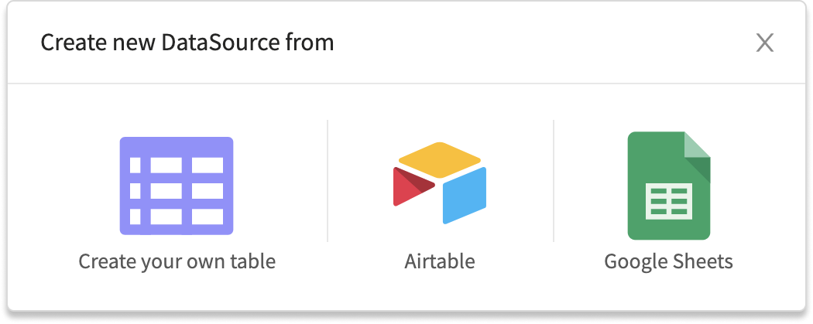

Please note that some users have reported issues connecting to Google Sheets if they are using G Suite for Education accounts. The quickest way around this, for now, is to user a personal Gmail account. If you need a large group or class to use this feature then you may need to contact your G Suite administrator to review your security settings. 

### Create your Own Table

Start by naming your data source.

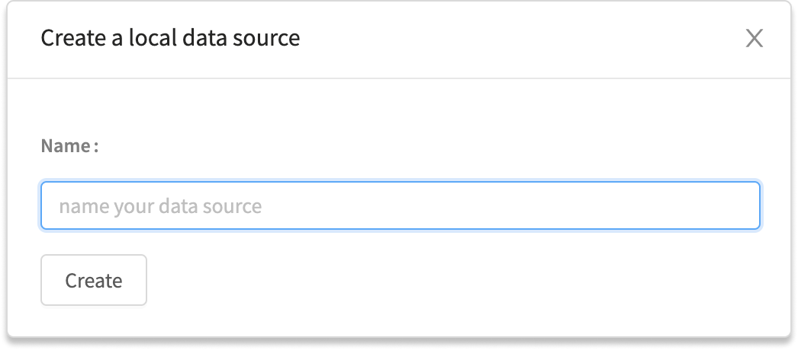

Next, select the Data Viewer component and click on the link that says `Click here to edit the data`. This allows you to edit the placeholder data that was automatically generated

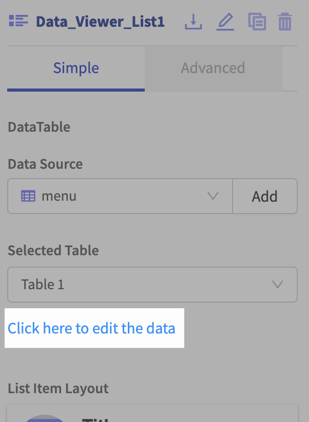

The data editor allows you to edit, add, and delete columns of information. To change any of the individual values simply click on the cell and type whatever you like. 

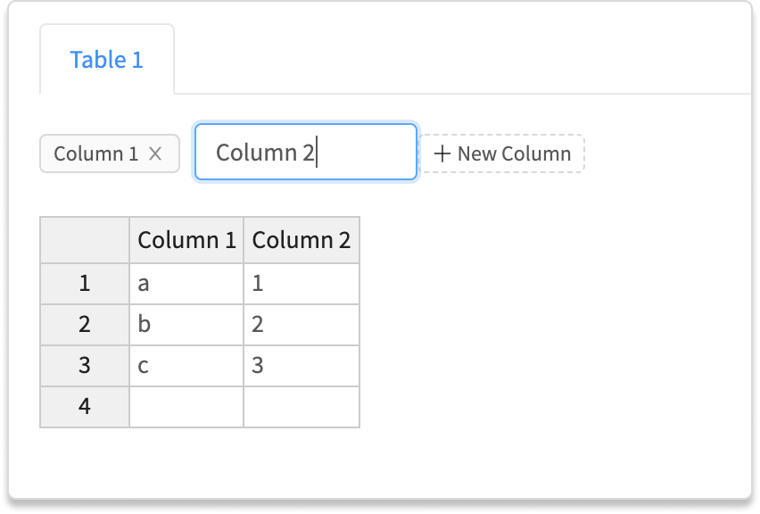

### Airtable 

In Airtable, a base in considered to be the data source. Adding an [Airtable](spreadsheet.md) is really simple. 

To start, copy your API key from your Airtable [account page](https://airtable.com/account). An Airtable API key is a 14 character code that begins with the three letters "key". Paste this key into Thunkable and click the `Refresh` button to see a list of your Airtable bases. 

Choose the base you want to use as your data source and click `Create`.

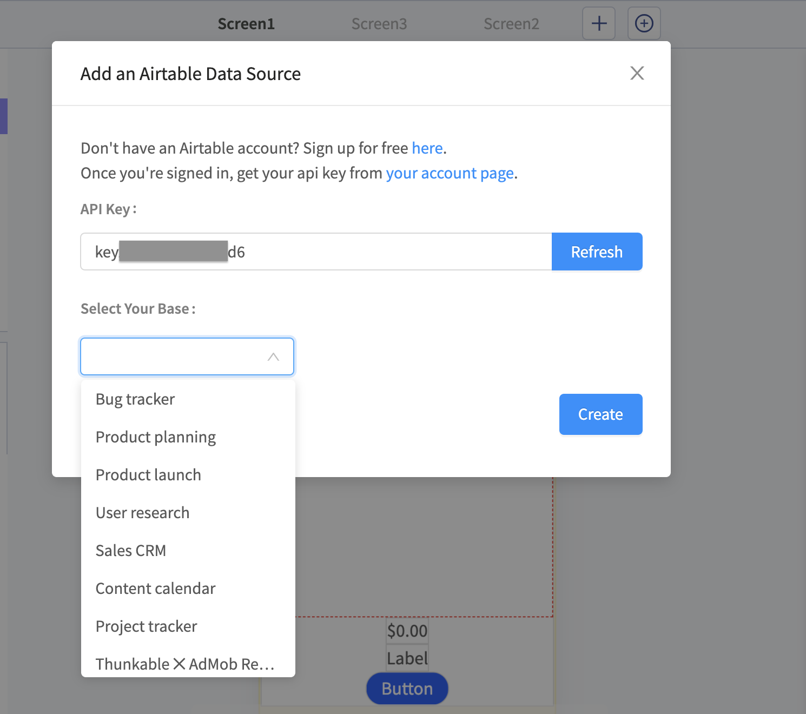

If you're new to Airtable you can read more about it in our [Airtable](spreadsheet.md) documentation. 

### Google Sheets

In Google Sheets, the entire document is considered to be the data source.


In order to use Google Sheets, the first row in your Sheet must be a header row. 


To connect a Google Sheet, sign in and grant permission for your Thunkable project to access your Google Drive.

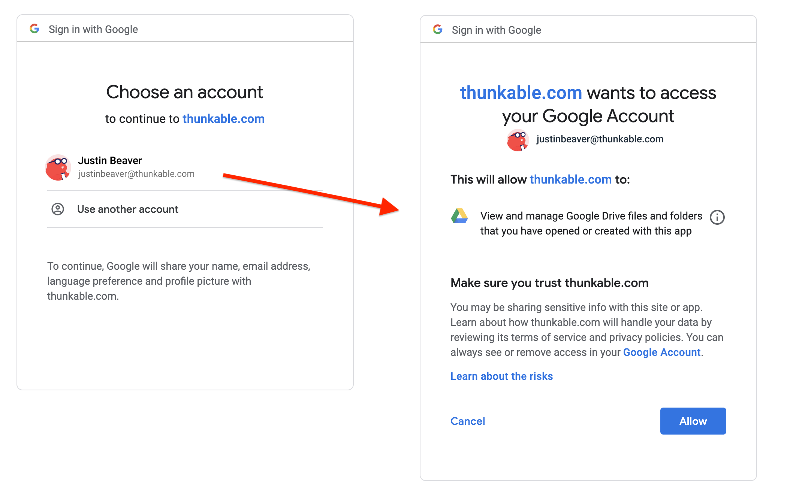

Once you have allowed this, you will see a list of spreadsheets in your Google Drive. If you don't seen the sheet you are looking for you can switch to list view, sort alphabetically or search for the one you need. Click `Select` to return to your Thunkable project.

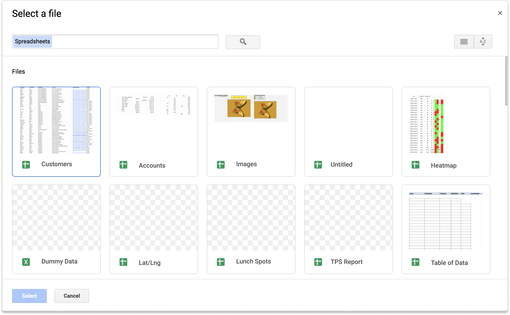

Finally, give you data source a name and you're ready to go. 

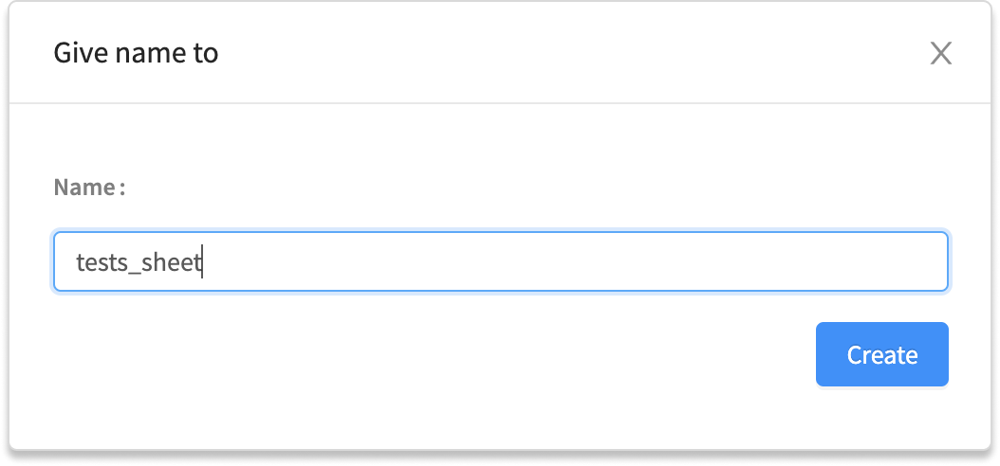

## List Item Layout

Once you have specified a [data source](data-viewer-list.md#data-source) you can choose your List Item Layout. There are 7 options to choose from. Depending on the raw data you have you can choose a layout that best fits your particular needs

### Title

### Title Subtitle

### Image Title 

### Image Title Subtitle

### Image Title Subtitle Text

### Image Title Subtitle Secondary Image Description

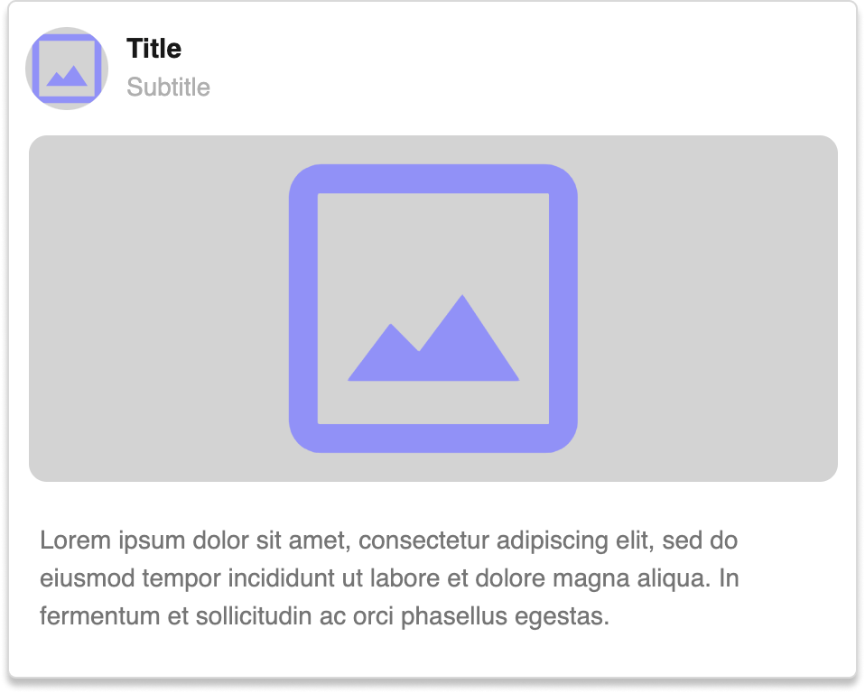

### Image Title Subtitle Description

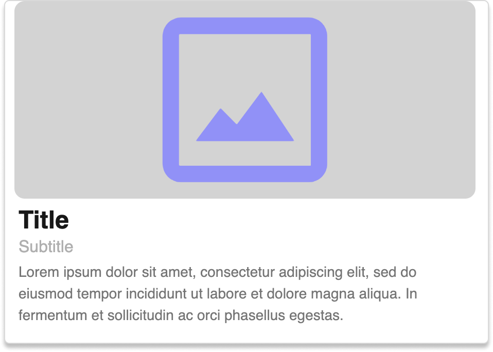

### Custom Layout

You can also design a[ Custom Data Viewer Layout](custom-data-viewer-layout.md) and save it with the Layout Type 'List' to use it in your Data Viewer List.

## Data Bindings

You can now manually specify which columns in your data source correspond with the placeholders in your chosen layout. Each layout will have its own specific set of data bindings. Two examples are included below for reference.

If you use the [Title](data-viewer-list.md#title) layout, you will only have one data binding, the Title property.

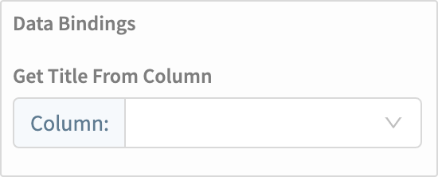

This increases all the way up to five properties, in the case of the [Image Title Subtitle Secondary Image Description](data-viewer-list.md#image-title-subtitle-secondary-image-description) layout.

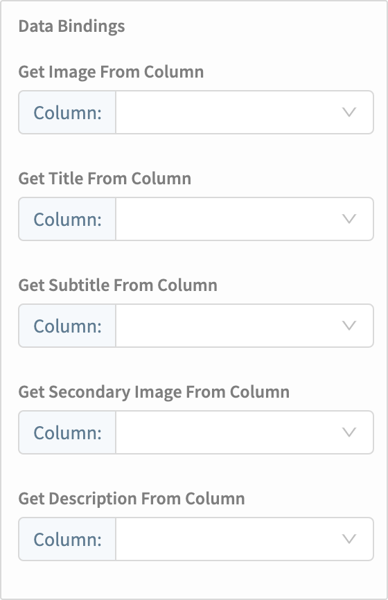

## Left Swipe

You can set a customizable, clickable button to appear when the list item is swiped to the left. If `Left Swipe` is set to true you will see additional options to customize the button text, text color and button background color. 

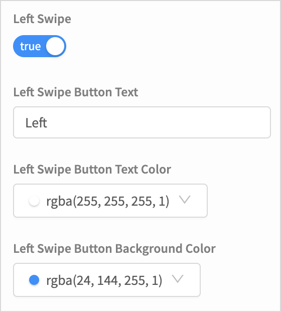

When you test this on your phone you will see that each list item can be dragged to the left to reveal a clickable button. The [Left Swipe Click](data-viewer-list.md#swipe) event handler controls what happens when this block is clicked.

## Right Swipe

You can also set a customizable, clickable button to appear when the list item is swiped to the right.

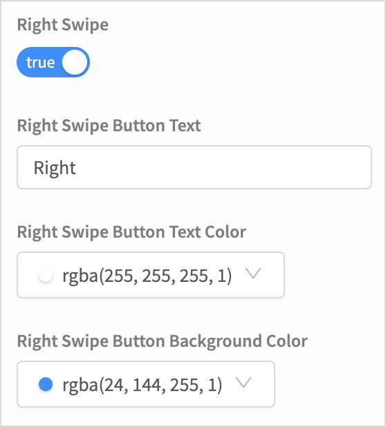

  
When you test this on your phone you will see that each list item can be dragged to the right to reveal a clickable button. The[ Right Swipe Click](data-viewer-list.md#right-swipe) event handler controls what happens when this block is clicked.

## Blocks

### Click 

The Item Click event is fired when any list item in the Data Viewer is clicked. It returns a `row id` which corresponds to the unique Thunkable Id of the item that was clicked. The row id is most useful when used with the the Data Source blocks.

### Swipe 

The left and right swipe click events are fired when these buttons are clicked. Both return a `row id` to quickly identify which row was clicked when using the Data Source blocks

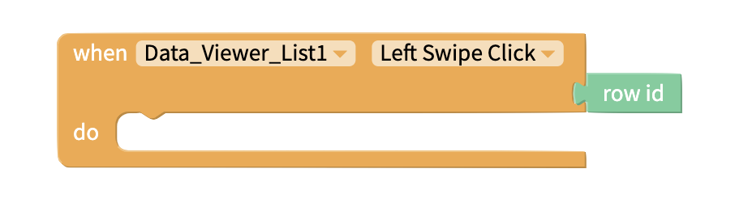

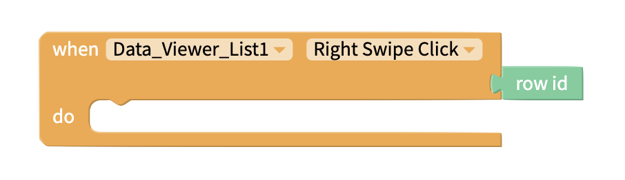

### Height & Width 

The following blocks allow you to work with the height and width properties of the Data Viewer.

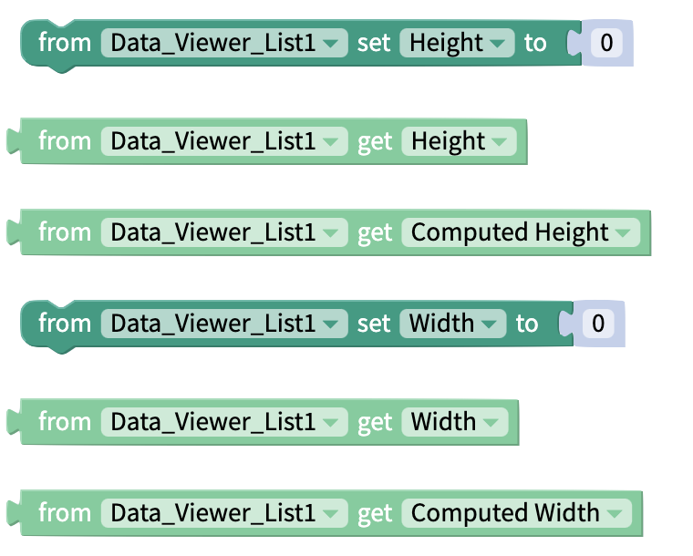

### Visible

The entire Data Viewer can be hidden or shown by setting the `Visible`property to false or true, respectively. 

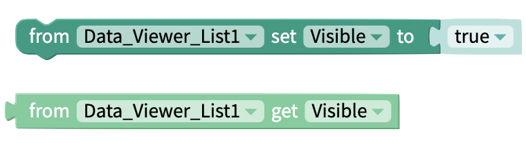

### Refresh

Refresh the Data Viewer List to sync with the Data Source.

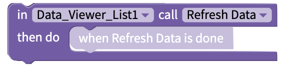

### Data Source Blocks

When you connect a Data Source to your project you will also have access to a second block drawer. These Data Source blocks allow you to perform a variety of CRUD \(**C**reate, **R**ead, **U**pdate, **D**elete\) operations on your data. 

Click on the link below to learn how to use the Data Sources blocks in your project. 



