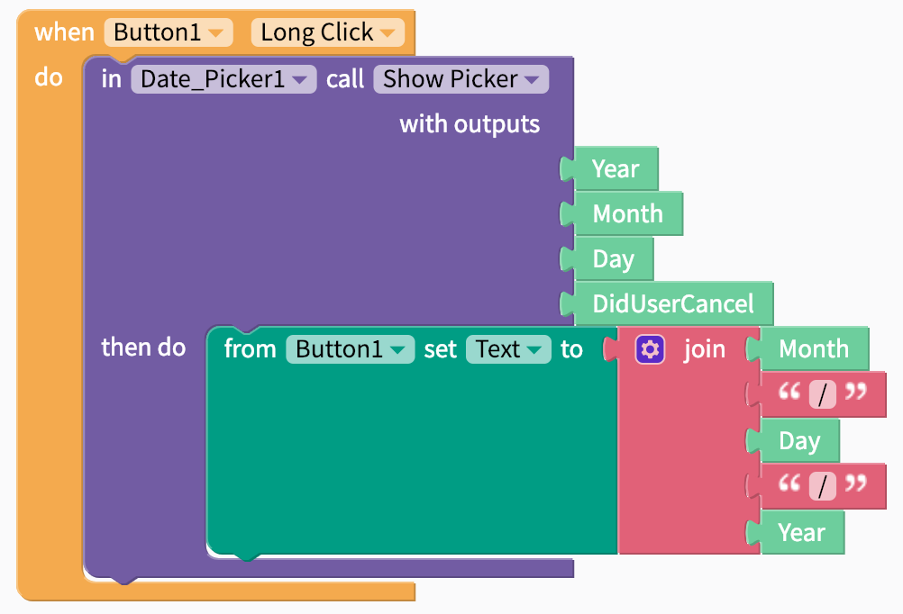

# Date Input


This component has not yet been released but will be available soon


Date Input components are helpful when you want the user of your app to easily select a specific date using the native Android or iOS date picker

## Set up 

The Date Input component is only surfaced after you have triggered it from another event so you'll need to select the event using an event block like the one below.

After the user has selected a date, you will get the following outputs which you can format however you choose

| Property | Output |
| :--- | :--- |
| Year | Year in 4 digit format e.g. `2019` |
| Month | Numerical month from `1-12` |
| Day | Day of the month from `1-31` \(depending on the month |

