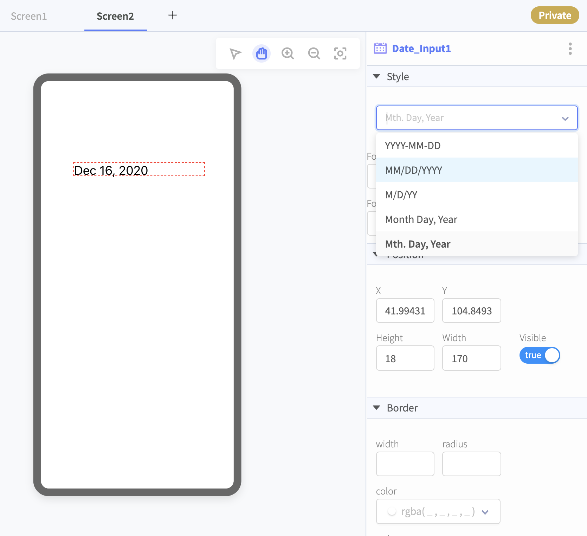
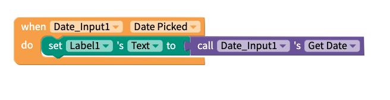
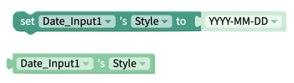

# Date Input

## Date Input Overview

* [Getting Started](date-input.md#getting-started)
* [Set the Date Format](date-input.md#set-the-date-format)
* [Save the Date](date-input.md#save-the-date)
* [Events](date-input.md#events)
* [Functions](date-input.md#functions)
* [Properties](date-input.md#properties)

A Date Input component is helpful when you want the user of your app to easily select a specific date using the native Android or iOS date picker

## Getting Started 

The Date Input component needs no set-up \(Woohoo!\). Just drag and drop the component into your project. As a bonus, the current date will automatically show up as a label.

When a user of your app taps on the Date Input, it will automatically launch the native Android or iOS date pickers.

## Set the Date Format

You can set the format of the date by choosing an option from the `Style` property. Currently supported styles are:

* YYYY-MM-DD
* MM/DD/YYYY
* M/D/YY
* Month Day, Year
* Mth. Day, Year

## Save the Date

The date that a user selects will show up automatically in the Date Input label but if you want to save the date somewhere to be uploaded later, you'll need to add a block like the one below. 

| Event | Output |
| :--- | :--- |
| Get Date | Date in whichever format you specify e.g. `YYYY-MM-DD` |
| Get Year | Year in 4 digit format e.g. `2019` |
| Get Month | Numerical month from `1-12` |
| Get Day | Day of the month from `1-31` \(depending on the month\) |

## Events

### Date Picked

## Functions

### Get Date 

### Get Day 

### Get Month 

### Get Year 

### Launch Picker

##  Properties

### Background Color 

### Color 

### Computed Height and Width 

### Font Size 

### Font Style 

### Font Weight 

### Style 

### Text Align 

### Visible

