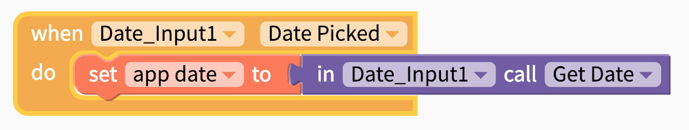

# Date Input

A Date Input component is helpful when you want the user of your app to easily select a specific date using the native Android or iOS date picker

## Getting Started 

The Date Input component needs no set-up \(Woohoo!\). Just drag and drop the component into your project. As a bonus, the current date will automatically show up as a label.

When a user of your app taps on the Date Input, it will automatically launch the native Android or iOS date pickers.

## Set the Date Format

You can set the format of the date by choosing an option from the `Style` property. Currently supported styles are:

* YYYY-MM-DD
* MM/DD/YYYY
* M/D/YY
* Month Day, Year
* Mth. Day, Year

## Save the Date

The date that a user selects will show up automatically in the Date Input label but if you want to save the date somewhere to be uploaded later, you'll need to add a block like the one below. 

| Event | Output |
| :--- | :--- |
| Get Date | Date in whichever format you specify e.g. `YYYY-MM-DD` |
| Get Year | Year in 4 digit format e.g. `2019` |
| Get Month | Numerical month from `1-12` |
| Get Day | Day of the month from `1-31` \(depending on the month\) |

