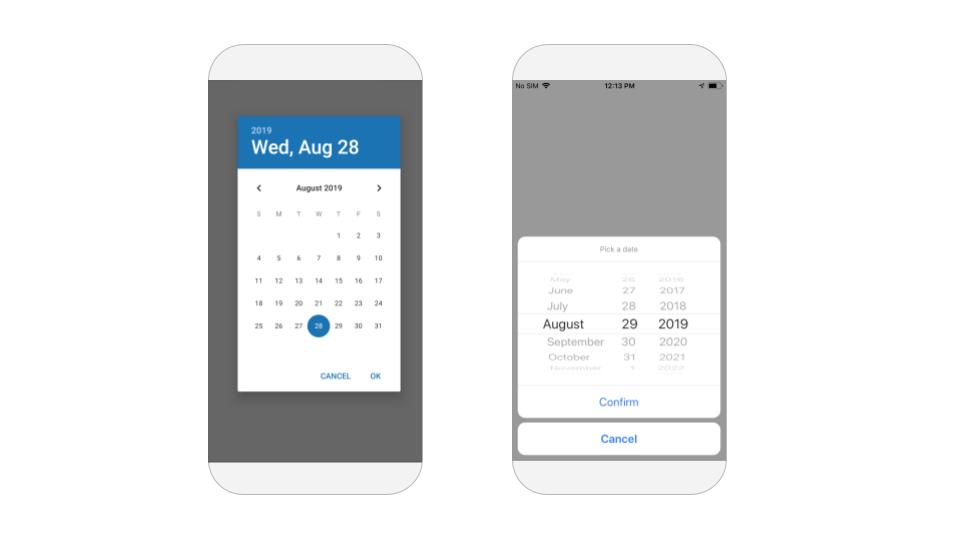

# Date Input

## Date Input Overview

A Date Input component is helpful when you want the user of your app to easily select a specific date using the native Android or iOS date picker

## Properties

### Date Input

| Property | Description | Data Type |
| :--- | :--- | :--- |
| Style | Format to use when displaying selected date | Select from menu |
| Font Size | Size of font when displaying date | Number |
| Font Style | Select whether font is normal or italic | Select from menu |
| Font Weight | Set boldness of font | Select from menu |
| Color | Color of font when displaying date | Color |

The following formats are currently available to use as `Style:`

* YYYY-MM-DD
* MM/DD/YYYY
* M/D/YY
* Month Day, Year
* Mth. Day, Year

### Layout

| Property | Description | Data Type |
| :--- | :--- | :--- |
| X | Location of top left corner of Web Viewer on X-axis, where the left hand side is X=0 | Number |
| Y | Location of top left corner of Web Viewer on Y-axis, where the top side is Y=0 | Number |
| Height | Height of Web Viewer in pixels | Number |
| Width | Width of Web Viewer in pixels | Number |
| Visible | Set whether the Web Viewer is visible | True/False |

### **Style**

| **Property** | Description | Data Type |
| :--- | :--- | :--- |
| Border Width | Width of border around Web Viewer in pixels | Number |
| Border Radius | Radius of corners of border on Web Viewer in degrees | Number |
| Border Color | Color of border \(only visible if border width &gt; 0\) | Color |
| Border Style | Set whether border style is solid, dotted or dashed  \(only visible if border width &gt; 0\) | Select from menu |

## Blocks

### Events

You can trigger actions to happen when an event occurs.

#### Date Picked

This event fires when the user has selected a date using the Date Picker.

### Functions

#### Get Date 

Returns full date from Date Picker in format Mon., DD, YYYY.

#### Get Day 

Returns date from Date Picker in numeric form.

Eg. If February 17, 2021 has been selected in Date Picker, this block will return 17.   
If 5 March 2021 is selected in Date Picker, this block will return 5.

#### Get Month 

Returns date from Date Picker in numeric form.

Eg. If February 17, 2021 has been selected in Date Picker, this block will return 2.   
If 7 November 2021 is selected in Date Picker, this block will return 11.

#### Get Year 

Returns date from Date Picker in YYYY form.

#### Launch Picker

Opens Picker of the Date Input to prompt the user to enter a date.

###  Properties

Set and get [properties](date-input.md#properties) of the Date Picker.

#### Background Color 

#### Color 

#### Computed Height and Width 

Returns the height/width of the Date Input on the device screen in pixels.

#### Font Size 

#### Font Style 

#### Font Weight 

#### Style 

#### Text Align 

Set the Text Alignment of the Date Input to `Auto`, `Left`, `Right`, `Center` or `Justify`.

#### Visible

