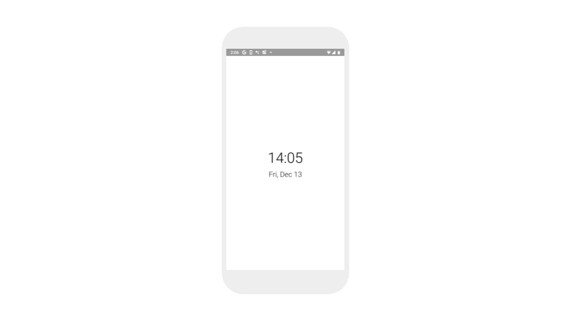
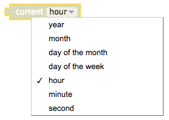
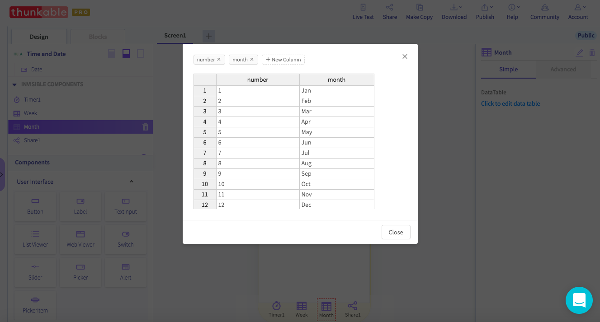
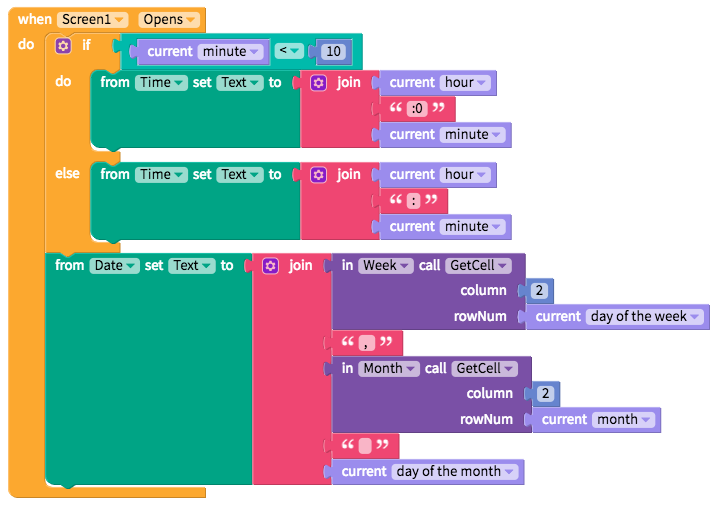
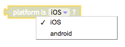
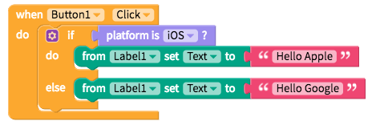
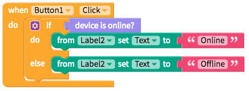
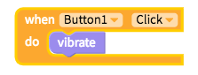
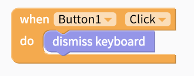

# Device

The Device blocks gather useful data from the device \(Android / iOS, online / offline, time and date\) as well as set the phone to vibrate.

* [Get current time and date](device.md#get-current-time-and-date)
* [Get mobile operating system](device.md#get-mobile-operating-system)
* [Get online/offline status](device.md#get-online-offline-status)
* [Set device to vibrate](device.md#set-device-to-vibrate)
* Dismiss keyboard

## Get current time and date

At the moment, all the dates and times are in numerical format i.e. month = 1 rather than month = Jan. If you want to convert the numbers into names, we suggest you to add a [Local DB](local-db.md) component and a simple table like the ones shown below.

## Get mobile operating system

Since Thunkable Cross Platform ✕ works on both Android and iOS from a single project, there may be times when you want to modify your user experience depending on their mobile operating system. To do so, you can use the block below:

To see how this might work in your app, take a look at the blocks below:

## Get online/offline status

There may be times you may want to design a different experience when a user is offline. To detect a user's connection, you can simply use the blocks below:

## Set device to vibrate

Apps often work in the background and vibrating a device is a popular way of notifying a user of a certain event. To set your device to vibrate, you can use the block sample below:

## Dismiss keyboard

If you have a Text Input in your app, there may be situations when you want to dismiss the keyboard for the user. The block below will help with that:

