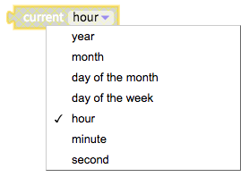
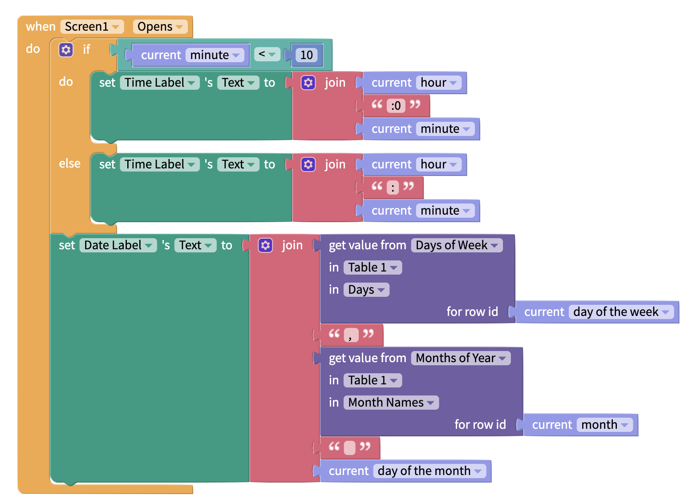
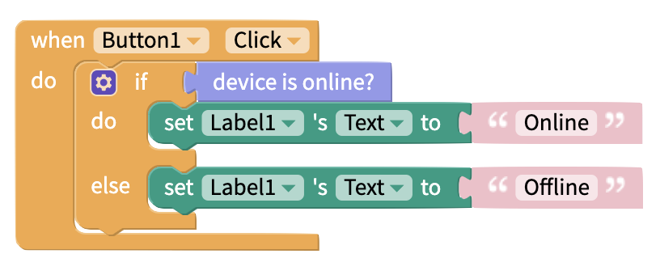

# Device

## Vibrate Device

This block will vibrate the device.

## Get Current Time and Date

At the moment, all the dates and times are in numerical format i.e. month = 1 rather than month = Jan. If you want to convert the numbers into names, we suggest you to add a Local [Data Source](data-sources.md#create-your-own-table) and a simple table like the ones shown below.

## Get Seconds since 1970

Measures seconds since 00:00:00 UTC on 1 January 1970. This timestamp is also known as Unix time or Epoch time. You can read about its use in computer programming at the [Unix time Wikipedia page](https://en.wikipedia.org/wiki/Unix\_time).

## Get Online/Offline Status

There may be times you may want to design a different experience when a user is offline. To detect a user's connection, you can simply use the blocks below:

This block will return `true` or `false`.

## Get Screen Height/Width

Returns the height or width of the screen running the app in pixels.

## Get Mobile Operating System

Since Thunkable can build apps for Android, iOS and web, there may be times when you want to modify your user experience depending on their mobile operating system. To do so, you can use the block below:

This block will return `true` or `false`.

## Dismiss Keyboard

If you have a Text Input in your app, there may be situations when you want to dismiss the keyboard for the user. The block below will help with that:

## Keep Screen Awake

Some devices will auto-sleep if there is no user activity in an app for a certain period of time.\
The Keep Screen Awake block can be used to keep the screen awake even if the user is not actively interacting with the app.\
This block can be set to `true` or `false`.

## Get Device Color Scheme

Having dark mode and light mode available is a popular choice for apps and device operating systems.\
This block can be used to detect whether the user's device has a light or dark theme on their device. \
You can then use blocks to change the color scheme of components in your app to match the user's preferences.\
This block will return `true` or `false`.
