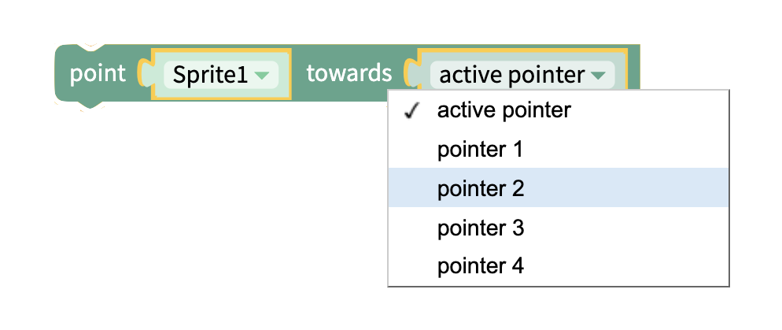
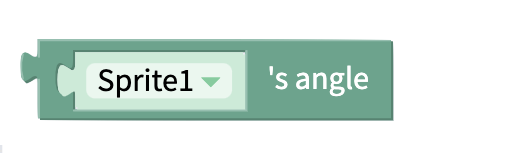
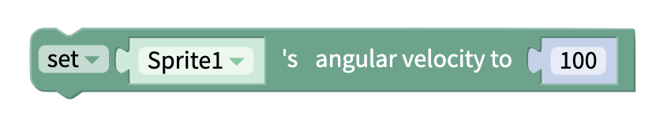

# Direction

## Point

### Point Sprite Towards Pointer

Turn the sprite in the direction of where the user has tapped on the canvas 

### Point Sprite Towards Sprite

Turn a sprite in the direction of another sprite 

## Angle 

### Set or Change Sprite's Angle

Set or change the angle of the sprite 

### Get Sprite's Angle

Get the angle of the sprite

## Angular Velocity

### Set or Change Sprite's Angular Velocity

Set or change the angular velocity of the sprite 

### Get Sprites Angular Velocity

Get the angular velocity of the sprite

## 

