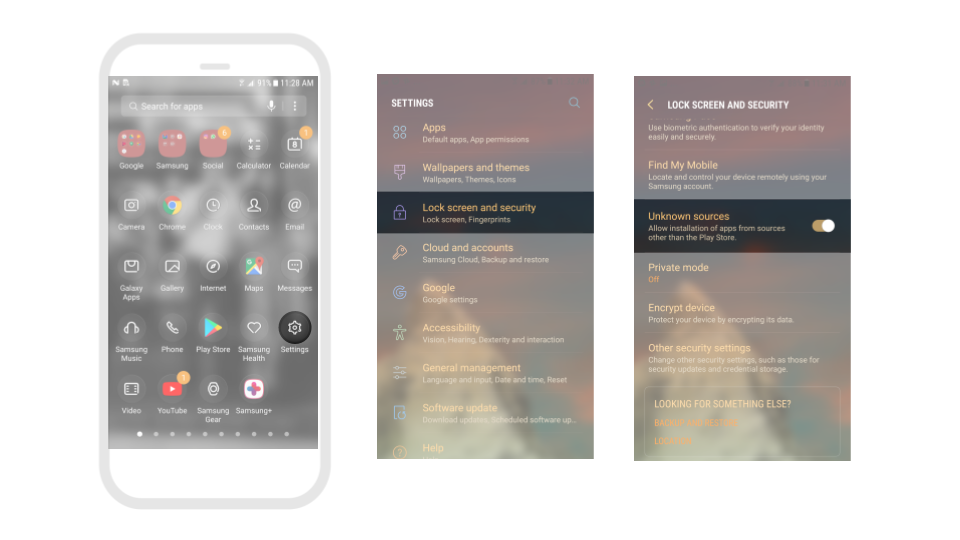

# 📥 Download


Before you download, we recommend first [adding an App Icon and Name](project-settings.md) to your app


## iOS Download&#x20;

We have updated our platform to adhere to Apple's best practices of having developers test apps with their individual accounts. As a result, downloading iOS apps is no longer available. You can learn more here: [Update on iOS downloading with Thunkable](https://blog.thunkable.com/update-on-ios-downloading-with-thunkable). Soon we will release the ability to download iOS apps with your own Apple Developer Certificate.

## How can I download iOS apps for testing?&#x20;

In order to facilitate iOS testing, you will need to follow the instructions on the [Publish](publish-to-app-store-ios/) page to use [TestFlight](publish-to-app-store-ios/testflight-overview/testflight-in-depth.md).&#x20;

## General Download Limits

Users should be aware of the total number of downloads they are allowed per month. If you reach your total allowed downloads, you will not be allowed to download again until your next billing cycle begins.&#x20;

## Download Android app


All Android apps built with Thunkable are built with Android API 31 and target Android 12


To download your Android app, click the Download icon and select **Download Android**&#x20;

<figure><figcaption></figcaption></figure>

* Enter your email address in the pop-up window

<figure><figcaption></figcaption></figure>

You will be sent an email with a link to download your app.

### Install Android App

To install the app on your Android device, you must indicate that you trust Thunkable. To do that:

1. Open your Android device's Settings menu.
2. Navigate to **Lock Screen and Security**.&#x20;
3. Set the **Unknown Sources** option to true.

In addition, you may be alerted that Play Protect has blocked an unsafe app. This is because you are downloading the app outside of the Play Store. If that is the case:

1. Select the APK file you downloaded to your device.
2. Click **Install**.
3. Click **More details**.
4. Click **Install anyway**.
5. Click **Open**.

<figure><figcaption></figcaption></figure>


Anyone installing your app directly, instead of from the Play Store, will need to change the setting on their phone to allow installation of apps from Unknown Sources.


### Troubleshooting

Common issues

**You receive an email from the hard-working beaver saying that this app will not build**

* You uploaded an icon that has the same name as an existing asset that you have uploaded
* Your app icon is not an image file
* Your app icon contains transparent pixels. Apple does not allow you to have any icons with any transparent colors
* We are having trouble with our build servers. Please try again in 30 minutes or chat with us if you are still having problems
* App (Bundle) ID. Your App (Bundle) ID is a series of short strings of text that are separated by periods, such as **com.thunkable.creator.app**. These string of text must i) be lowercase, ii) begin with a letter.
  * Examples of App (Bundle) IDs that can cause errors: com.thunkable.creator.1app, Com.Thunkable.Creator.APP
* Asset names. We recommend that asset names **only** contain Roman alphabet characters with no accents, and numbers.
  * Examples of asset names that could cause errors: image(1).jpg, imãge.jpg
  * Examples of asset names that won't cause errors: image1.jpg, image.jpg

**You cannot install your app and get the message "Cannot connect to storage.googleapis.com"**

* You have a special character like "&" in your [App Name](project-settings.md#app-name)

**When you install your app on Android, you see the message "There was a problem parsing the Package"**

* This is caused by your package name, also known in your project as your App (Bundle) ID. Your App (Bundle) ID is a series of short strings of text that are separated by periods, such as **com.thunkable.creator.app**. These string of text must i) be lowercase, ii) begin with a letter.
  * Examples of App (Bundle) IDs that can cause errors: com.thunkable.creator.1app, Com.Thunkable.Creator.APP


**Have feedback on this doc?** Please take a moment to share your feedback here: [Thunkable Docs Feedback](https://docs.google.com/forms/d/e/1FAIpQLSfCwn5L2xyla-LSLZX0DSWFcFeJ43qp-r1tELCacuVS2zduLA/viewform?usp=sf\_link). Your valuable insights will help us improve and better serve you in the future.

