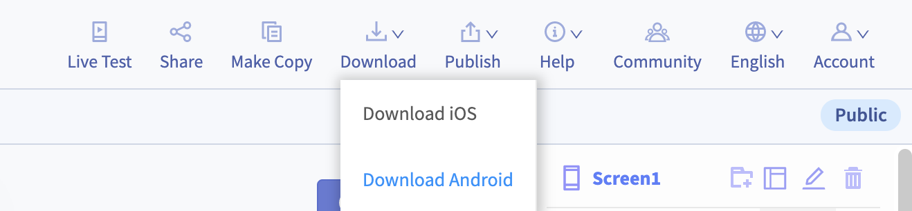
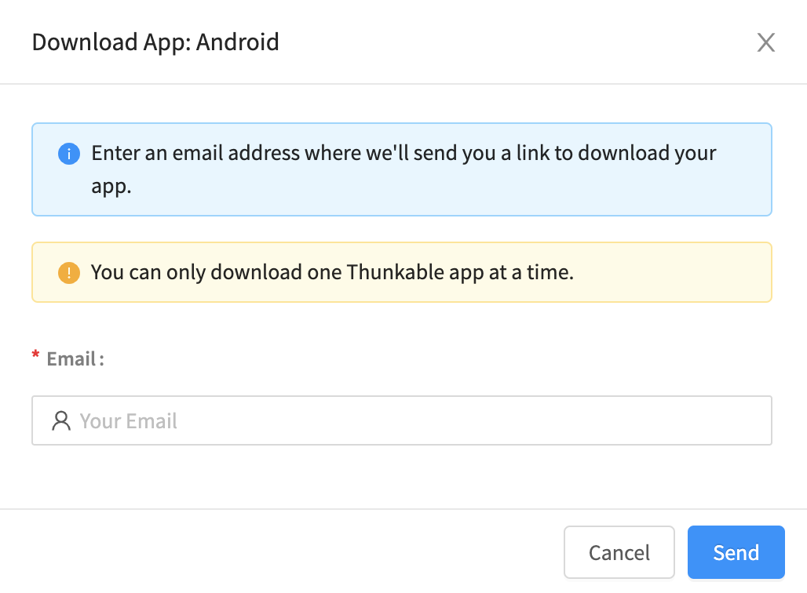

# 📥 Download


Before you download, we recommend first [adding an App Icon and Name](projects/settings.md) to your app


## iOS Download limits

Due to special circumstances from Apple, there is a limit of one downloaded app per phone on iOS. Download wait times may also be a bit longer. You can download and install as many apps as you like to your Android device.

| Android  | iOS                                                                                                                                                                                                                                                                                                                                                                                        |
| -------- | ------------------------------------------------------------------------------------------------------------------------------------------------------------------------------------------------------------------------------------------------------------------------------------------------------------------------------------------------------------------------------------------ |
| No limit | 
Due to Apple recently updating its enterprise certificate guidelines we are unable to facilitate direct downloads at this time.   Historically we've had an agreement with Apple that allowed Thunkable to give our users this capability, however the updated  eligibility requirements preclude Thunkable from accessing this feature and making it available to our users.
 |

## How can I download iOS apps for testing?&#x20;

In order to facilitate iOS testing, you will need to follow the instructions on the [Publish](publish-to-app-store-ios/) page to use TestFlight.&#x20;

## Download Android app

To download your Android app:

* select **Download** > **Download Android**&#x20;

* Enter your email address in the pop-up window

You will be sent an email with a link to download your app.

### Install Android App

To install your Android app, you will need to go to **Settings** > **Security** and allow apps to be installed from **Unknown Sources**. This will allow you to install apps from sources other than the Play Store.


Anyone installing your app directly, instead of from the Play Store, will need to change the setting on their phone to allow installation of apps from Unknown Sources


### Troubleshooting

Common issues

**You receive an email from the hard-working beaver saying that this app will not build**

* You uploaded an icon that has the same name as an existing asset that you have uploaded
* Your app icon is not an image file
* Your app icon contains transparent pixels. Apple does not allow you to have any icons with any transparent colors
* We are having trouble with our build servers. Please try again in 30 minutes or chat with us if you are still having problems
* App (Bundle) ID. Your App (Bundle) ID is a series of short strings of text that are separated by periods, such as **com.thunkable.creator.app**. These string of text must i) be lowercase, ii) begin with a letter.
  * Examples of App (Bundle) IDs that can cause errors: com.thunkable.creator.1app, Com.Thunkable.Creator.APP
* Asset names. We recommend that asset names **only** contain Roman alphabet characters with no accents, and numbers.
  * Examples of asset names that could cause errors: image(1).jpg, imãge.jpg
  * Examples of asset names that won't cause errors: image1.jpg, image.jpg

**You cannot install your app and get the message "Cannot connect to storage.googleapis.com"**

* You have a special character like "&" in your [App Name](projects/settings.md#app-name)

**When you install your app on Android, you see the message "There was a problem parsing the Package"**

* This is caused by your package name, also known in your project as your App (Bundle) ID. Your App (Bundle) ID is a series of short strings of text that are separated by periods, such as **com.thunkable.creator.app**. These string of text must i) be lowercase, ii) begin with a letter.
  * Examples of App (Bundle) IDs that can cause errors: com.thunkable.creator.1app, Com.Thunkable.Creator.APP
