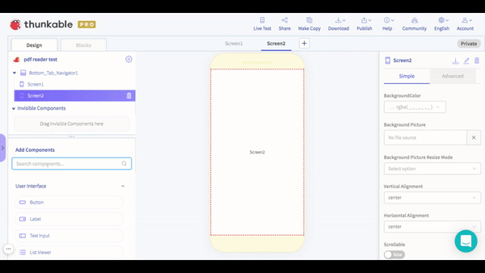

# Drawer Navigator

## Adding Navigators

To add a navigator to your app, you will need to drag the navigator component into your component tree, and then drag a screen on top of the navigator component.&#x20;

## Name Your Drawers

To name your drawers, click on each screen and navigate to the Drawer label on the bottom right corner of the properties section.&#x20;

.png>)

## Drawer Navigator Properties

You have many options for styling your Drawer Navigator, such as changing the background color or tint color. Here are the different options for customization:

* **Drawer Width:** Width of the Drawer in pixels
* **Drawer Position:** Position Drawer swipes out from: left or right
* **DrawerOptions**
  * **Active Tint Color:** Tint color for selected drawer.&#x20;
  * **Active Background Color:** Background color for selected drawer.
  * **Inactive Tint Color:** Text color for unselected drawers.&#x20;
  * **Inactive Background Color:** Background color for unselected drawer.&#x20;
