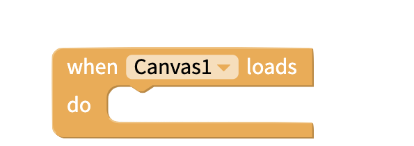
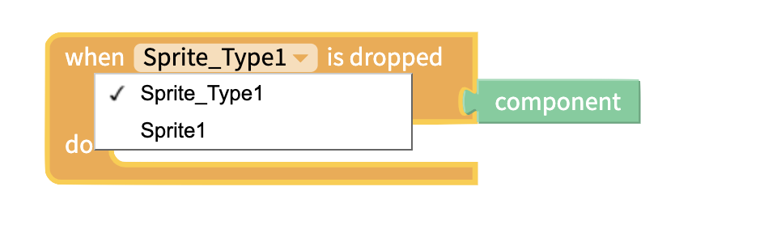
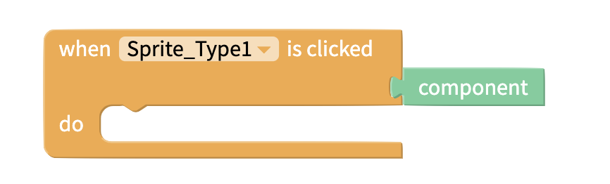
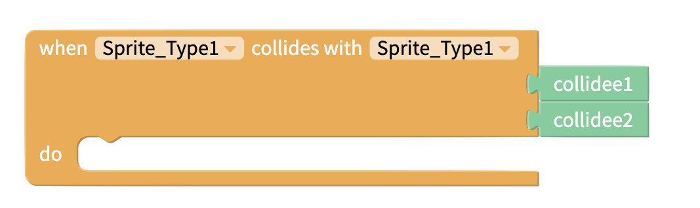
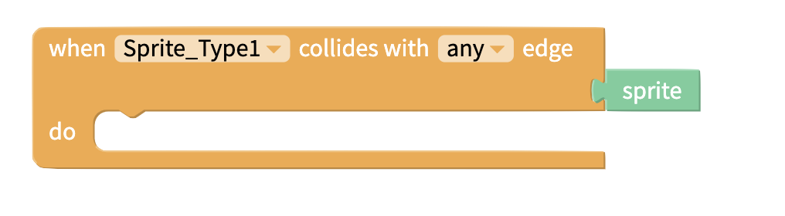

# Events

## Canvas 

### When Canvas Loads

 Program an action after the canvas loads.

### When Canvas Touched

Program an action when the user touches the canvas

## Sprites

Please note, that for the sprite events, event handlers can be configured to work with an entire type of sprite or just with one specific sprite. 

### Sprite Clicked 

This event triggers when the sprite is clicked.

### Collision with Sprite 

This event triggers when the two sprites collide.

### Collision with Edge 

This event triggers when the sprite collides with the edge.

### Sprite Dropped

This event triggers when the user stops dragging the sprite.

## 

