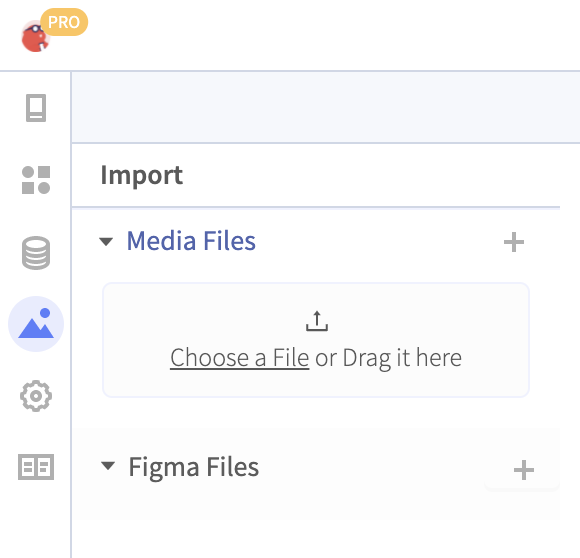

# Figma Integration

## Figma Integration


Figma integration is a beta feature, so there will be some bugs and snags as you use it. We would love any [feedback](https://community.thunkable.com/t/report-bugs-and-submit-feature-requests-in-our-public-github-repository/31760?page=2) you have to give!


## Importing a file

You can import a Figma file into your Thunkable project. 

Click on the Assets tab and click the + icon next to the text **Figma Files**.

You will be asked to Authenticate with your Figma account. Follow the steps. You will only need to do this once.

Paste in the URL of your Figma Project and select a Page in the dropdown menu. 


At the moment, we are only supporting imports for mobile designs at 375x669 px in portrait mode. 


The Figma importer will add all Artboards in a single page, so we recommend creating a separate Page in Figma with the Artboards you intend on importing.  

### What gets imported?

Thunkable will recognize imported items as either Figma components or Groups. 

A Figma component will allow us to know that it has been imported and will be recognized when a file is re-synced when the original Figma file is updated. Figma components can be recognized as either a Text component or a Vector component. 

## Updating a file

As you change and update your original designs, keep Thunkable up to date by re-syncing a Screen.


There might be a few differences with your Figma file and the output in Thunkable. Re-syncing your Screen with Figma may improve your imported Screen's appearance!


## Blocks

Imported Figma components have basic Blocks available. 

