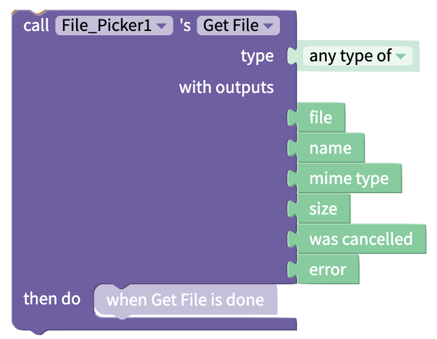

# File Picker

## Overview

The File Picker will open your end user's file library and allow them to select a file. The file can then be used in the app.

You can allow your end user to upload any kind of file, or limit their selection by file type, eg. HTML, PDF, etc.


Your end users may experience lags or delays if the size of the file the try to upload is larger than 5MB


## Blocks

### Functions

#### Get File

| Input | Description                                              | Data Type                                                  |
| ----- | -------------------------------------------------------- | ---------------------------------------------------------- |
| type  | Select the type of file you want your end user to upload | Select from list `[any type of, image, video, html, pdf]`  |

| Output        | Description                                                                                                                 | Data Type                                                                                           |
| ------------- | --------------------------------------------------------------------------------------------------------------------------- | --------------------------------------------------------------------------------------------------- |
| file          | Points to the file that has been uploaded                                                                                   | 
Data type of the file that has been uploaded. Can also return address of the file as text
 |
| name          | Name of the uploaded file                                                                                                   | Text                                                                                                |
| mime type     | Describes the type of file in [MIME format](https://developer.mozilla.org/en-US/docs/Web/HTTP/Basics\_of\_HTTP/MIME\_types) | Text                                                                                                |
| size          | Returns size of uploaded file in bytes                                                                                      | Number                                                                                              |
| was cancelled | Indicates whether the end user cancelled selecting a file                                                                   | True/False                                                                                          |
| error         | If there is an error, returns the error. Else returns `null`                                                                | Text                                                                                                |
