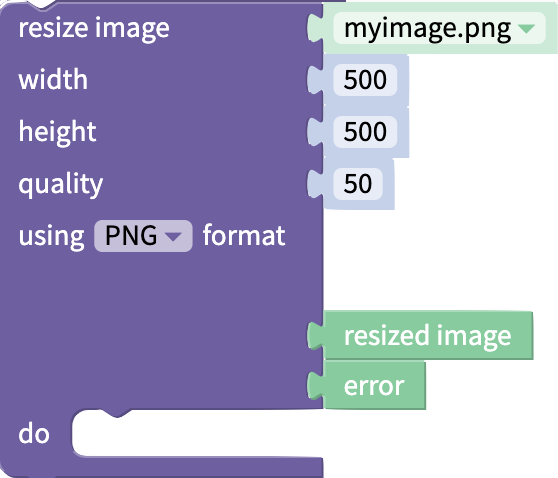

# Files

## Advanced Blocks

For each block in this drawer, you can right-click the block and select **Show advanced block** to see an expanded block with additional outputs. Both the simple and advanced blocks will be explained in this document.

## Image from Photo Library

This block will open the user's photo library and allow the user to select a photo. The photo can then be used in the app.

.png>)

#### Advanced Block

.png>)

| Output        | Data Type  | Function                                             |
| ------------- | ---------- | ---------------------------------------------------- |
| photo         | image      | if a photo was taken, returns the photo              |
| was cancelled | true/false | returns whether the user cancelled selecting a photo |
| error         | text       | if there was an error, returns the error             |

## File from Device

This block will open the user's file library and allow the user to select a file. The file can then be used in the app.

You can allow the user to upload any kind of file, or limit their selection by file type using the drop down menu.


Your end users may experience lags or delays if the size of the file the try to upload is larger than 5MB


#### Advanced Block

| Output        | Description                                                                                                                 | Data Type                                                                                           |
| ------------- | --------------------------------------------------------------------------------------------------------------------------- | --------------------------------------------------------------------------------------------------- |
| file          | Points to the file that has been uploaded                                                                                   | 
Data type of the file that has been uploaded. Can also return address of the file as text
 |
| name          | Name of the uploaded file                                                                                                   | Text                                                                                                |
| mime type     | Describes the type of file in [MIME format](https://developer.mozilla.org/en-US/docs/Web/HTTP/Basics\_of\_HTTP/MIME\_types) | Text                                                                                                |
| size          | Returns size of uploaded file in bytes                                                                                      | Number                                                                                              |
| was cancelled | Indicates whether the end user cancelled selecting a file                                                                   | True/False                                                                                          |
| error         | If there is an error, returns the error. Else returns `null`                                                                | Text                                                                                                |

## Upload file to the cloud

Cloudinary Media DB is a service that allows you to store media files in the cloud. Thunkable's `upload file` block allows you to send media directly from your Thunkable app to a linked Cloudinary account.


If you use Thunkable's default Cloudinary DB, your files will be deleted after 90 days. Please connect your own Cloudinary DB to your Thunkable project to keep your media safe.


#### Advanced block

.png>)

| Output | Data Type | Function                                 |
| ------ | --------- | ---------------------------------------- |
| URL    | text      | returns a URL for the uploaded file      |
| error  | text      | if there was an error, returns the error |

### Connecting Your Cloudinary DB to Your Thunkable project

No set up is required but creating your free Cloudinary account is highly recommended. Thunkable provides its own subscription key for your convenience but we strongly recommend creating your own account to ensure privacy for your uploaded media. We also have a current media size limit of 10MB per app and we may periodically clean out our default Cloudinary account

#### Create a [free Cloudinary](https://cloudinary.com/) account

.png>)

#### Connect your Cloudinary cloud to Thunkable

To connect your Cloudinary cloud to Thunkable, simply retrieve the following fields from the Cloudinary dashboard: `Cloud name`, `API key`, and `API secret.` You can add these details to your app in the [Project Settings panel](project-settings.md#api-keys).

.png>)

## Resize Image

This block will take an image file and return it in the given dimensions, quality and format.

#### Advanced Block

| Input            | Data Type        | Function                                                                 |
| ---------------- | ---------------- | ------------------------------------------------------------------------ |
| \[resize] image  | Any image file   | The image to be resized                                                  |
| Width            | Number           | Width in pixels to resize image file to                                  |
| Height           | Number           | Height in pixels to resize image file to                                 |
| Quality          | Number           | Quality of resulting image, as a percentage of quality of original image |
| using ... format | Select from menu | Select image type for resulting image                                    |

| Output        | Data Type | Function                                                    |
| ------------- | --------- | ----------------------------------------------------------- |
| Resized Image | Image     | The resized image in the selected format and quality level  |
| Error         | Text      | If there was an error, returns the error. Else returns NULL |

