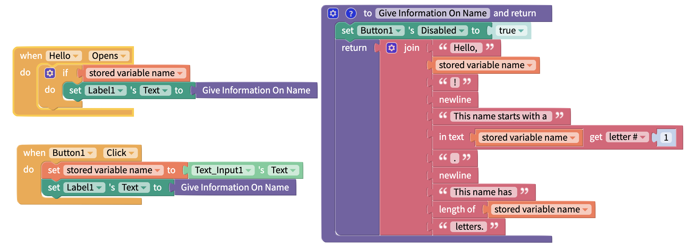
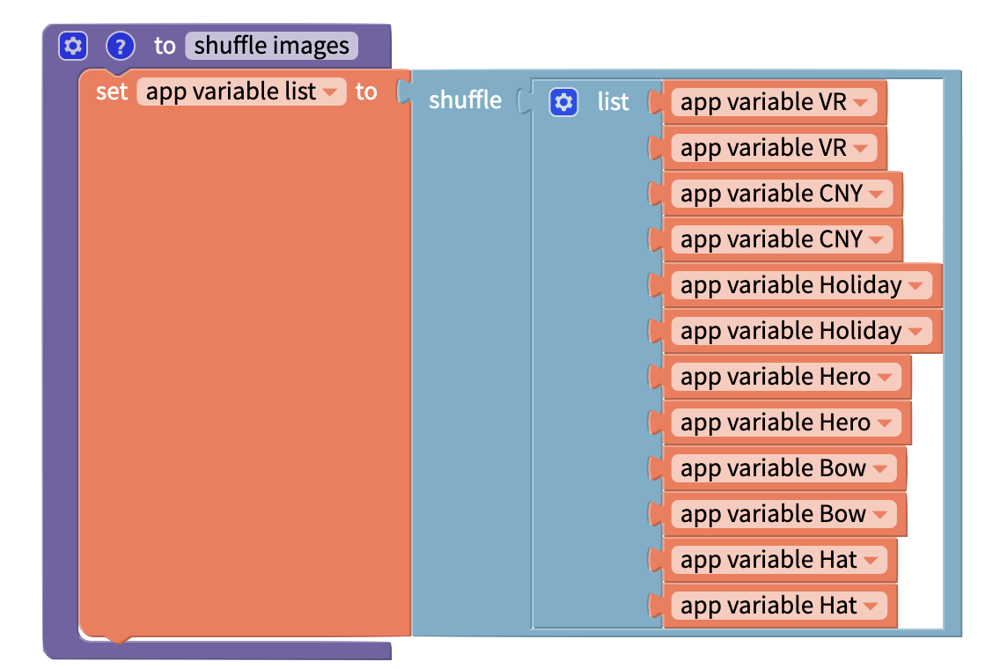
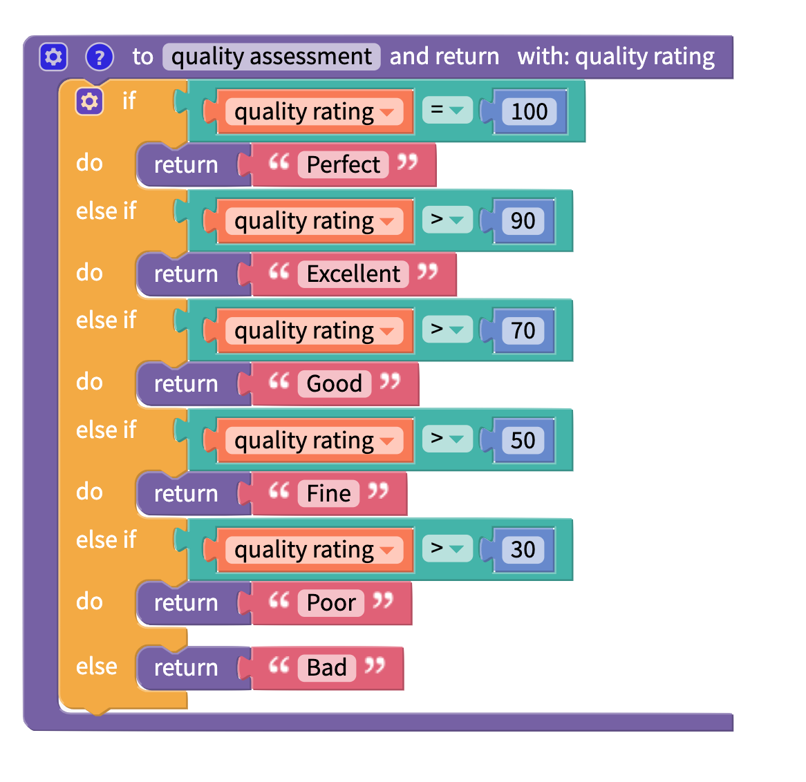
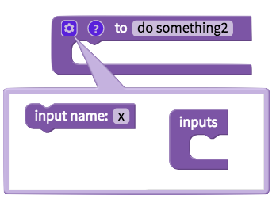

# Functions

## Function Overview

A function is a block of code that performs a specific task. If you use the same code set multiple times in your project, you can work more efficiently using functions. Clear function names also make your code more readable.

## Video Tutorial

You can view a video tutorial on using functions here:



## Create a function

You can use the following block to create a function and give it a name:

One example of a function is below. This function will create and shuffle a list of items.

After you have created your function, you can simply use it at any time using the function block you have named:

## Create a function with an output

You can also create a function that returns a specific output.

### Conditional Outputs

You can add multiple `return` blocks to your function. This allows you to return a different output based on some conditions.

For example, this function will take a rating out of 100, and return a description of the quality of the item being reviewed:

The function will break when the `return` block is fired. For example, in the above example, if the quality rating is 100, the function will return **Perfect** and then stop. It will not run the other tests, and won't return **Excellent**. **Good**, **Fine**, etc.

## Inputs and Functions

You can click the gear icon to add inputs to your functions.&#x20;

You can then treat that input as a local variable in your function.

In this example, the function `change font size` takes a number as an input and sets the text on a Screen to this font size. The number can be fed in as the number selected on a [Slider](slider.md), or the user can click a Reset [Button](button.md) to set the font size back to 18.

