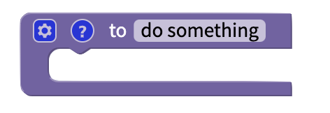

# Functions

## Function Overview

A function is a block of code that performs a specific task. If you use the same set of code multiple times in your project, you can work more efficiently by using blocks. Clear function names also make your code more readable.

## Video Tutorial

You can view a video tutorial on using functions here:



## Create a function

To create a function, you will need to specify if it has any inputs and give it a name

One example of a function is below. This function will create and shuffle a list of items.

After you have created your function, you can simply use it at any time using the function block you have named:

## Create a function with an output

You can also create a function that returns a specific output.

### Conditional Outputs

You can add multiple `return` blocks to your function. This allows you to return a different output based on some conditions.

For example, this function will take a rating out of 100, and return a description of the quality of the item being reviewed:

The function will break when the `return` block is fired. For example, in the above example, if the quality rating is 100, the function will return **Perfect** and then stop. It will not run the other tests, and won't return **Excellent**. **Good**, **Fine**, etc.
