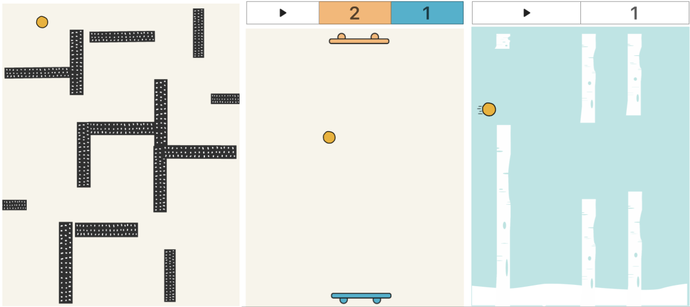

# 🎮 Gaming

With Thunkable's gaming components, you can build games and touch interface experiences.

## Canvas

The Canvas contains the Stage where your Sprites are displayed.   
Read more in the [Canvas docs](canvas.md).

## Sprites

Sprites are the elements on your stage that represent characters, obstacles, and more.   
Read more in the [Sprites docs.](sprites.md)

## Canvas Label

Use the Canvas Label to display text on your Canvas.  
Read more in the [Canvas Label](canvas-label.md) docs.

## Gaming Blocks

You can use blocks to change the appearance and behavior of your Stage and Sprites.   
Read more in the [Gaming Blocks docs.](gaming-blocks.md)

## Example Games

[Download and remix the Maze game ](https://x.thunkable.com/projectPage/5d729d6c6026a1c0e3f6bb71)

[Download and remix a "Pong-like" game](https://x.thunkable.com/projectPage/5d71dd5c6026a1717df6bb38)

[Download and remix a "Flappybird-like" game](https://x.thunkable.com/projectPage/5d71e5936026a18960f6bb5a)

