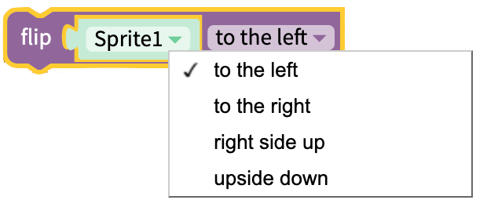
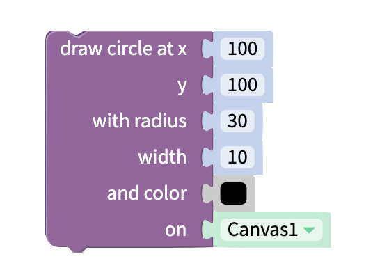
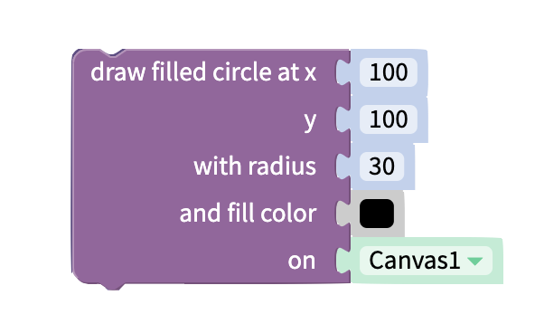
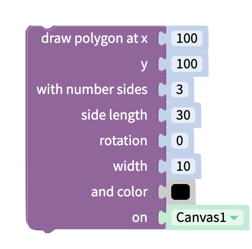
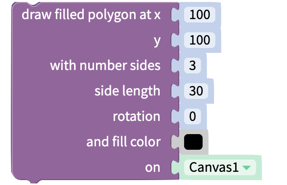

# Looks

## Sprite Visibility&#x20;

### Set Visibility

Show the selected sprite or hide the selected sprite on the canvas.

### Get Visibility

Returns true if the sprite is visible, and false if it is hidden

## Sprite Image

### Next or Previous Image

<figure><figcaption></figcaption></figure>

Set the sprite's image to the next or previous image in the sprite type's [picture list](../gaming/sprites.md#sprite-type-properties).

### Set Image Number

Set the sprite's image to an image in the sprite type's [picture list](../gaming/sprites.md#sprite-type-properties).

## Sprite Dimensions&#x20;

### Set Height or Width to

Set the Sprite's height or width.

### Change Height, Width or Opacity by

<figure><figcaption></figcaption></figure>

Change the sprite's height, width, or opacity.

### Get Height or Width

Get the sprite's height or width.

## Flip Sprite

Flip Sprite along a specified axis.

## Freeze Frame&#x20;

### Stamp

Add freeze frame of sprite in current position.

## Drawing&#x20;

### Draw Line

Draw line between two points with specified width and color.

### Draw Circle

Draw circle outline at specified point with a given radius.

### Draw Filled Circle

Draw filled circle at specified point with a given radius.

### Draw Polygon

Draw a polygon outline at a specified point. The number of sides, length of sides, and angle of rotation (measured in degrees) can be specified.

### Draw Filled Polygon

Draw a filled polygon at a specified point. The number of sides, length of sides, and angle of rotation (measured in degrees) can be specified.

### Clear Drawings

Clear all the drawings on the specified canvas.

## Make Image

Get an image of the specified canvas. Returns a base 64 encoded image.&#x20;

