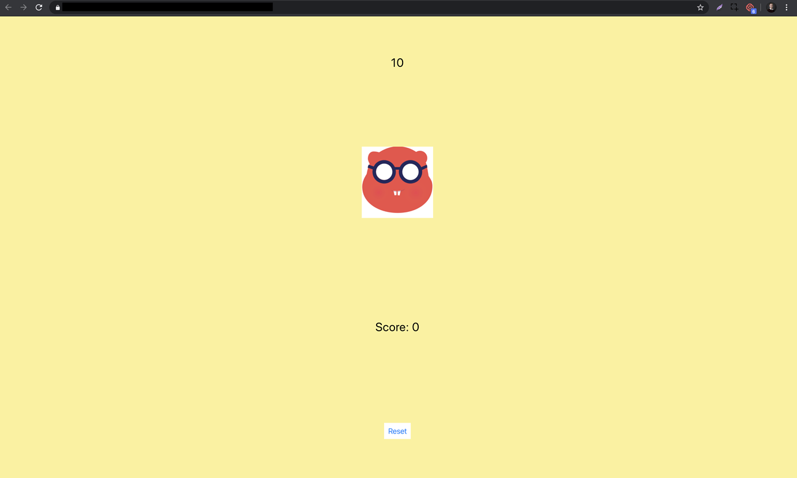
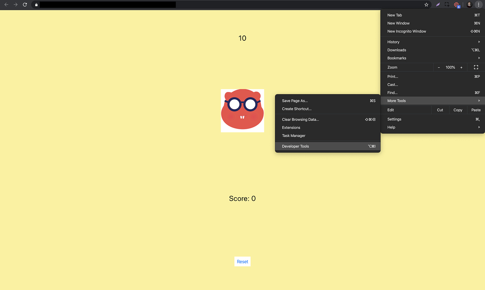
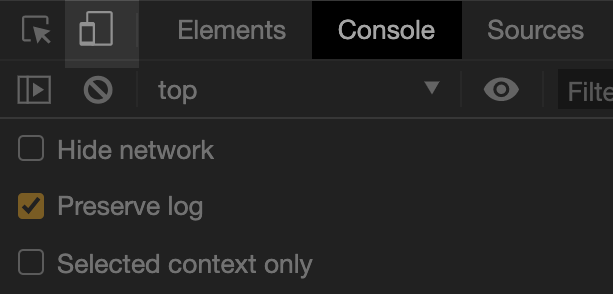
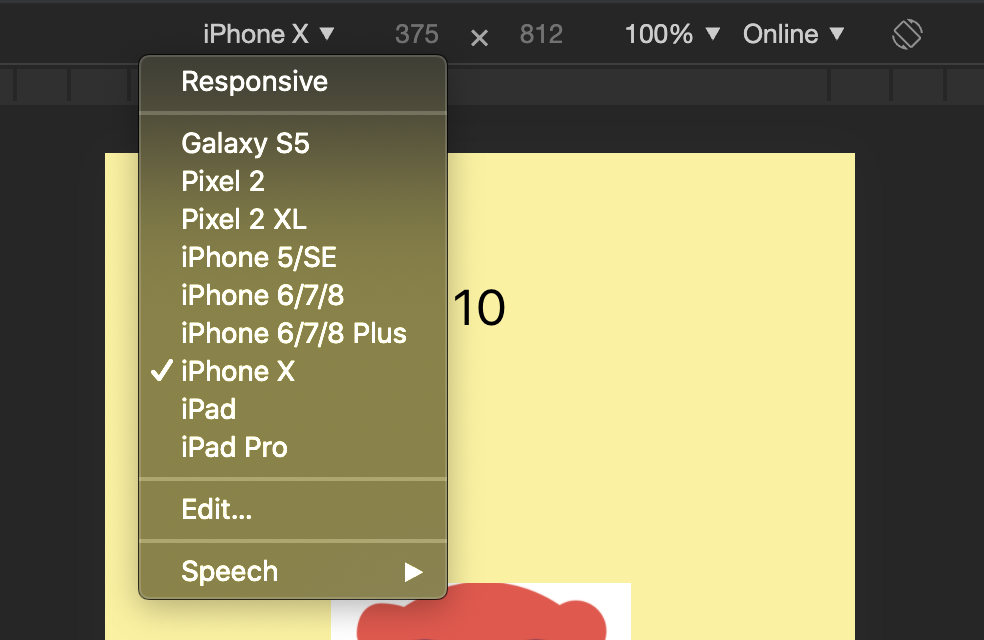

# Generate Screenshots

With the introduction of [responsive web apps,](publish-as-a-web-app-pro.md#responsive-web-app) you can now:

* View your app on many different device screens
* Create your own app screenshots for publishing your app

You can now create all screenshots necessary with Thunkable X!

* [Preview your app on different sized device screens](generate-screenshots.md#preview-your-app-on-different-sized-device-screens)
* [Create screenshots for your chosen device](generate-screenshots.md#create-screenshots-for-your-chosen-device)
* [Required screenshot sizes for App Store](generate-screenshots.md#required-screenshot-sizes-for-app-store)

## **Preview your app on different sized device screens:**

First, publish your app as [responsive web app.](https://docs.thunkable.com/publish-as-a-web-app-pro#responsive-web-app)  
Or, click **Live Test**  in the Design screen of your app, and click the text **Preview as a responsive web app**

Open the link in Google Chrome.

Click Settings &gt; More Tools &gt; Developer Tools to view app in **Developer mode.**

In the top left hand corner of the dock, click the icon that looks like a phone and a tablet standing next to each other**.**

You will now see that your app looks like it is being viewed on a mobile device:

You can use the drop-down menus at the top of the screen to select different devices and screen orientation.

## **Create screenshots for your chosen device**

Go back to the top left-hand corner of your console dock.  
****You will now see three dots to the left of the dock.   
Click on these three dots to open a menu, and click on “Capture Screenshot” in the menu.

## **Required screenshot sizes for App Store**

[Here](https://help.apple.com/app-store-connect/#/devd274dd925) is a list of screenshot sizes you need to publish to the App Store.

To get all of the screenshot sizes you need, create screenshots using the following device settings. Each device name will be followed by its corresponding screen size in the screenshot doc linked above.

iPhone X \(5.8 inch screenshots\)

iPhone 6/7/8 Plus \(5.5 inch screenshots\)

iPad Pro \(12.9 inch screenshots - suitable for iPad Pro 3rd gen and iPad Pro 2nd gen screenshots described in doc\)


5.8 inch screenshots are used as an alternative to 6.5 inch screenshots. There are two ways to upload these iPhone X screenshots to your App Store listing:


#### Upload 5.8 inch screenshots in Media Manager

When you look at your screenshot upload window, you will see the text ‘View All Sizes in Media Manager’. Click here. In the iOS tab, you will see a segment that says ‘6.5-inch display’. At the bottom of this segment you will see the text ‘5.8-inch display’. Next to this you will see a checkbox with the text ‘Use 6.5-inch Display’. Uncheck this box and expand the ‘5.8-inch Display’ segment. Click on ‘Choose File’, and upload your 5.8-inch screenshots.

#### Resize 5.8 inch screenshots to 6.5 inch screenshots

Use an image editor of your choice to resize your iPhone X screenshots from 1125 x 2436 pixels \(5.8-inch Display\) to 1242 x 2688 pixels \(6.5-inch Display\). Upload your new 6.5-inch screenshots to the App Store.

