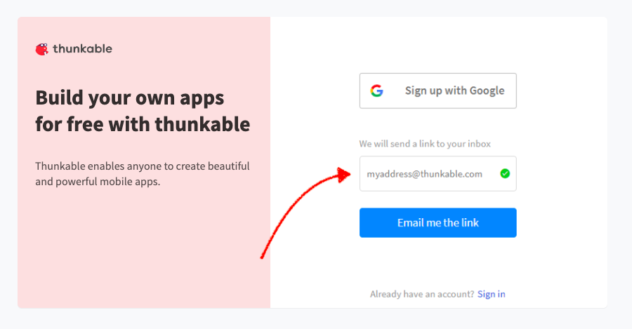
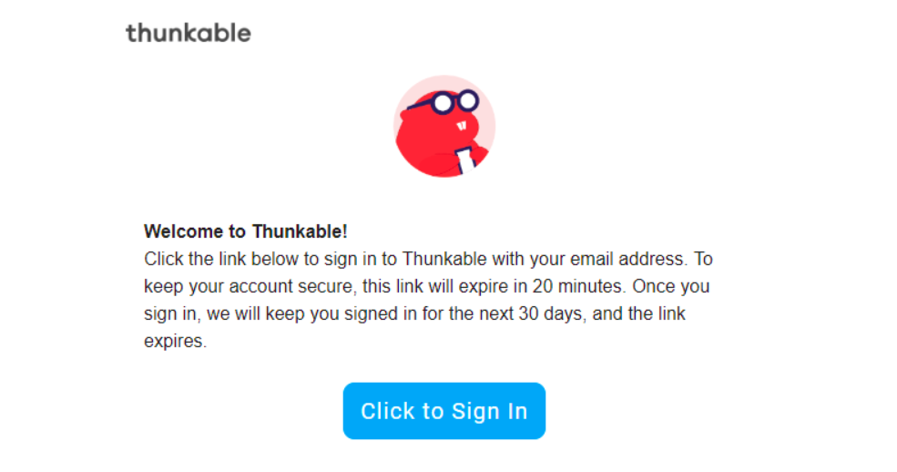
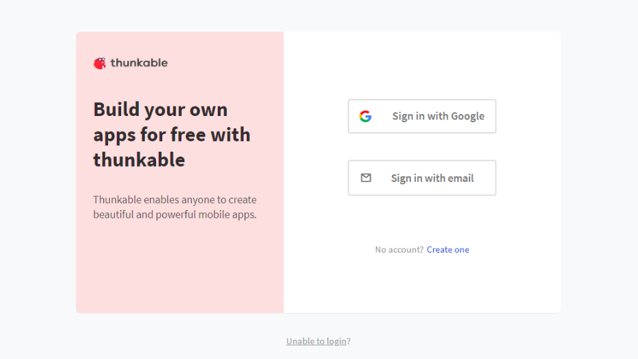
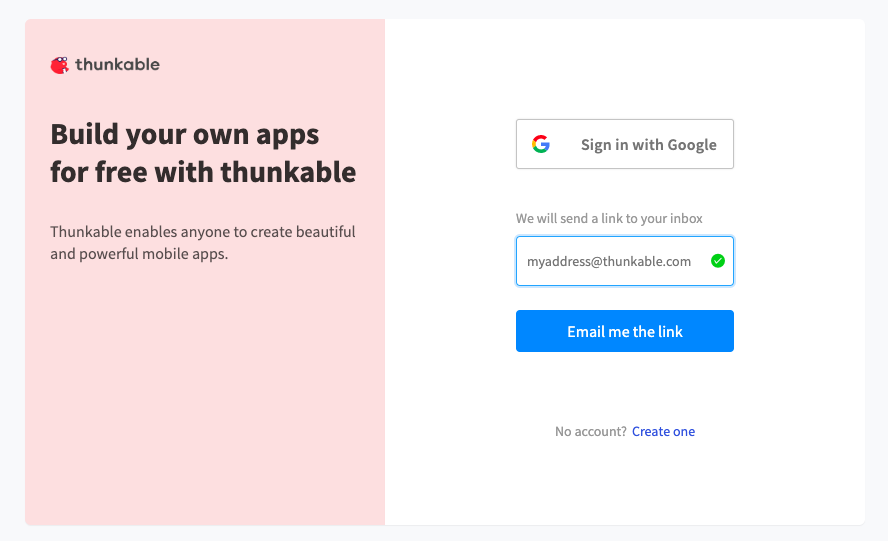

# Signing In

## **Sign Up**

If you've never used Thunkable before then you should visit our [sign up](https://x.thunkable.com/signup) page. The sign up page gives you two options. You can either sign up with your Google account or you can use any other email address you want. We recommend using your Google account, as it will make testing your app a little easier.

If you click **Sign up with Google** you will be signed in automagically. Clicking on **Sign in with email** will invite you to enter your email address and click a button saying **Email me the link**. Once you do this, we'll send you a magic link to your inbox.

The email will look something like the image below. Pressing the **Click to Sign In** button will open your new Thunkable account and keep you signed in for 30 days, unless you choose to sign out sooner.

## **Sign in**‌

Returning users can go directly to our [sign in](https://x.thunkable.com/login) page to sign back into their Thunkable account. The sign in screen has two options; **Sign in with Google** or **Sign in with email**.

### **Sign in with Google**

This button will sign you in automatically with your Google account. For most users this will be a Gmail address but if your school or work email is powered by Google then that will work too.‌

### **Sign in with Email**

If you click **Sign in with email** you will be invited to type you email address in a text input.

When you click **Email me the link** we will send you a magic link that will sign you back into your account.

## **Next Steps**

To learn more about using Thunkable take a look at some of our fantastic [tutorials](tutorials.md).

Once you're ready to try out your app, we have a helpful guide for [live testing](live-test.md) your apps.

