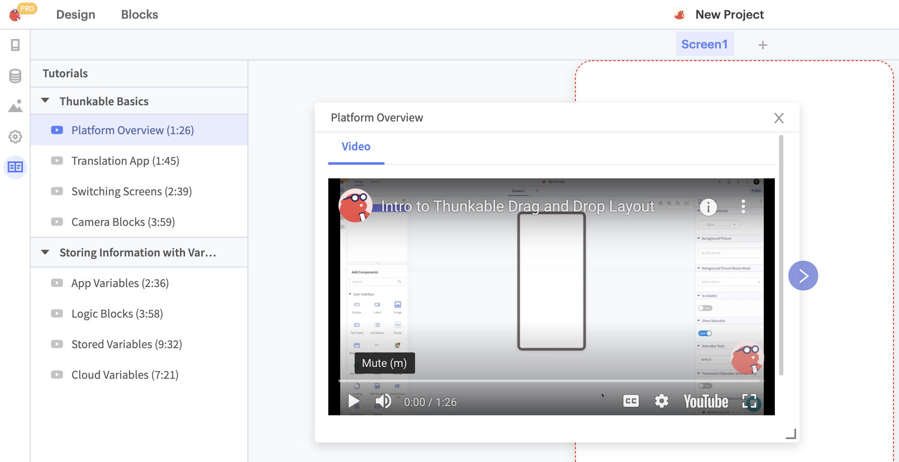

# Tutorials

## In-platform Tutorials

To learn how to use Thunkable try our in-platform tutorials. Click the Tutorials button in the left hand side bar to open up the tutorials panel. Clicking on an individual tutorial will launch a video modal that you can move and resize anywhere on the screen. 

## [Video Tutorials](https://www.youtube.com/watch?v=YrONgW8udmM&list=PLB89L9PPGIrwpd62eYs6iOsHpjYboyuZE)

Follow step by step app building instructions in our [YouTube tutorial series](https://www.youtube.com/watch?v=dQQsvQr-f1U&list=PLB89L9PPGIrxGeViKhkRvHVD7yFc4q_Np)!



## [Community Tutorials](https://community.thunkable.com/c/thunkable-cross-tutorials)


The Thunkable Community is where Thunkers share their ideas with the world. You can find a wide selection of staff and community written guides and tutorials in the [Thunkable Tutorials](https://community.thunkable.com/c/thunkable-tutorials/56) section.

