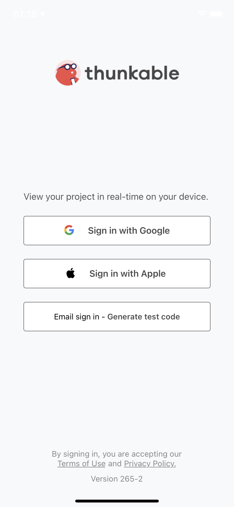
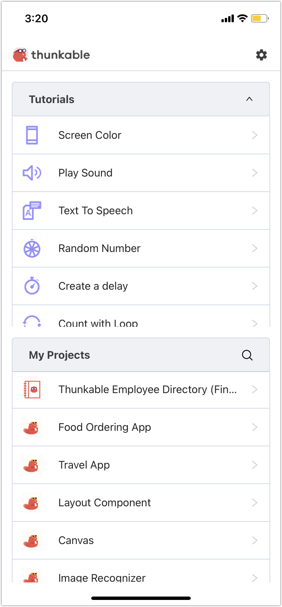

# Preview and Test your App

## Overview

There are two ways to test and preview your Thunkable app: Web Preview in your computer's browser or on your mobile device with the Thunkable Live app. These tools aren't designed to check for errors, but to allow you to preview your app's design and test its functionality in real time.

## Web Preview

You can test and preview your project directly within your browser. This is a great option when designing your app's user interface and building out the app's functionality with blocks.

<figure><figcaption></figcaption></figure>

<figure><figcaption></figcaption></figure>

It is important to note, however, that Web Preview does not support some app features. This is because some app features require functionality only available on a mobile device, such as push notifications, accelerometer, and Bluetooth low energy. For a full list of features that cannot be tested with Web Preview, please see here: [Publish as a Web App](../publishing-apps/publish-as-a-web-app-pro.md#unsupported-components).

You can also preview any public app, directly from the app's Project Detail Page.&#x20;

## **Thunkable Live App**

The Thunkable Live app connects the projects in your web browser to your mobile device. It allows you to preview and test your projects directly on your device. Any changes you make in your browser are displayed on your device immediately. You can also take your project on the go and show it off with the Thunkable Live app.

Links to download Thunkable Live on your mobile device are available here: [https://thunkable.com/#/mobile](https://thunkable.com/#/mobile)

### **Download the Thunkable Live App**

Links to download Thunkable Live for Android and iOS are available here: [https://thunkable.com/#/mobile](https://thunkable.com/#/mobile)

If you don't have an iOS or Android device, you can also [set up an emulator](../additional-resources/emulators.md) on your computer that mimics what you would see on an actual device.‌

### **Testing and Previewing with Thunkable Live**

1. Open your project in your web browser.
2.  Click the **Live Test on Device** icon.\

    

    <figure><figcaption></figcaption></figure>

    

3. If you're **signed in to Thunkable with Google**:
   1. Open the **Thunkable Live** app on your device.
   2. &#x20;Sign in with the same **Google** **account**.&#x20;
4. If you're **signed in to Thunkable with email**:
   1. Click **Enter my code**.
   2. Open the Thunkable Live app on your device.
   3.  Click **Email sign in - Generate test code.**\

       

       

       

   4.  A test code is displayed on your device screen. Enter it into the provided field on your web browser. \

       

       <figure><figcaption></figcaption></figure>

       

   5. Click **Connect**.
5.  Select the app you want to open from your list of Thunkable projects.\

    

    <figure><figcaption></figcaption></figure>

    

## Troubleshooting

#### **If you see a blank or white screen when you live test an app with UI components...**

* If you have added a navigator to your app, ensure screens are nested underneath it in the component tree. If your screens are not nested, drag and drop to nest them within the navigator.
* Ensure your blocks are connected without errors.
* Ensure you're logged into the same account on your web browser and the Thunkable Live app.&#x20;
* You have an event triggered by a Screen.Start which may be causing the screen to crash

#### **If changes that you make cause the app to crash...**

* Close the app and reopen it.&#x20;

#### **If an image is not showing up on your device...**

* You may have the image's height or width set to `Fit contents`. Try changing this and try again.
