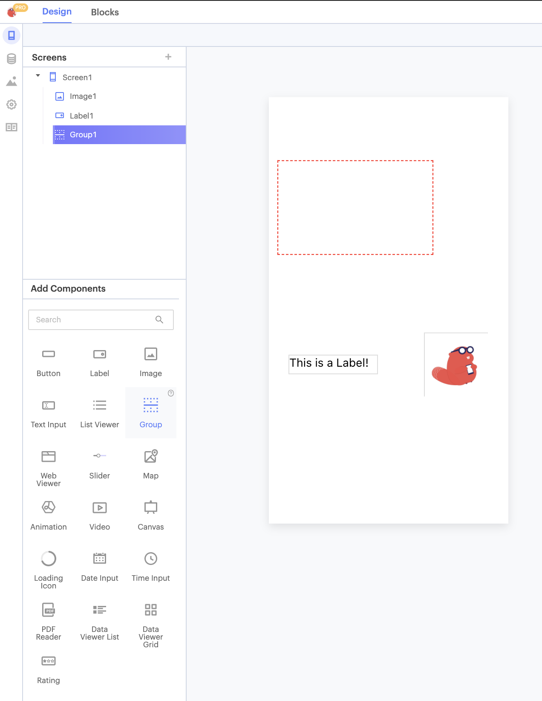

# Groups

A group is a container component. You can place [User Interface](user-interface.md) components inside a Group to make changing the layout of your app easier.

## Add a Group to your Project

Select the Group component from your [Components](components.md) menu and add it to your project.

## Set Group Size

You can drag and drop your component into position, and set its size.   
You can set exact values for the component's Height and Width, and X and Y coordinates, in its properties.

**Height:** Height of Button in pixels  
**Width:** Width of Button in pixels

**X:** position of top left corner of Button on X-axis  
**Y:** position of top right corner of component on Y-axis

## Add Components to Group

To add components to a Group, simply drag and drop the components inside the Group.

You will see the components you added to the Group are now nestled inside the Group in the component tree.

## Moving Groups in Your Project

Once you have added components to a Group, you can move them around as a group. This will make it easier to create complex layouts made of multiple components that you can still move around in your app as a single unit.

