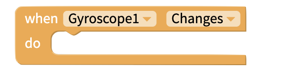
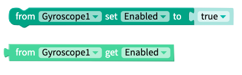
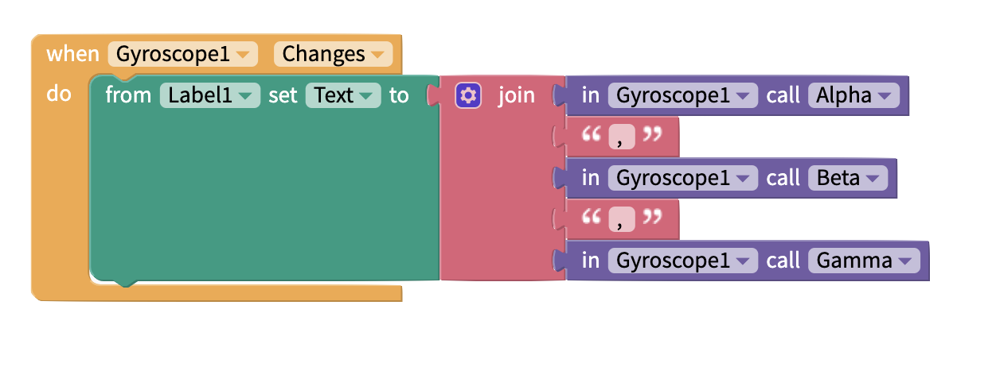
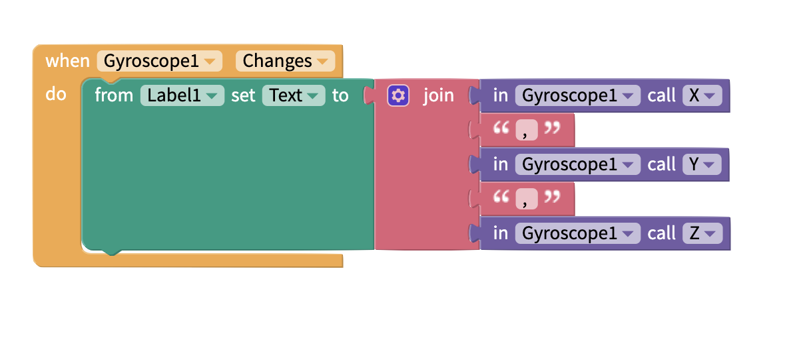

# Gyroscope

## Description

The gyroscope is capable of measuring how quickly the phone is being turned. It measures the rate of rotation of the phone and returns values in radians per second about the x axis, the y axis and the z axis. This rate of rotation is also known as the _Angular Velocity,_ so the gyroscope can tell us the speed of rotation of the phone. By extension, if the speed of rotation is any number greater than 0, we can infer that the phone is being turned.

## Events

Whenever the phone is turned, or rotated, the `Changes` event will fire. 

## Properties

By default the gyroscope sensor is turned on, but the `enabled`property can be used to read and write new values to the gyroscope, thus allowing you to turn it on or off.

| Property | Type | Default |
| :--- | :--- | :--- |
| `set Enabled` | Bool | true |
| `get Enabled` | Bool |  |

| Property | Type | Description |
| :--- | :--- | :--- |
| `Alpha` | Number | Rotation about the y-axis |
| `Beta` | Number | Rotation about the x-axis |
| `Gamma` | Number | Rotation about the z-axis |

| Property | Type | Description |
| :--- | :--- | :--- |
| `X` | Number | Angular velocity about the X axis |
| `Y` | Number | Angular velocity about the Y axis |
| `Z` | Number | Angular velocity about the Z axis |

