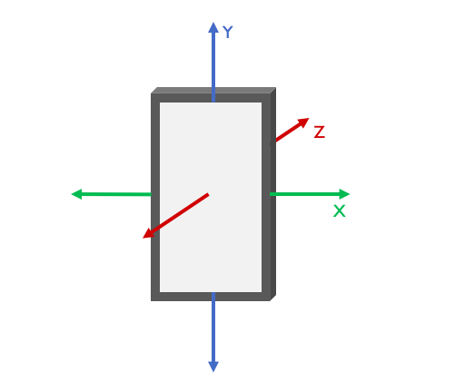
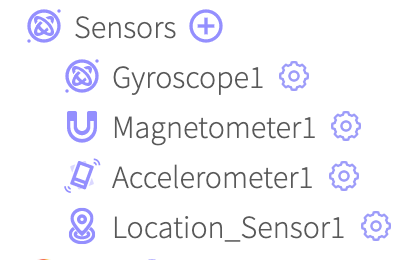
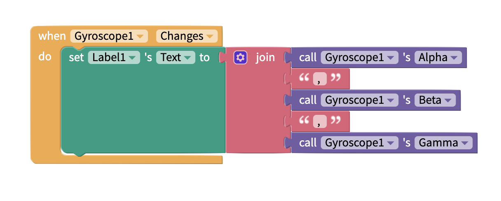
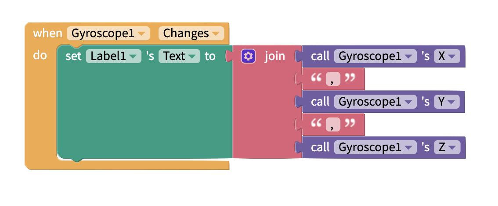

# Gyroscope

## Description

The gyroscope is capable of measuring how quickly the phone is being turned. It measures the rate of rotation of the phone and returns values in radians per second about the x axis, the y axis and the z axis. This rate of rotation is also known as the _Angular Velocity,_ so the gyroscope can tell us the speed of rotation of the phone. By extension, if the speed of rotation is any number greater than 0, we can infer that the phone is being turned.

## Adding a Gyroscope to your app

To add a Gyroscope to your app:

1. Go to the Blocks tab of your project
2. Find the Sensors drawer of blocks and click on the ⊕ symbol to add a Sensor to your app
3. Select Gyroscope from the menu that pops up

You will see a settings panel where you can set:

* The **Name** of the Gyroscope
* Whether the Gyroscope is **Enabled**

You can either confirm your choices and create the Gyroscope, or delete the Gyroscope.

.png>)

### Change Settings of Gyroscope

You will see the sensors you have added to your app underneath the Sensors section of your blocks.

If you click on the ⚙ icon next to your Gyroscope, you will be able to edit its settings as seen in the panels above. You can click on your Gyroscope's name to access its drawer of blocks.

## Properties

| Property | Description                                             | Data Type  |
| -------- | ------------------------------------------------------- | ---------- |
| Enabled  | Toggle whether the component is functioning in your app | True/False |

## Blocks

### Events

#### when Gyroscope Changes

Whenever the phone is turned, or rotated, the `Changes` event will fire.&#x20;

### Functions

Call Alpha/Beta/Gamma, call X/Y/Z

.png>)

| Property | Type   | Description               |
| -------- | ------ | ------------------------- |
| `Alpha`  | Number | Rotation about the y-axis |
| `Beta`   | Number | Rotation about the x-axis |
| `Gamma`  | Number | Rotation about the z-axis |

| Property | Type   | Description                       |
| -------- | ------ | --------------------------------- |
| `X`      | Number | Angular velocity about the X axis |
| `Y`      | Number | Angular velocity about the Y axis |
| `Z`      | Number | Angular velocity about the Z axis |

### Set/Get Properties

By default the gyroscope sensor is turned on, but the `enabled`property can be used to read and write new values to the gyroscope, thus allowing you to turn it on or off.

###
