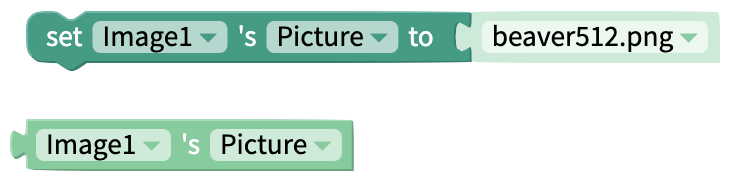
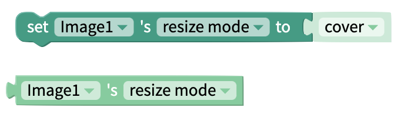
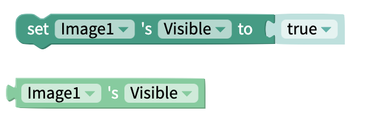

# Image

## Image Overview

The Image component lets you display pictures in your app and pairs nicely with image-based components like the [Camera](camera.md), [Photo Library](camera.md#use-image-from-photo-library), and [Image Recognizer](camera.md#image-recognition).

## Properties

### Image

| Property            | Description                                                                                         | Data Type                                                                                                                                                                                                    |
| ------------------- | --------------------------------------------------------------------------------------------------- | ------------------------------------------------------------------------------------------------------------------------------------------------------------------------------------------------------------ |
| Picture             | The image file to be shown in the Image component                                                   | 
PNG, JPG, GIF, SVG, etc. Can also use URL that ends in file extension (eg <a href="https://thunkable.com/static/media/logo.ba96eb83.png">https://thunkable.com/static/media/logo.ba96eb83.png</a>)
 |
| Picture Resize Mode | Set how picture is shown if the file and the Image component have different dimensions/aspect ratio | Select from list `[cover, contain, stretch, repeat, center]`                                                                                                                                                 |

#### Picture Resize Mode

With the Resize Mode property, you can do the following:

* **Center:** Positions the picture in the middle of the image component
* **Cover:** Resizes the picture to its max height or width regardless without changing the image quality.
* **Contain:** Resizes the picture to fit the area without changing its quality
* **Repeat:** Repeats the picture at its original quality within the image component area
* **Stretch:** The picture’s height will change to fill the image component length-wise

### Layout

| Property    | Description                                                                     | Data Type                                    |
| ----------- | ------------------------------------------------------------------------------- | -------------------------------------------- |
| X           | Position of top left corner of Image on X-axis, where the left hand side is X=0 | Number                                       |
| Y           | Position of top left corner of Image on Y-axis, where the top is Y=0            | Number                                       |
| Height      | Height of Image in pixels                                                       | Number                                       |
| Width       | Width of Image in pixels                                                        | Number                                       |
| Resize Mode | Define dimensions of the image component/container                              | Select from list `[Stretch, Float in Place]` |

### Style

| Property       | Description                                                             | Data Type                                  |
| -------------- | ----------------------------------------------------------------------- | ------------------------------------------ |
| Visible        | Toggle whether your end users can see the Image                         | True/False                                 |
| Border Style   | Style of Image's border                                                 | Select from list `[solid, dotted, dashed]` |
| Border Color   | Color of Image's border                                                 | Color                                      |
| Border Width   | Width of Image's border in pixels                                       | Number                                     |
| Border Radius  | Radius of corners of Image's border in pixels                           | Number                                     |
| Shadow Color   | Color of Image's shadow                                                 | Color                                      |
| Shadow Opacity | Opacity of Image's shadow                                               | Number between 0 and 100                   |
| Shadow Radius  | Radius of corners of Image's shadow in pixels                           | Number                                     |
| Shadow Offset  | How far Image's shadow should be offset, in Height and Width, in pixels | Number                                     |

## Blocks

### Events

#### Click

This event handler is fired when the user clicks on the image.

### Properties

#### Picture&#x20;

Set and get the Image component's Picture.

#### Resize Mode&#x20;

Set and get the Image component's [Resize mode](image-1.md#picture-resize-mode)

#### Height&#x20;

Returns the height of the Image component in pixels after it has been rendered on-screen.

#### Width

Returns the width of the Image component in pixels after it has been rendered on-screen.

#### Visible&#x20;

Set and get whether the Image component is visible on the screen.
