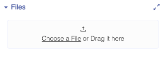

# Image

## Image Overview

The Image component lets you display pictures in your app and pairs nicely with image based components like the [Camera](camera.md), [Photo Library](photo-library.md), [Image Recognizer](image-recognizer.md) and [Media DB](media-db.md)

## Set Image

There are a few ways you can display an image in your app:\
****

1. **Upload a picture to your project Files:**\
   ****\
   ****\

2. **Provide a link in the Image properties**\
   ****\
   ****\

3. **Take a picture with the Camera component**

The blocks above open up your phone’s camera and set the Image component to the picture that you took.&#x20;

## Edit Image size

You can set how tall the Image is using the height property and set how wide it is using the width property.

**Height**

* **Fill container -** The Image fills the entire screen vertically
* **Fit contents -** The Image’s height changes to fit the contents it contains
* **Relative size -** The Image fills the specified percentage of the screen
* **Absolute size -** Sizes the Image to a specified number of pixels

**Width**

* **Fill container -** The Image fills the entire screen horizontally
* **Fit contents -** The Image’s width changes to fit the contents it contains
* **Relative size -** The Image fills the specified percentage of the screen
* **Absolute -** Sizes the Image to a specified number of pixels

### Resizing the Image

With the Resize Mode property, you can do the following:

* **Cover:** Resizes the picture to its max height or width regardless without changing the image quality.
* **Contain:** Resizes the picture to fit the area without changing its quality
* **Stretch:** The picture’s height will change to fill the image component length-wise
* **Repeat:** Repeats the picture at its original quality within the image component area
* **Center:** Positions the picture in the middle of the image component

## Style the Image

You can style the image with the following properties:

* **Border**
  * **Width:** Enter how wide you want the border outline of the image to be&#x20;
  * **Color:** Pick a color for the border of the image
  * **Radius:** Enter how round you want the edges of the border for the image to be ****&#x20;

## Add spacing

You can change the spacing and positioning of the Image with the Margin and Padding properties.

**Margin**

* You can specify how much space you want between the edges of the image and the screen using either pixel or percent values.

**Padding**

* You can specify how much space you want between the border and the contents of the image using either pixel or percent value.&#x20;

## Events

### Click

This event handler is fired when the user clicks on the image.

## Properties

### Computed Dimensions

.jpg>)

.jpg>)

The `Computed Height` and `Computed Width` blocks return the on screen dimensions of the image, after it has been rendered on-screen. The value returned is an integer, representing the size of the image in pixels.

### Height&#x20;

.jpg>)

The set and get height blocks work with the Height property of the image component. Acceptable input values are.&#x20;

* Number of Pixels
* Percentage Height
* "Fit Contents"
* "Fill Container"

### Picture&#x20;

The set and get picture blocks work with picture property of the image component. Pictures can be uploaded as local assets or specified as URLs&#x20;

### Resize Mode&#x20;

.png>)

The set and get resize mode blocks work with how the picture is scaled within the image component. Acceptable values are:

* Cover
* Contain
* Stretch
* Repeat
* Center

### Visible&#x20;

.png>)

The set and get visible blocks are used to show or hide the entire image component. Acceptable values are:

* True
* False

### Width

\
The set and get width blocks work with the Width property of the image component. Acceptable values are.‌

* Number of Pixels
* Percentage Width
* "Fit Contents"
* "Fill Container"

