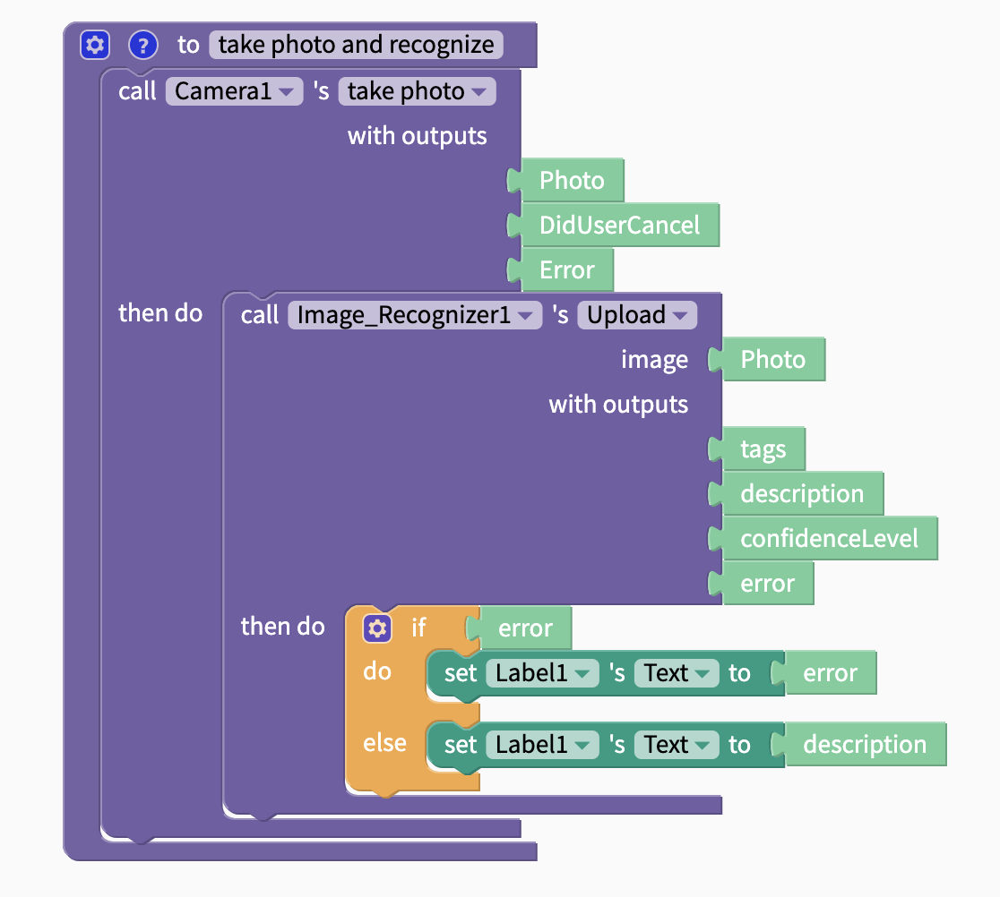

# Image Recognizer

This component is powered by [Microsoft Azure](https://blogs.microsoft.com/ai/azure-image-captioning/). You can get your own server URL and subscription key for Microsoft Azure [here](https://azure.microsoft.com/en-us/free/). You can add these details to your app in the [Project Settings panel](projects/settings.md#api-keys), which you can access by clicking on your app icon.

## Blocks

### Upload

#### Inputs

| Name | Data Type |
| :--- | :--- |
| image | Image |

#### Outputs

| Name | Data Type | Data |
| :--- | :--- | :--- |
| tags | List | Tags used to categorize the image |
| description | Text | Description of the image |
| confidenceLevel | Decimal | Value between 0 and 1 describing confidence that the description and tags are correct |
| error | Text | If error, returns error; else returns `null` |

