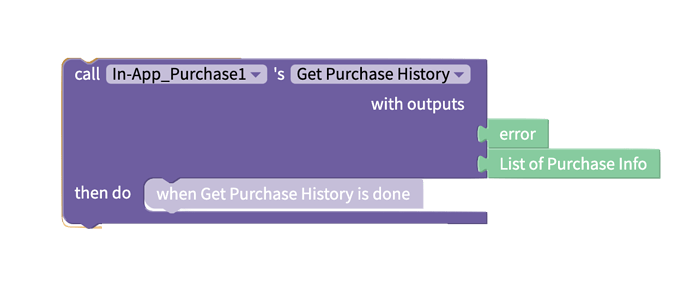
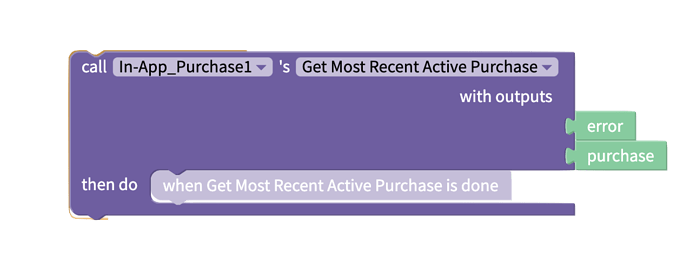

# In-App Purchase


In-App Purchases is available to Thunkers on PRO, Business and Enterprise plans.&#x20;

[Sign up for a plan on our pricing page.](https://thunkable.com/#/pricing)


## Compatibility

* The IAP component works on the Android platform and iOS platform.
* Currently, there is no support for IAP on web apps
* The IAP component doesn’t work on the Thunkable live apps (Android/iOS)

## **Initial Setup**

Before you set up your IAP blocks in Thunkable, you need to establish a set of product IDs. Each product ID is associated with the item being paid for.&#x20;

If you are developing for both Android & iOS, we suggest you use the same product ID for similar items in both stores.

Product IDs need to start with a number or lower case letter, and be 148 characters or less. They can contain  any of the following characters: numbers (0-9), lowercase letters (a-z), underscores (\_), and periods (.)

### Google Play Store (Monetize → Products)

Select your product type:

* In-App Product - a one-time purchase
* Subscription - recurring purchases

Read: Earn | aR

### Apple App Store (In-App Purchase → Manage)

Before you can create your In-App Purchases, you are required by Apple to request and fill out their Paid Applications contract.

To do so, log into your App Store Connect account, and go to the Agreements, Tax, and Banking section. In this section, you will see the ability to request the Paid Applications contract towards the top of the page.

After this is complete, you will now be able to add your In-App Purchases.

* Consumable - a one-off purchase which can be repeated and keeps no history&#x20;
* Non-Consumable - a product that can only be purchased once and keeps history in your apple account. If you try and buy a second time, it reports you have already purchased and offers a free download
* Auto-Renewable Subscription
* Non-Renewing Subscription

## Properties

To add IAP to your project, navigate to the block section and create an instance of the IAP component, which is nested under Advanced. During the setup stage, you need to enter the product IDs from the store setups.

## Blocks

### For Sale

If you need to pull the product/subscription info from the Play Store or App Store, you can use the following block. For the fields in the return object, you can reference them here.

### Purchasing

You can use the following blocks to start the one-time purchase or subscription. For the fields in the return object, you can reference them here.

 (1).png>)

### Purchase History&#x20;

You can use the following block to get the purchase history and you can verify the purchase from the return list. This block is helpful when you need to restore an existing purchase either on a new device or a new app installation. For the fields in the return object, you can reference them here.


The "Get Most Recent Active Purchase" block may crash your iOS app.&#x20;


## Testing

To test the IAP component, you have to publish it to the Google Play Store or App Store. You will not be able to test IAP with the Thunkable Live App or through Web Preview.


Be mindful to leave extra time for testing in your app development cycle to allow time for each respective store to review your apps. Depending on your stage of app development, a review could take anywhere from an hour to 4 days.


### App Store (iOS):

On iOS you need to submit to the App Store via Testflight to test the features. You can read more about Testflight here: [TestFlight Overview](https://docs.thunkable.com/publish-to-app-store-ios/testflight-overview).&#x20;

Testflight sets up a sandbox environment automatically. When you send your update to the app store, you are able to test without having it go to the live version.

### Play Store (Android):

On Android publish to the Play Store via internal beta testing. You can read more about internal beta testing in the Play Store here.

You have to upload the APK or AAB file to the Play Store console before you can add any In-App Purchases.

There are two ways you can test how a pre-release app functions on the Google Play store: You can publish an app to the alpha or beta distribution channels. This makes the app available on the Google Play store, but only to the testers you put on a "whitelist."

&#x20;In a few cases, you can test Google Play functionality with an unpublished app. For example, you can test an unpublished app's in-app billing support by using static responses, special reserved product IDs that always return a specific result (like "purchased" or "refunded").

## Managing Subscriptions

At this time, there are no blocks to support in-app subscription management by the user.&#x20;

Users can manage their own subscriptions in the Google Play Store or Apple App Store.

We recommend including instructions in your app or app’s website that outline the processes below.

### Android Subscription Management

#### Cancel, pause, or change a subscription on Google Play&#x20;


Subscriptions on Google Play renew automatically **unless** you unsubscribe through the Google Play app. Uninstalling an app won't automatically cancel your subscription.&#x20;


1. Open the Google Play app .
2. At the top right, tap the profile icon.
3. Tap **Payments & subscriptions**  **Subscriptions**.
4. Select the subscription you want to cancel.
5. Tap **Cancel subscription**.
6. Follow the instructions.


If you have a subscription with an app and the app gets removed from Google Play, your future subscription will be canceled. Your past subscriptions will not be refunded.


Read more about managing your Android subscriptions [here](https://support.google.com/googleplay/answer/7018481?hl=en\&co=GENIE.Platform%3DAndroid#zippy=%2Ccancel-a-subscription-on-the-google-play-app).

### iOS Subscription Management

#### Change or cancel your App Store subscriptions&#x20;

1. Open the App Store app on your iOS device or on a computer
   * Sign in to the App Store if necessary
2. Tap  or your profile picture at the top right, then tap Subscriptions.
3. Choose a subscription, then do any of the following:
   * Change or cancel an existing subscription.
   * Resubscribe to an expired subscription.
   * [Share an eligible App Store subscription](https://support.apple.com/guide/iphone/share-subscriptions-iph6e7917d3f/15.0/ios/15.0#iph6f8d8ed1c) with other family members in your Family Sharing group.

Read more about managing your iOS subscriptions [here](https://support.apple.com/guide/iphone/manage-purchases-subscriptions-settings-iph3dfd91de/ios).
