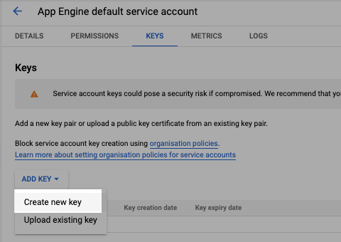
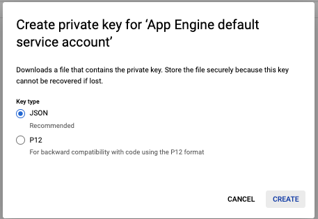
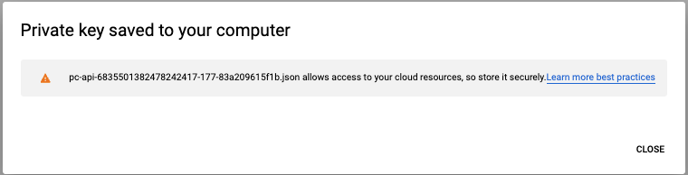

# Android Play Store Setup

## Android App Store Setup

Using [Google Play's billing system](https://developer.android.com/google/play/billing/billing\_admin.html), you can offer in-app products that charge users on a one-time basis, known as in-app products. In-app products can include items like virtual goods (for example, game levels or potions) and premium services within your app on Google Play.

* You can also [create a subscription](https://support.google.com/googleplay/android-developer/answer/140504), which charges users on a recurring basis.
  * we cover this below

**Important**: Google Play [Developer Program Policies](https://play.google.com/about/developer-content-policy/) and [service fees](https://support.google.com/googleplay/android-developer/answer/112622) apply to all in-app products, including both one-time products and subscriptions

## Step 1 - Create a payments profile

Create a payments profile in payments center to manage and track your app sales from Play Console. Review the list of [Supported locations for developer and merchant registration](https://support.google.com/googleplay/android-developer/answer/9306917).

1. Sign in to [Play Console](https://accounts.google.com/AccountChooser?service=androiddeveloper\&continue=https://play.google.com/apps/publish/).
2. Go to the [**Payments settings**](https://play.google.com/console/developers/paymentssettings) page (**Settings** > **Developer Account** > **Payment settings**).
3. Click **Create payments profile**. Make sure to have your business information available to set up your payments profile.
4. Under "Payments profile," click the down arrow and select **Create payments profile**.
5. **Name and address:**&#x20;
   * Enter the legal name of your business as you want it to appear on your payments profile. This information will be shown to your customers and also on your receipts.&#x20;
   * Provide your legal business address as it appears on official documents. It’s important that we have a valid physical address on file for your business. We don't allow you to use a PO box address. Later, you'll need to make sure that your bank account is registered in the same country listed in your payments profile. Learn more [about bank account requirements](https://support.google.com/paymentscenter/answer/7161440).
6. **Primary contact:** Enter the name of an authorized representative for your company who Google can contact if we have questions about your payments profile. Provide an email address and a phone number (optional).
7. Enter the following public business information, or choose to match your public merchant profile and payments profile information:
   * Enter your business website.
   * Select the category of products that you sell.
   * Your customer support email.
   * The business/product name that'll appear on your customers' credit card statements.
     * **Note:** To help customers remember what they purchased and keep chargebacks to a minimum for you, use an appropriate credit card statement name.
8. When you're finished, click **Submit**.\
   **Note:** You cannot change your business location country but you can [change your public merchant and payments profiles](https://support.google.com/paymentscenter/answer/7162811) later.

After you create a payments profile it is automatically linked to your Play Console. **Note**: If you have set up a payments profile or merchant center account previously, it is already linked to your Play Console.

## Step 2 - Create the item or subscription to purchase



### Create in-app products

Before creating a product, make sure to plan your product IDs carefully. Product IDs need to be unique for your app, and they can’t be changed or reused after they’ve been created.

* Product IDs must start with a number or lowercase letter, and can contain numbers (0-9), lowercase letters (a-z), underscores (\_), and periods (.).
* You can’t change or reuse a product ID after the product has been created.&#x20;
* **Note**: The product ID `android.test` is unavailable for use, along with all product IDs that start with `android.test`.

To create an in-app product:

1. Open Play Console and go to the [**In-app products**](https://play.google.com/console/developers/app/managed-products) page (**Monetize** > **Products** > **In-app products)**.
2. Click **Create product**.
3. Enter your product details.
   * **Product ID:** A unique ID for your in-app product.
   * **Title**: A short name of the item (up to 55 characters, but we recommend limiting titles to 25 characters to display properly in all contexts), like "Sleeping potion."
   * **Description**: A long description of the item (up to 200 characters), like “Instantly puts creatures to sleep."
   * **Icon:** A unique and accurate image for your product. Don't include text, promotions, or branding. Your product icon is shown on your store listing and during the purchase flow.
     * 32-bit PNG
     * 512 px by 512 px
     * Up to 1 MB
   * **Price**: Enter a price in your local currency or [select a pricing template](https://support.google.com/googleplay/android-developer/answer/6334373#pricing\_template).
   * **Multi-quantity:** Allow multi-quantity checkout for this product. Users will be able to purchase in multiple quantities within the threshold of their country/region. Note the following information:
     * To configure multi-quantity checkout in Play Console, your app needs [Google Play Billing Library 4.0](https://developer.android.com/google/play/billing/release-notes#4-0). Visit the [Android Developers site](https://developer.android.com/google/play/billing/integrate) to learn how to integrate the Google Play Billing Library into your app
     * Multi-quantity checkout is not available in some countries/regions.
     * In most countries/regions where Multi-quantity checkout is available, the SKU price threshold is around US$100. To allow multi-quantity checkout, you will need to adjust the price (before tax) to below the threshold in each country/region.
   * **Play Points exclusive:** Make your product available only in Google Play Points.
4. Save your changes and click **Activate** to make your in-app product available to users..
   * To be available for purchase, a product needs to be active, and its app needs to be published.
   * If you’re using a test account, active items are available in unpublished apps. To learn more, go to the [Android Developers site](https://developer.android.com/google/play/billing/billing\_testing.html#billing-testing-real).

#### Languages and translations

In-app products use the same default language as their app. To add translations in specific languages, select an in-app product, and then click **Manage translations** and apply the languages you want. [Learn more about translating your app](https://support.google.com/googleplay/android-developer/answer/3125566).



## Subscription Overview

Review Google's updated [Subscriptions Policy](https://play.google.com/about/monetization-ads/subscriptions/) in the Developer Policy Center to ensure your app is compliant with the latest changes.

Using [Google Play's billing system](https://developers.google.com/android-publisher#subscriptions), you can offer in-app products that charge users for content or services on a recurring basis, known as subscriptions. Subscriptions can include items like a collection of apps, games, or other content for a recurring fee within your app on Google Play.

You can offer multiple subscriptions within the same app. Subscriptions must be priced within the [accepted price range](https://support.google.com/googleplay/android-developer/table/3541286). Subscriptions can't be unpublished.

* You can also [create an in-app product](https://support.google.com/googleplay/android-developer/answer/1153481), which charges users on a one-time basis.

**Important**: Google Play [Developer Program Policies](https://play.google.com/about/developer-content-policy/) and [service fees](https://support.google.com/googleplay/android-developer/answer/112622) apply to in-app products and subscriptions.

### Availability 

If you’re in a supported location and want to start using Google Play's billing system features in your apps, [set up a payments profile](https://support.google.com/googleplay/android-developer/answer/7161426) and [review the Google Play billing system API documentation](https://developer.android.com/google/play/billing/api.html).

### Subscription and free trial time periods

* Weekly
* 1 month
* 3 months
* 6 months
* Annual

**Note:** Weekly subscriptions can now be charged using Direct Carrier Billing (DCB). For more information, review the [accepted payment methods on Google Play](https://support.google.com/googleplay/answer/2651410#zippy=). \

Read more about Google in-app subscriptions [here](https://support.google.com/googleplay/android-developer/answer/140504).



### Add a subscription to your app 

Adding a subscription is similar to [adding an in-app product](https://support.google.com/googleplay/android-developer/answer/1153481), except the price is set for a period of time.

Before creating a subscription, make sure to plan your product IDs carefully. Product IDs need to be unique for your app, and they can’t be changed or reused after they’ve been created.

* Product IDs need to start with a lowercase letter or a number and must be composed of only lowercase letters (a-z), numbers (0-9), underscores (\_), and periods (.)
* **Note**: The product ID `android.test` is unavailable for use, along with all product IDs that start with `android.test`.

Before adding a subscription, review our [Subscriptions Policy](https://play.google.com/about/monetization-ads/subscriptions/).

To add a subscription:

1. Open Play Console and go to [**Subscriptions**](https://play.google.com/console/developers/app/subscriptions/setup) page (**Monetize** > **Products** > **Subscriptions**).
2. Click **Create subscription**.
3. Enter your subscription details.
   * **Name**: A short name of the item (up to 55 characters, but we recommend limiting titles to 25 characters to display properly in all contexts) such as "Sleeping potion."
   * **Description**: A long description of the item (up to 80 characters) such as "Instantly puts creatures to sleep."
   * **Benefits**: Provide up to 4 benefits, which each describes a feature of the subscription (up to 40 characters each)
     * Benefits should highlight the features to give users a better idea of what your subscription offers, like “Full catalog of TV shows and movies.”&#x20;
     * Since not all users will be eligible for a promotional price or free trial, the benefit should **not** mention free trial or price, for example “Try 7 days free” is not allowed.
4. Enter pricing details in the “Price” section:
   * **Billing period:** Choose the time interval between billing statements.
   * **Default price:** Enter a default price or import from an existing pricing template; this is used to generate local prices in other countries. Local prices use today’s exchange rate and country-specific pricing patterns. Countries without local currency support use your default price.
5. Choose and define additional options in the “Subscription settings” section:
   * **Free trial:** You can let users try your subscription before they pay. If you select **Enabled**, choose how many days you want to make it available for free. Learn more [below](https://support.google.com/googleplay/android-developer/answer/140504#free).
   * **Introductory price:** You can offer new subscribers a discounted price for a specific duration. If you do, this must be within the accepted price range and cost less per day than the original price. Learn more [below](https://support.google.com/googleplay/android-developer/answer/140504#intro).
   * **Grace period:** You can give users time to resolve payment issues while keeping their subscription active. Grace periods can be 3 days, 7 days, or 14 days. Learn more [below](https://support.google.com/googleplay/android-developer/answer/140504#grace).
   * **Resubscribe:** Enabling resubscribe allows users to resubscribe from the Play Store after cancellation. Learn more [below](https://support.google.com/googleplay/android-developer/answer/140504#cancellations).
6. Click **Save**.
7. Click **Activate** to make the subscription you created active.
   * To be available for purchase, a product needs to be active, and its app needs to be published.
   * If you’re using a test account, active items are available in unpublished apps. To learn more, go to Google's [Android developers](https://developer.android.com/google/play/billing/billing\_testing.html#billing-testing-real) site.



## Step 3 - Test in-app billing with application licensing  

With application licensing, you can set up a list of Gmail accounts to test your in-app billing and subscription integration. Your own publishing account is always considered a licensed tester.&#x20;



## Set up application licensing

To set up [application licensing](https://developer.android.com/google/play/licensing/overview.html), start by adding your list of testers' Gmail addresses in Play Console.&#x20;

1. Open [Play Console](https://play.google.com/apps/publish/).
2. Click **Setup** > **License testing**.
3. In "Add license testers" box, enter your testers' Gmail addresses.
4. In the bottom right corner of the screen, select **Save changes**.

Once your list is ready, make sure that:

* Your app has been published to the open, closed, internal test, or production track. We recommend publishing your app to the internal test track. Make sure that your testers are also eligible to receive your release by following the instructions for [managing testers by email address](https://support.google.com/googleplay/android-developer/answer/3131213#closed\_beta) or using [Google Groups](https://support.google.com/googleplay/android-developer/answer/3131213#closed\_groups).
* You've [set up a test environment](https://developer.android.com/google/play/licensing/setting-up.html#test-env).

###



### Test in-app billing and subscriptions

You're able to purchase your own app, in-app item, or subscription as a test purchase. Once you've set up application licensing, authorized users can also purchase in-app products and subscriptions without charging the users’ accounts.

When making a purchase from a license test user, you will see two choices for payment method:&#x20;

* “Test card, always approves”
* “Test card, always declines"&#x20;

Before they can be tested, your in-app products and subscriptions need to be published.

Learn more about [testing in-app billing](https://developer.android.com/google/play/billing/billing\_testing)and using [static responses](https://developer.android.com/google/play/billing/billing\_testing.html#billing-testing-static) .



### Test one-time products 

#### Test consumable products 

When testing consumable products, we recommend testing a variety of situations, including the following:

* A successful purchase where the user receives an item. With a license tester, you can use the **Test instrument, always approves** payment method.
* A purchase where the payment method failed to be charged, and the user should not receive the item. With a license tester you can use the **Test instrument, always declines** payment method.
* Ensure items can be purchased multiple times.

You should also verify that purchases are properly acknowledged as described in [processing purchases](https://developer.android.com/google/play/billing/integrate#process). For purchases from license testers, a purchase will be refunded after 3 minutes if your app does not acknowledge the purchase and you will receive an email about the cancellation. You can also check the **Orders** tab in the Google Play Console to see if an order was refunded after 3 minutes.

#### Test non-consumable products 

Non-consumables should be tested the same as consumables, but you should verify an item cannot be purchased again within your app. Be sure to verify purchase acknowledgement for both non-consumables and consumables (when applicable) since the logic to process each the two types of purchases vary.



### Test subscription-specific features 

The purchase flows for one-time products and subscriptions are similar, but subscriptions have additional scenarios, such as successful or declined subscription renewals. To test renewals, you can use the **Test instrument, always approves** and **Test instrument, always declines** payment methods that are available for license testers, as shown in figure 1. Use these payment instruments to test scenarios beyond the successful subscription scenario.

Similar to one-time products, you should also verify that purchases are properly acknowledged as described in [processing purchases](https://developer.android.com/google/play/billing/integrate#process). For purchases from license testers, a purchase will be refunded after 3 minutes if your app does not acknowledge the purchase and you will receive an email about the cancellation. You can also check the Orders tab in Google Play Console to see if an order was refunded after 3 minutes.

#### Renewal periods 

Test subscriptions renew more quickly than actual subscriptions, and test subscriptions can renew a maximum of six times.

The following table lists the testing renewal times for subscriptions of various durations. These times are approximate. You may see small variations in the precise time of an event. To compensate for variation, call the API to view the current status after every subscription expiration date.

| **Production subscription period** | **Test subscription renewal** |
| ---------------------------------- | ----------------------------- |
| 1 week                             | 5 minutes                     |
| 1 month                            | 5 minutes                     |
| 3 months                           | 10 minutes                    |
| 6 months                           | 15 minutes                    |
| 1 year                             | 30 minutes                    |

Time-based subscription features such as free-trials are also shortened for testing. The following table identifies the testing time periods associated with time-based subscription features:

| **Feature**                      | **Test period**                  |
| -------------------------------- | -------------------------------- |
| Purchase acknowledgement         | 5 minutes                        |
| Free trial                       | 3 minutes                        |
| Introductory price period        | Same as subscription test period |
| Grace period (both 3- and 7-day) | 5 minutes                        |
| Account hold                     | 10 minutes                       |
| Pause (1 month)                  | 5 minutes                        |
| Pause (2 months)                 | 10 minutes                       |
| Pause (3 months)                 | 15 minutes                       |

\




## Step  4 - Setup your Google Cloud account and Android Service Account

This next step is vital for subscriptions. If you don't complete this step, you wont be able to 'acknowledge' subscriptions. For android IAP, 'acknowledging' is how you complete the transaction and if not completed the transaction will revert and you as the developer  will not make money on that purchase plus your users will  likely have an unpleasant experience (i.e. they loose access to the thing they wanted to buy).

To do this process you need to make API calls. Before you can start making API calls, you need to set up API access to your Google Play Developer Account. This involves changes in both the Google Play Console and Google Cloud Console. The following instructions explain the four steps needed to start using the Google Play Developer API.

1. Link your developer account to a new or existing Google Cloud Project.
2. Enable the Google Play Developer API for your linked Google Cloud Project.
3. Authorize an API key for the Google Play Developer API in your linked Google Cloud Project.
4. Set up a service account with appropriate Google Play Console permissions to access the Google Play Developer API.

### Link your account and project 

Before you can access the Google Play Developer API, you must link your Google Play Developer Account to a Google Cloud Project. In most cases, we recommend that you create a new Google Cloud Project dedicated to your Google Play Developer Account, but you can link an existing project. Keep in mind that each Google Play Developer Account can only be linked to a single Google Cloud Project. If you have multiple apps in the same Google Play Developer Account, they all must share the same Google Cloud Project.

#### Create a new project 

1. Go to the [API access](https://play.google.com/console/api-access) page on the Google Play Console.
2. Click **Create new project**.

The Google Cloud Project is automatically created and linked to your Google Play Developer Account.

#### Use an existing project 

If you are already a user of the Google Cloud Console, you can link to your existing Google Cloud Project by following these steps:

1. Go to the [API access](https://play.google.com/console/api-access) page on the Google Play Console.
2. Choose the project you’d like to link. If your project isn't listed, verify that your user account is designated as _Owner_ in the Google Cloud Project you want to link.
3. Click **Link existing project**.

### Enable the API 

Once you have set up the linked Google Cloud Project, you need to enable the Google Play Developer API for this project. To do this, you need to be an owner of the Google Cloud Project.

1. Go to the [API access](https://play.google.com/console/api-access) page on the Google Play Console.
2. Under **APIs**, find the Google Play Developer API and click **Turn on**.

This directly updates the Google Cloud Project and the change takes effect immediately.

### Authorize an API key 

To use the API, you need an API key in your linked Google Cloud Project that is authorized to use the Google Play Developer API. Set this up in the Google Play Console.

### Configure OAuth and Service Accounts 

You need to configure access to the Google Play Developer API with an OAuth client or a service account. In most cases, you should use a service account to access the API.

Service accounts must be used in a secure environment, such as your server. The service account credentials need to be securely managed so they are not revealed to anyone that is not authorized to use the API.

The OAuth Client ID should be used if you need to access the API on behalf of an individual user. For example, if your website needs to access the Google Play Developer API from the web client on behalf of the user, you can use the Client ID. The user will be authenticated with their Google account instead of the service account. This allows you to make API calls on behalf of a user without compromising service account credentials.

* Service account: A secure software service will access the API (most common)
* OAuth clients: A user will access the API

#### Use a service account 

You can create a [service account](https://developers.google.com/accounts/docs/OAuth2ServiceAccount) from the Google Play Console.

1. Go to the [API access](https://play.google.com/console/api-access) page on the Google Play Console.
2. Under **Service accounts**, click **Create new service account**.
3.  Follow the instructions to create your service account.

    During the process of account creation you need to grant your service account access to the Google Cloud Project in order for it to appear in the Google Play Console.
4. Once you’ve created the service account on the Google Play Console, click **Done**. The Service Accounts section of the [API access](https://play.google.com/console/api-access) page automatically refreshes, and your service account is listed.
5.  Click **Grant Access** to provide the service account the necessary rights to perform actions.

    To use the Google Play Billing APIs, you must grant the following permissions:

    * _View financial data, orders, and cancellation survey responses_
    * _Manage orders and subscriptions_

At this point, you should be able to access the Google Play Developer API through the service account. For more information, see [Using OAuth 2.0 for Server to Server Applications](https://developers.google.com/accounts/docs/OAuth2ServiceAccount).

## Step 5 - Download your service key for later steps 

1. Go to your [API Access tab](https://play.google.com/console/u/0/developers/6835501382478242417/api-access) in the Android Developer Console\

2. Find the service account you created in [Step 4](android-play-store-setup.md#step-4-setup-your-google-cloud-account-and-android-service-account) and click "View in Google Cloud Platform"

<figure><figcaption></figcaption></figure>

3\. Find and click on the service account in the list in the Google Cloud Platform

<figure><figcaption></figcaption></figure>

4\. Click the Keys tab

<figure><figcaption></figcaption></figure>

5\. Click "Add key" then "Create new Key"

<figure><figcaption></figcaption></figure>

6\. Select JSON as the key type and click Create. The file will automatically download to your default download folder.&#x20;

<figure><figcaption></figcaption></figure>

<figure><figcaption></figcaption></figure>

