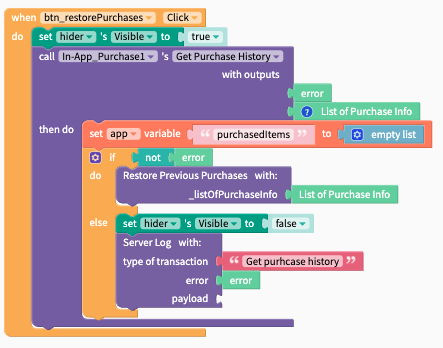
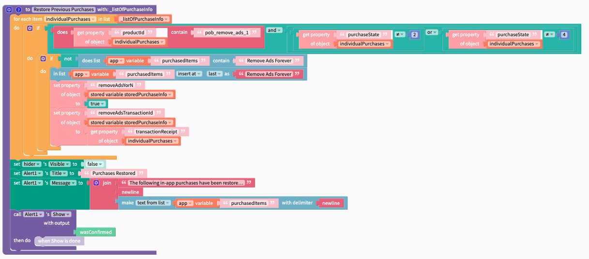
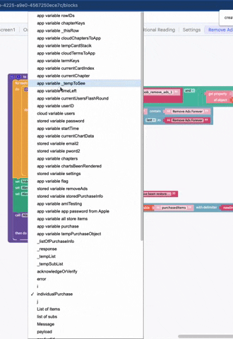
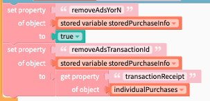

# Get Purchase History / Restore Purchases

## Get Purchase History

You must be able to restore your users purchases at the click of a button. This is an iOS App Store policy.

<details>

<summary>Learn more about the data this API call returns</summary>

The following is the format of data returned by this block

```javascript
//iOS
[{
purchaseTime:234234234234,
originalPurchaseTime:23423423423423,
purchaseState: 2,
orderId:"adsfasfdf",
originalOrderId:"232adfa",
acknowledged: true,
productId:"rasdf",
transactionReceipt:"LONG STRING"
}]


//Android
[{
"packageName":"edu.fit.jgibb",
"productID":"new_sub",
"acknowledged":true,
"purchaseToken":"LONG STRING",
"purchaseState":1,
"orderId":"GPA.3388-2344-2345-65433",
"purchaseTIme":23423423423423424
}]
```

Notes about purchaseState:

0 = PURCHASING - The transaction is being processed.&#x20;

1 =  PURCHASED - The App Store successfully processed payment.&#x20;

2 = FAILED - The transaction failed.

3 = RESTORED - iOS OnlyThis transaction restores content previously purchased by the user. Read the originalTransaction properties to obtain information about the original purchase. InAppPurchaseState.RESTORED ＝ 3

4 = DEFERRED - iOS OnlyThe transaction has been received, but its final status is pending external action such as the Ask to Buy feature where a child initiates a new purchase and has to wait for the family organizer's approval. Update your UI to show the deferred state, and wait for another callback that indicates the final status.&#x20;

</details>

<div align="left">

<figure><figcaption></figcaption></figure>

</div>

<figure><figcaption></figcaption></figure>

A quick note on the blocks above. users have asked where the individualPurchaes variable comes from.&#x20;



### Get purchase history step-by-step



First show the hider to block user interaction, then call <mark style="color:purple;">`Get Purchase History`</mark>&#x20;

<div align="left">

<figure><figcaption></figcaption></figure>

</div>

<mark style="color:green;">`List of Purchase info`</mark> will output a list of objects that are formatted like this:

```
[{
purchaseTime:234234234234, //this will be Epoch time in miliseconds
originalPurchaseTime:23423423423423, //this value is formatted as above
purchaseState: 2,
orderId:"adsfasfdf",
originalOrderId:"232adfa",
acknowledged: true,
productId:"YOUR_PRODUCT_IDs_WILL_BE_HERE", 
transactionReceipt:"THIS_IS_A_VERY_LONG_STRING"
}]

[{
purchaseTime:234234234234, //this will be Epoch time in miliseconds
originalPurchaseTime:23423423423423, //this value is formatted as above
purchaseState: 2,
orderId:"adsfasfdf",
originalOrderId:"232adfa",
acknowledged: true,
productId:"YOUR_PRODUCT_IDs_WILL_BE_HERE", 
transactionReceipt:"THIS_IS_A_VERY_LONG_STRING"
}]
```

[more info on Epoch time](https://www.epochconverter.com/)



Assign a temporary variable as an empty list.

<div align="left">

<figure><figcaption></figcaption></figure>

</div>



If there's not an error, pass the `List of Purchase Info` to the `Restore Previous Purchases` function, else handle the error<mark style="color:green;">`.`</mark>

<div align="left">

<figure><figcaption></figcaption></figure>

</div>



Handling restoration will look different for each app, however in general it should follow this general format.

<div align="left">

<figure><figcaption></figcaption></figure>

</div>

Notice the \_listOfPurchases variable. you can create that by clicking the cog wheel, dragging an `input name`  block into the `inputs` receiver, and giving it a meaningful name



Loop through the list of purchases.  You can access this variable by right clicking on the function body and selecting `create _listOfPurchases`&#x20;

<div align="left">

<figure><figcaption></figcaption></figure>

</div>

Notice that the 'for each item' variable name is 'individualPurchase'. See how to change those variable names below. \





in the loop, you will first check if that purchases product\_id matches one of your known products, and then the purchaseState to ensure the product's purchase is still valid.&#x20;

<div align="left">

<figure><figcaption></figcaption></figure>

</div>

There should be one of these for each item you have in your app using an if/else if/else allowing for 1 check per product.&#x20;



if the item passed the checks in **step 6,** check if `purchasedItems` list contains that purchase and if not, add it to the list.&#x20;

<div align="left">

<figure><figcaption></figcaption></figure>

</div>



The final step is to save the state of the purchase locally so that you do not need to verify purchases every day. It is recommended to regularly [check that subscriptions are still valid](get-purchase-history-restore-purchases.md#verify-ios-transaction-and-purchase-status).&#x20;

<div align="left">

<figure><figcaption></figcaption></figure>

</div>

In this example, we store a T/F value for the purchase as well as the transactionReceipt. This allows the app to permit/block access to the purchased item and allows the app to check if the purchase is still valid again in the future.&#x20;



In our example, we display an alert to the user to display the  restored purchases. This is not required, though highly recommended as your users will appreciate that information. _**The main purpose of a workflow like this would be to be able to**** **<mark style="color:green;">**restore purchases**</mark>** ****if the user has to reinstall the app or changes phone**_




##
