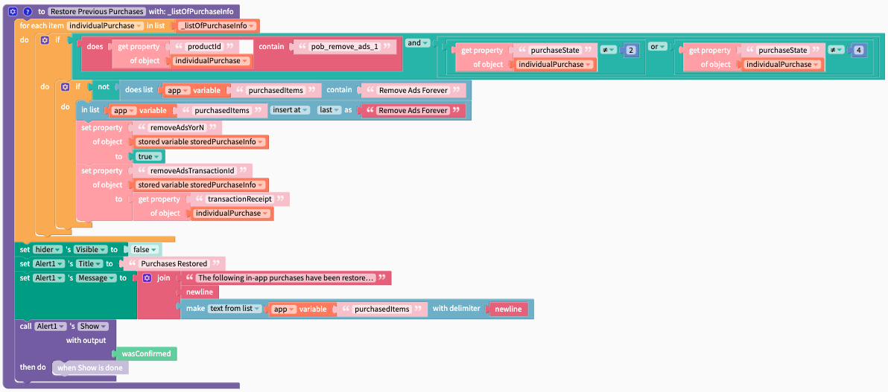
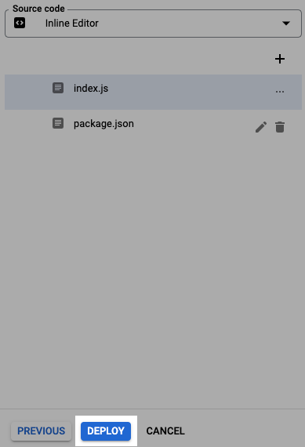

# iOS Code

These codes will allow you to acknowledge and verify purchases or subscriptions. There is 1 call for each type of transaction.&#x20;

### 1. To get started, go to[ console.google.cloud.com/functions](https://console.cloud.google.com/functions/list)

### 2. Click Create Function

<figure><figcaption></figcaption></figure>

### 3. Give your new function  a meaningful name

**verifyiOSPurchase** should be the name you use here

<figure><figcaption></figcaption></figure>

### 4. Save the trigger type

<div>


 

<figure><figcaption></figcaption></figure>

</div>

### 5. Copy the code below and click the blue "next" button

<details>

<summary>Copy Me</summary>


```
  const axios = require("axios");
  const functions = require("firebase-functions");
  const admin = require("firebase-admin");
  admin.initializeApp();
  
exports.verifyiOSPurchase = functions.https.onRequest((req, res) => {


  const {transactionID, testing, password} = req.body;
  const url = testing ? "https://sandbox.itunes.apple.com/verifyReceipt" : "https://buy.itunes.apple.com/verifyReceipt";
  functions.logger.info(`Verifying iOS purchase with transactionID: ${transactionID}\nTesting is occuring: ${testing} for user ${userID}`);

  const data = JSON.stringify({
    "receipt-data": transactionID,
    "password": password,
    "exclude-old-transactions": true,
  });

  const config = {
    method: "post",
    url: url,
    headers: {
      "Content-Type": "application/json",
    },
    data: data,
  };

  axios(config)
      .then(function(response) {
        res.json(response.data).status(200);
      })
      .catch(function(error) {
        functions.logger.log(error);
        res.send(error).status(500);
      });
});
```



</details>

<figure><figcaption></figcaption></figure>

### 6. Clear the default and paste the copied code into the code



### 7. Update the package.json file

<details>

<summary>copy and paste this over  the default code</summary>

```
{
  "name": "sample-http",
  "version": "0.0.1",
  "dependencies": {
     "axios": "^0.26.0",
     "firebase-functions": "^3.18.0",
     "firebase-admin": "^10.0.2"
   }
}

```

</details>



### 8. Set the name of the functions entry point

the name used here should match the name used in **Step 3** above

<figure><figcaption></figcaption></figure>

### 9. Deploy the function

<figure><figcaption></figcaption></figure>

### 10. Set function invocation privacy permissions

This allows any device with your endpoint URL the ability to verify purchases made via your app

1. Go to [https://console.cloud.google.com/functions/list](https://console.cloud.google.com/functions/list)
2. Select the function you want to make public. (the function you just created)
3. Click the **Permissions** tab.
4. Click **Add Principle**
5. In the **Add members** field, type `allUsers`
6. Select the **Cloud Function Invoker** role from the **Select a role** drop-down menu.
7. Click **Add**.
