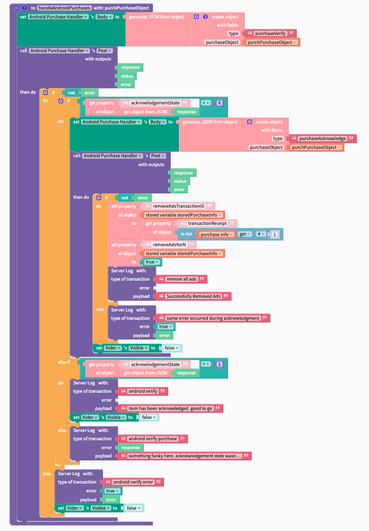

# Verify and Acknowledge Android Purchases and Subscription

For Android, when a user initiates a transaction, it must be completed by first verifying then acknowledging the purchase. Once you've verified the purchase, your app is ready to grant the purchased item or subscription to the user. After granting entitlement, your app must then acknowledge the purchase. This acknowledgement **communicates to Google Play that you have granted entitlement for the purchase and completes the transaction. If you fail to complete this acknowledgement step your subscriptions will revert in a period of 3 days from the time of purchase.** \
****\
****The verification process can also be used to confirm that a users subscription status or purchase is still valid.


This is not the most efficient method and we want to acknowledge this. We will be continuing to update the docs as we produce more concrete examples. We also wanted to get something solid into your hands now. Look for updates soon! \
\
The ideal way to maintain purchase status's will be completed using server side actions and maintaining a list of purchases and their status in a database that your users can access vs calling out to the verification endpoint for each subscription/purchase to be verified. \
\
i.e. You can keep things up to date in real time without making a bunch of API calls to the Google Play Store


### You must send a purchase/subscription to the appropriate endpoint to complete the transactions and verify the sale.&#x20;

For this reason, we have simplified the process by creating 2 separate endpoints for Android. See how to find those [below](verify-and-acknowledge-android-purchases-and-subscription.md#the-purchase-or-subscription-api-endpoint-urls)

<details>

<summary>Get the code to handle subscriptions</summary>

```
///subscription handler

const functions = require("firebase-functions");
const admin = require("firebase-admin");
const googleServiceAccountKey = require("./serviceAccount.json");
admin.initializeApp({
  credential: admin.credential.cert(googleServiceAccountKey),
});
const {google} = require("googleapis");
const axios = require("axios");

exports.androidSubscriptionHandler = functions.https.onRequest((request, response) => {

  // caputre the data from the request
  const {purchaseObject, type} = request.body;
  functions.logger.info("trying to handle " + type + " for the follow purchaseObject");
  functions.logger.info(JSON.stringify(purchaseObject));
  // get the token and subscription id from the request
  const purchaseToken = purchaseObject.purchaseToken;
  const subscriptionID = purchaseObject.productId;
  // set your package id
  const packageID = "edu.fit.my.jgibb2018.pob";

  const returnTheResponse = (data) => {
    functions.logger.log("returning the response" + JSON.stringify(data));
    response.status(200).send(data);
  };

  const acknowledgeSubscription = (err, tokens) => {
    functions.logger.info(`
    Attempting to acknowledge subscription ${subscriptionID}\n
    your access token for a manual retry ${tokens.access_token}\n
    your purchase object ${JSON.stringify(purchaseObject)}\n\n
    `);

    const config = {
      method: "post",
      url: `https://androidpublisher.googleapis.com/androidpublisher/v3/applications/${packageID}/purchases/subscriptions/${subscriptionID}/tokens/${purchaseToken}:acknowledge`,
      headers: {
        "Authorization": `Bearer ${tokens.access_token}`,
      },
    };
    functions.logger.info("acknowledge config" + JSON.stringify(config));
    axios(config)
        .then(function(r) {
          returnTheResponse("Your transaction has been completed");
        })
        .catch(function(e) {
          functions.logger.warn("an error occured while acknowledging the subscription");

          functions.logger.error(JSON.stringify({error: e}));

          returnTheResponse({error: e.data, status: e.status, message: e.message});
        });
  };

  const verifySubscription = (err, tokens) => {
    functions.logger.info("verify function");
    const config = {
      method: "get",
      url: `https://androidpublisher.googleapis.com/androidpublisher/v3/applications/${packageID}/purchases/subscriptions/${subscriptionID}/tokens/${purchaseToken}`,
      headers: {
        "Authorization": `Bearer ${tokens.access_token}`,
      },
    };
    functions.logger.info(config.url);
    axios(config)
        .then(function(r) {
          functions.logger.info("verify success" + JSON.stringify(r.data));
          returnTheResponse(r.data);
        })
        .catch(function(e) {
          returnTheResponse(JSON.stringify({error: e.data, status: e.status, message: e.message}));
        });
  };

  const getAccessToken = () => {
    const jwtClient = new google.auth.JWT(
        googleServiceAccountKey.client_email,
        null,
        googleServiceAccountKey.private_key,
        ["https://www.googleapis.com/auth/androidpublisher"],
        null,
    );
    try {
      if (type == "subscriptionAcknowledge") {
        jwtClient.authorize(acknowledgeSubscription);
      } else if (type == "subscriptionVerify") {
        jwtClient.authorize(verifySubscription);
      }
    } catch (error) {
      functions.logger.error(error);
      response.status(500).send("issue getting getting auth", JSON.stringify(error));
    }
  };

  getAccessToken();
  });
```


</details>

<details>

<summary>Get the code to handle purchases</summary>

```
///purchase handler
const functions = require("firebase-functions");
const admin = require("firebase-admin");
const googleServiceAccountKey = require("./serviceAccount.json");
admin.initializeApp({
  credential: admin.credential.cert(googleServiceAccountKey),
});
const {google} = require("googleapis");
const axios = require("axios");

exports.androidPurchaseHandler = functions.https.onRequest((request, response) => {
 
  const {purchaseObject, type} = request.body;
  // get the token and product id from the request
  const purchaseToken = purchaseObject.purchaseToken;
  const productId = purchaseObject.productId;
  functions.logger.info(`trying to handle ${type} for the follow ${JSON.stringify(purchaseObject)}`);
  // set your package id
  const packageID = "edu.fit.my.jgibb2018.pob";

  const returnTheResponse = (data) => {
    response.status(200).send(data);
  };

  const acknowledgePurchase = (err, tokens) => {
    functions.logger.info("acknowledging purchase");
    const config = {
      method: "post",
      url: `https://androidpublisher.googleapis.com/androidpublisher/v3/applications/${packageID}/purchases/products/${productId}/tokens/${purchaseToken}:acknowledge`,
      headers: {
        "Authorization": `Bearer ${tokens.access_token}`,
      },
    };

    axios(config)
        .then(function(r) {
          functions.logger.info("acknowledge success. returning ", JSON.stringify(r.data));

          returnTheResponse(r.data);
        })
        .catch(function(e) {
          returnTheResponse(JSON.stringify({error: e.data, status: e.status, message: e.message}));
        });
  };

  const verifyPurchase = (err, tokens) => {
    functions.logger.info("verifying purchase");
    const config = {
      method: "get",
      url: `https://androidpublisher.googleapis.com/androidpublisher/v3/applications/${packageID}/purchases/products/${productId}/tokens/${purchaseToken}`,
      headers: {
        "Authorization": `Bearer ${tokens.access_token}`,
      },
    };

    axios(config)
        .then(function(r) {
          functions.logger.info("verify success. returning ", JSON.stringify(r.data));
          returnTheResponse(r.data);
        })
        .catch(function(e) {
          returnTheResponse(JSON.stringify({error: e.data, status: e.status, message: e.message}));
        });
  };

  const getAccessToken = () => {
    const jwtClient = new google.auth.JWT(
        googleServiceAccountKey.client_email,
        null,
        googleServiceAccountKey.private_key,
        ["https://www.googleapis.com/auth/androidpublisher"],
        null,
    );
    try {
      functions.logger.info("type is ", type);
      if (type == "purchaseAcknowledge") {
        jwtClient.authorize(acknowledgePurchase);
      } else {
        jwtClient.authorize(verifyPurchase);
      }
    } catch (error) {
      functions.logger.log(error);
      response.status(500).send("getting auth", error);
    }
  };

  getAccessToken();
});


```

</details>

Notice that the blocks are almost similar for these two. Thats because the response is handled the same way. We broke up the API calls in the code into "Subscription" and "One-Time Purchase" as they technically call different API's.&#x20;

<figure><figcaption></figcaption></figure>

<figure><figcaption></figcaption></figure>

## The Purchase or Subscription API Endpoint URLs&#x20;

If you followed the directions for [Android Subscriptions Code](host-your-server-side-verification-code-on-firebase/setup-your-cloud-environment/android-subscriptions-code.md) or [Android Purchases Codes](host-your-server-side-verification-code-on-firebase/setup-your-cloud-environment/android-purchases-code.md) you will have a trigger URL.&#x20;

Find the trigger URL by going to your [function list](https://console.cloud.google.com/functions/list) and selecting the purchase or  subscription function&#x20;

Then click the trigger Tab and notice the included URL.&#x20;

<figure><figcaption></figcaption></figure>

you will copy this url then go back into your Thunkable projects to the blocks page and create a new [web api](https://docs.thunkable.com/v/drag-and-drop/web-api)

Copy in the URL and add a header as shown in the image below

<figure><figcaption></figcaption></figure>

**Note:** \
in the above example, there are several references to "server logs." this is nothing more than saving data to firebase in order to see logs in a different manner. \
\
Error logging should occur during testing to allow for easier debugging.&#x20;
