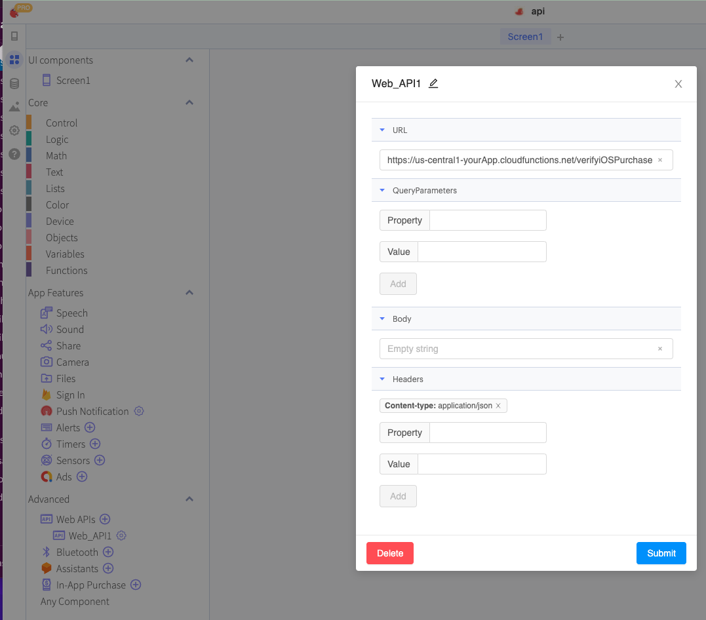

# Verify iOS Purchases

## Verify Transaction and Purchase Status - iOS

When you complete a purchase, a transaction ID is returned in the green blocks. This value should be kept in a [stored](../variables.md#stored-variables) or [cloud](../variables.md#cloud-variables) variable so that you can quickly verify specific purchases or that subscriptions are still valid at the device or user level. This helps ensure users are not able to trick your app into believing a purchase has been made when it has not. These values are also used to verify ongoing subscriptions for users and when restoring purchases to verify that all purchases returned by the server are valid still.&#x20;

<details>

<summary>Learn more about the data this API call returns</summary>

#### These blocks require the use of a custom backend server. We will provide you with code that can be used in a Firebase Cloud Function

The following is an actual example response returned when verifying an iOS transaction

```
{
    "environment": "Sandbox", // or "Live" dependinig on the environment
    "receipt": {
        "receipt_type": "ProductionSandbox",
        "adam_id": 0,
        "app_item_id": 0,
        "bundle_id": "your.app.bundle.id",
        "application_version": "202222633",
        "download_id": 0,
        "version_external_identifier": 0,
        "receipt_creation_date": "2022-03-02 14:58:18 Etc/GMT",
        "receipt_creation_date_ms": "1646233098000",
        "receipt_creation_date_pst": "2022-03-02 06:58:18 America/Los_Angeles",
        "request_date": "2022-03-02 16:53:21 Etc/GMT",
        "request_date_ms": "1646240001293",
        "request_date_pst": "2022-03-02 08:53:21 America/Los_Angeles",
        "original_purchase_date": "2013-08-01 07:00:00 Etc/GMT",
        "original_purchase_date_ms": "1375340400000",
        "original_purchase_date_pst": "2013-08-01 00:00:00 America/Los_Angeles",
        "original_application_version": "1.0",
        "in_app": [
            {
                "quantity": "1",
                "product_id": "renewable1",
                "transaction_id": "2000000002016325",
                "original_transaction_id": "2000000002016325",
                "purchase_date": "2022-03-01 22:33:43 Etc/GMT",
                "purchase_date_ms": "1646174023000",
                "purchase_date_pst": "2022-03-01 14:33:43 America/Los_Angeles",
                "original_purchase_date": "2022-03-01 22:33:44 Etc/GMT",
                "original_purchase_date_ms": "1646174024000",
                "original_purchase_date_pst": "2022-03-01 14:33:44 America/Los_Angeles",
                "expires_date": "2022-03-01 22:36:43 Etc/GMT",
                "expires_date_ms": "1646174203000",
                "expires_date_pst": "2022-03-01 14:36:43 America/Los_Angeles",
                "web_order_line_item_id": "2000000000151757",
                "is_trial_period": "false",
                "is_in_intro_offer_period": "false",
                "in_app_ownership_type": "PURCHASED"
            },
            {
                "quantity": "1",
                "product_id": "renewable1",
                "transaction_id": "2000000002016633",
                "original_transaction_id": "2000000002016325",
                "purchase_date": "2022-03-01 22:36:43 Etc/GMT",
                "purchase_date_ms": "1646174203000",
                "purchase_date_pst": "2022-03-01 14:36:43 America/Los_Angeles",
                "original_purchase_date": "2022-03-01 22:33:44 Etc/GMT",
                "original_purchase_date_ms": "1646174024000",
                "original_purchase_date_pst": "2022-03-01 14:33:44 America/Los_Angeles",
                "expires_date": "2022-03-01 22:39:43 Etc/GMT",
                "expires_date_ms": "1646174383000",
                "expires_date_pst": "2022-03-01 14:39:43 America/Los_Angeles",
                "web_order_line_item_id": "2000000000151758",
                "is_trial_period": "false",
                "is_in_intro_offer_period": "false",
                "in_app_ownership_type": "PURCHASED"
            },
            {
                "quantity": "1",
                "product_id": "renewable1",
                "transaction_id": "2000000002018422",
                "original_transaction_id": "2000000002016325",
                "purchase_date": "2022-03-01 22:39:43 Etc/GMT",
                "purchase_date_ms": "1646174383000",
                "purchase_date_pst": "2022-03-01 14:39:43 America/Los_Angeles",
                "original_purchase_date": "2022-03-01 22:33:44 Etc/GMT",
                "original_purchase_date_ms": "1646174024000",
                "original_purchase_date_pst": "2022-03-01 14:33:44 America/Los_Angeles",
                "expires_date": "2022-03-01 22:42:43 Etc/GMT",
                "expires_date_ms": "1646174563000",
                "expires_date_pst": "2022-03-01 14:42:43 America/Los_Angeles",
                "web_order_line_item_id": "2000000000151839",
                "is_trial_period": "false",
                "is_in_intro_offer_period": "false",
                "in_app_ownership_type": "PURCHASED"
            },
            {
                "quantity": "1",
                "product_id": "renewable1",
                "transaction_id": "2000000002019810",
                "original_transaction_id": "2000000002016325",
                "purchase_date": "2022-03-01 22:42:43 Etc/GMT",
                "purchase_date_ms": "1646174563000",
                "purchase_date_pst": "2022-03-01 14:42:43 America/Los_Angeles",
                "original_purchase_date": "2022-03-01 22:33:44 Etc/GMT",
                "original_purchase_date_ms": "1646174024000",
                "original_purchase_date_pst": "2022-03-01 14:33:44 America/Los_Angeles",
                "expires_date": "2022-03-01 22:45:43 Etc/GMT",
                "expires_date_ms": "1646174743000",
                "expires_date_pst": "2022-03-01 14:45:43 America/Los_Angeles",
                "web_order_line_item_id": "2000000000151915",
                "is_trial_period": "false",
                "is_in_intro_offer_period": "false",
                "in_app_ownership_type": "PURCHASED"
            },
        ]
    },
    "latest_receipt_info": [
        {
            "quantity": "1",
            "product_id": "renewable1",
            "transaction_id": "2000000002649126",
            "original_transaction_id": "2000000002016325",
            "purchase_date": "2022-03-02 14:58:15 Etc/GMT",
            "purchase_date_ms": "1646233095000",
            "purchase_date_pst": "2022-03-02 06:58:15 America/Los_Angeles",
            "original_purchase_date": "2022-03-01 22:33:44 Etc/GMT",
            "original_purchase_date_ms": "1646174024000",
            "original_purchase_date_pst": "2022-03-01 14:33:44 America/Los_Angeles",
            "expires_date": "2022-03-02 15:01:15 Etc/GMT",
            "expires_date_ms": "1646233275000",
            "expires_date_pst": "2022-03-02 07:01:15 America/Los_Angeles",
            "web_order_line_item_id": "2000000000195219",
            "is_trial_period": "false",
            "is_in_intro_offer_period": "false",
            "in_app_ownership_type": "PURCHASED",
            "subscription_group_identifier": "20930601"
        }
    ],
    "latest_receipt": "MIIT+gYJKoZIhvcNAQcCoIIT6zCCE+cCAQExCzAJBgUrDgMCGgUAMIIDmwYJKoZIhvcNAQcBoIIDjASCA4gxggOEMAoCAQgCAQEEAhYAMAoCARQCAQEEAgwAMAsCAQECAQEEAwIBADALAgELAgEBBAMCAQAwCwIBDwIBAQQDAgEAMAsCARACAQEEAwIBADALAgEZAgEBBAMCAQMwDAIBCgIBAQQEFgI0KzAMAgEOAgEBBAQCAgDLMA0CAQ0CAQEEBQIDAksdMA0CARMCAQEEBQwDMS4wMA4CAQkCAQEEBgIEUDI1NjATAgEDAgEBBAsMCTIwMjIyMjYzMzAYAgEEAgECBBBMbrXcx9ombJk6Fl7R2xg+MBsCAQACAQEEEwwRUHJvZHVjdGlvblNhbmRib3gwHAIBBQIBAQQU14v08KDKU0h++W+ymMFYwcNBC3UwHgIBDAIBAQQWFhQyMDIyLTAzLTAyVDE2OjUzOjIxWjAeAgESAgEBBBYWFDIwMTMtMDgtMDFUMDc6MDA6MDBaMCICAQICAQEEGgwYZWR1LmZpdC5teS5qZ2liYjIwMTgucG9iMDoCAQcCAQEEMk5z5sPAXbR4PMOWsGUqzkVhNK244+XT2PeQG3V4t1iSDIIEQfZrq+C0BGYPSgTO7bypMEwCAQYCAQEERDTi+K8HkNc5qUTv1cdBAVIJ53EXZwzQe1KQXx3lljvlvJGVivfffHV1qolnSVxYAXrDjvlgf/98EFb2Ir1mSS0fJ5uvMIIBhQIBEQIBAQSCAXsxggF3MAsCAgatAgEBBAIMADALAgIGsAIBAQQCFgAwCwICBrICAQEEAgwAMAsCAgazAgEBBAIMADALAgIGtAIBAQQCDAAwCwICBrUCAQEEAgwAMAsCAga2AgEBBAIMADAMAgIGpQIBAQQDAgEBMAwCAgarAgEBBAMCAQMwDAICBq4CAQEEAwIBADAMAgIGsQIBAQQDAgEAMAwCAga3AgEBBAMCAQAwDAICBroCAQEEAwIBADASAgIGrwIBAQQJAgcHGv1Jj/qTMBUCAgamAgEBBAwMCnJlbmV3YWJsZTEwGwICBqcCAQEEEgwQMjAwMDAwMDAwMjY0OTEyNjAbAgIGqQIBAQQSDBAyMDAwMDAwMDAyMDE2MzI1MB8CAgaoAgEBBBYWFDIwMjItMDMtMDJUMTQ6NTg6MTVaMB8CAgaqAgEBBBYWFDIwMjItMDMtMDFUMjI6MzM6NDRaMB8CAgasAgEBBBYWFDIwMjItMDMtMDJUMTU6MDE6MTVaoIIOZTCCBXwwggRkoAMCAQICCA7rV4fnngmNMA0GCSqGSIb3DQEBBQUAMIGWMQswCQYDVQQGEwJVUzETMBEGA1UECgwKQXBwbGUgSW5jLjEsMCoGA1UECwwjQXBwbGUgV29ybGR3aWRlIERldmVsb3BlciBSZWxhdGlvbnMxRDBCBgNVBAMMO0FwcGxlIFdvcmxkd2lkZSBEZXZlbG9wZXIgUmVsYXRpb25zIENlcnRpZmljYXRpb24gQXV0aG9yaXR5MB4XDTE1MTExMzAyMTUwOVoXDTIzMDIwNzIxNDg0N1owgYkxNzA1BgNVBAMMLk1hYyBBcHAgU3RvcmUgYW5kIGlUdW5lcyBTdG9yZSBSZWNlaXB0IFNpZ25pbmcxLDAqBgNVBAsMI0FwcGxlIFdvcmxkd2lkZSBEZXZlbG9wZXIgUmVsYXRpb25zMRMwEQYDVQQKDApBcHBsZSBJbmMuMQswCQYDVQQGEwJVUzCCASIwDQYJKoZIhvcNAQEBBQADggEPADCCAQoCggEBAKXPgf0looFb1oftI9ozHI7iI8ClxCbLPcaf7EoNVYb/pALXl8o5VG19f7JUGJ3ELFJxjmR7gs6JuknWCOW0iHHPP1tGLsbEHbgDqViiBD4heNXbt9COEo2DTFsqaDeTwvK9HsTSoQxKWFKrEuPt3R+YFZA1LcLMEsqNSIH3WHhUa+iMMTYfSgYMR1TzN5C4spKJfV+khUrhwJzguqS7gpdj9CuTwf0+b8rB9Typj1IawCUKdg7e/pn+/8Jr9VterHNRSQhWicxDkMyOgQLQoJe2XLGhaWmHkBBoJiY5uB0Qc7AKXcVz0N92O9gt2Yge4+wHz+KO0NP6JlWB7+IDSSMCAwEAAaOCAdcwggHTMD8GCCsGAQUFBwEBBDMwMTAvBggrBgEFBQcwAYYjaHR0cDovL29jc3AuYXBwbGUuY29tL29jc3AwMy13d2RyMDQwHQYDVR0OBBYEFJGknPzEdrefoIr0TfWPNl3tKwSFMAwGA1UdEwEB/wQCMAAwHwYDVR0jBBgwFoAUiCcXCam2GGCL7Ou69kdZxVJUo7cwggEeBgNVHSAEggEVMIIBETCCAQ0GCiqGSIb3Y2QFBgEwgf4wgcMGCCsGAQUFBwICMIG2DIGzUmVsaWFuY2Ugb24gdGhpcyBjZXJ0aWZpY2F0ZSBieSBhbnkgcGFydHkgYXNzdW1lcyBhY2NlcHRhbmNlIG9mIHRoZSB0aGVuIGFwcGxpY2FibGUgc3RhbmRhcmQgdGVybXMgYW5kIGNvbmRpdGlvbnMgb2YgdXNlLCBjZXJ0aWZpY2F0ZSBwb2xpY3kgYW5kIGNlcnRpZmljYXRpb24gcHJhY3RpY2Ugc3RhdGVtZW50cy4wNgYIKwYBBQUHAgEWKmh0dHA6Ly93d3cuYXBwbGUuY29tL2NlcnRpZmljYXRlYXV0aG9yaXR5LzAOBgNVHQ8BAf8EBAMCB4AwEAYKKoZIhvdjZAYLAQQCBQAwDQYJKoZIhvcNAQEFBQADggEBAA2mG9MuPeNbKwduQpZs0+iMQzCCX+Bc0Y2+vQ+9GvwlktuMhcOAWd/j4tcuBRSsDdu2uP78NS58y60Xa45/H+R3ubFnlbQTXqYZhnb4WiCV52OMD3P86O3GH66Z+GVIXKDgKDrAEDctuaAEOR9zucgF/fLefxoqKm4rAfygIFzZ630npjP49ZjgvkTbsUxn/G4KT8niBqjSl/OnjmtRolqEdWXRFgRi48Ff9Qipz2jZkgDJwYyz+I0AZLpYYMB8r491ymm5WyrWHWhumEL1TKc3GZvMOxx6GUPzo22/SGAGDDaSK+zeGLUR2i0j0I78oGmcFxuegHs5R0UwYS/HE6gwggQiMIIDCqADAgECAggB3rzEOW2gEDANBgkqhkiG9w0BAQUFADBiMQswCQYDVQQGEwJVUzETMBEGA1UEChMKQXBwbGUgSW5jLjEmMCQGA1UECxMdQXBwbGUgQ2VydGlmaWNhdGlvbiBBdXRob3JpdHkxFjAUBgNVBAMTDUFwcGxlIFJvb3QgQ0EwHhcNMTMwMjA3MjE0ODQ3WhcNMjMwMjA3MjE0ODQ3WjCBljELMAkGA1UEBhMCVVMxEzARBgNVBAoMCkFwcGxlIEluYy4xLDAqBgNVBAsMI0FwcGxlIFdvcmxkd2lkZSBEZXZlbG9wZXIgUmVsYXRpb25zMUQwQgYDVQQDDDtBcHBsZSBXb3JsZHdpZGUgRGV2ZWxvcGVyIFJlbGF0aW9ucyBDZXJ0aWZpY2F0aW9uIEF1dGhvcml0eTCCASIwDQYJKoZIhvcNAQEBBQADggEPADCCAQoCggEBAMo4VKbLVqrIJDlI6Yzu7F+4fyaRvDRTes58Y4Bhd2RepQcjtjn+UC0VVlhwLX7EbsFKhT4v8N6EGqFXya97GP9q+hUSSRUIGayq2yoy7ZZjaFIVPYyK7L9rGJXgA6wBfZcFZ84OhZU3au0Jtq5nzVFkn8Zc0bxXbmc1gHY2pIeBbjiP2CsVTnsl2Fq/ToPBjdKT1RpxtWCcnTNOVfkSWAyGuBYNweV3RY1QSLorLeSUheHoxJ3GaKWwo/xnfnC6AllLd0KRObn1zeFM78A7SIym5SFd/Wpqu6cWNWDS5q3zRinJ6MOL6XnAamFnFbLw/eVovGJfbs+Z3e8bY/6SZasCAwEAAaOBpjCBozAdBgNVHQ4EFgQUiCcXCam2GGCL7Ou69kdZxVJUo7cwDwYDVR0TAQH/BAUwAwEB/zAfBgNVHSMEGDAWgBQr0GlHlHYJ/vRrjS5ApvdHTX8IXjAuBgNVHR8EJzAlMCOgIaAfhh1odHRwOi8vY3JsLmFwcGxlLmNvbS9yb290LmNybDAOBgNVHQ8BAf8EBAMCAYYwEAYKKoZIhvdjZAYCAQQCBQAwDQYJKoZIhvcNAQEFBQADggEBAE/P71m+LPWybC+P7hOHMugFNahui33JaQy52Re8dyzUZ+L9mm06WVzfgwG9sq4qYXKxr83DRTCPo4MNzh1HtPGTiqN0m6TDmHKHOz6vRQuSVLkyu5AYU2sKThC22R1QbCGAColOV4xrWzw9pv3e9w0jHQtKJoc/upGSTKQZEhltV/V6WId7aIrkhoxK6+JJFKql3VUAqa67SzCu4aCxvCmA5gl35b40ogHKf9ziCuY7uLvsumKV8wVjQYLNDzsdTJWk26v5yZXpT+RN5yaZgem8+bQp0gF6ZuEujPYhisX4eOGBrr/TkJ2prfOv/TgalmcwHFGlXOxxioK0bA8MFR8wggS7MIIDo6ADAgECAgECMA0GCSqGSIb3DQEBBQUAMGIxCzAJBgNVBAYTAlVTMRMwEQYDVQQKEwpBcHBsZSBJbmMuMSYwJAYDVQQLEx1BcHBsZSBDZXJ0aWZpY2F0aW9uIEF1dGhvcml0eTEWMBQGA1UEAxMNQXBwbGUgUm9vdCBDQTAeFw0wNjA0MjUyMTQwMzZaFw0zNTAyMDkyMTQwMzZaMGIxCzAJBgNVBAYTAlVTMRMwEQYDVQQKEwpBcHBsZSBJbmMuMSYwJAYDVQQLEx1BcHBsZSBDZXJ0aWZpY2F0aW9uIEF1dGhvcml0eTEWMBQGA1UEAxMNQXBwbGUgUm9vdCBDQTCCASIwDQYJKoZIhvcNAQEBBQADggEPADCCAQoCggEBAOSRqQkfkdseR1DrBe1eeYQt6zaiV0xV7IsZid75S2z1B6siMALoGD74UAnTf0GomPnRymacJGsR0KO75Bsqwx+VnnoMpEeLW9QWNzPLxA9NzhRp0ckZcvVdDtV/X5vyJQO6VY9NXQ3xZDUjFUsVWR2zlPf2nJ7PULrBWFBnjwi0IPfLrCwgb3C2PwEwjLdDzw+dPfMrSSgayP7OtbkO2V4c1ss9tTqt9A8OAJILsSEWLnTVPA3bYharo3GSR1NVwa8vQbP4++NwzeajTEV+H0xrUJZBicR0YgsQg0GHM4qBsTBY7FoEMoxos48d3mVz/2deZbxJ2HafMxRloXeUyS0CAwEAAaOCAXowggF2MA4GA1UdDwEB/wQEAwIBBjAPBgNVHRMBAf8EBTADAQH/MB0GA1UdDgQWBBQr0GlHlHYJ/vRrjS5ApvdHTX8IXjAfBgNVHSMEGDAWgBQr0GlHlHYJ/vRrjS5ApvdHTX8IXjCCAREGA1UdIASCAQgwggEEMIIBAAYJKoZIhvdjZAUBMIHyMCoGCCsGAQUFBwIBFh5odHRwczovL3d3dy5hcHBsZS5jb20vYXBwbGVjYS8wgcMGCCsGAQUFBwICMIG2GoGzUmVsaWFuY2Ugb24gdGhpcyBjZXJ0aWZpY2F0ZSBieSBhbnkgcGFydHkgYXNzdW1lcyBhY2NlcHRhbmNlIG9mIHRoZSB0aGVuIGFwcGxpY2FibGUgc3RhbmRhcmQgdGVybXMgYW5kIGNvbmRpdGlvbnMgb2YgdXNlLCBjZXJ0aWZpY2F0ZSBwb2xpY3kgYW5kIGNlcnRpZmljYXRpb24gcHJhY3RpY2Ugc3RhdGVtZW50cy4wDQYJKoZIhvcNAQEFBQADggEBAFw2mUwteLftjJvc83eb8nbSdzBPwR+Fg4UbmT1HN/Kpm0COLNSxkBLYvvRzm+7SZA/LeU802KI++Xj/a8gH7H05g4tTINM4xLG/mk8Ka/8r/FmnBQl8F0BWER5007eLIztHo9VvJOLr0bdw3w9F4SfK8W147ee1Fxeo3H4iNcol1dkP1mvUoiQjEfehrI9zgWDGG1sJL5Ky+ERI8GA4nhX1PSZnIIozavcNgs/e66Mv+VNqW2TAYzN39zoHLFbr2g8hDtq6cxlPtdk2f8GHVdmnmbkyQvvY1XGefqFStxu9k0IkEirHDx22TZxeY8hLgBdQqorV2uT80AkHN7B1dSExggHLMIIBxwIBATCBozCBljELMAkGA1UEBhMCVVMxEzARBgNVBAoMCkFwcGxlIEluYy4xLDAqBgNVBAsMI0FwcGxlIFdvcmxkd2lkZSBEZXZlbG9wZXIgUmVsYXRpb25zMUQwQgYDVQQDDDtBcHBsZSBXb3JsZHdpZGUgRGV2ZWxvcGVyIFJlbGF0aW9ucyBDZXJ0aWZpY2F0aW9uIEF1dGhvcml0eQIIDutXh+eeCY0wCQYFKw4DAhoFADANBgkqhkiG9w0BAQEFAASCAQCifT0RqwHaTbqIAg9AZJhRvPZyfHTCrHU4DhkhPN7954zz4Zh86xA6KIHMoqvxhb7kIK3r4YPOK44HYOSnayKz7vV7YA45BcfIYY97AfDbvh4PZWa+wIljMs1MiZk7jdEqOikS0fzK7mQqDzkXT2aljBOPEUlIxbEGlW0m8lJXCregFxU3w4dZKo5UGSEgIKQFlwvqfTHu4iQP/2WqtG5t4U0Sxh+isZfvj3jd38WQZq+6F0VXK4NOBfSdvYmSFijJ+StBE7LU0PPENEJkgD8C11iIWCeKsxB73rMj9p2wbvFK6AKDSf6RtlUKKxtz3GGsfO+qp7XbORlslhX1Mqym",
    "pending_renewal_info": [
        {
            "expiration_intent": "1",
            "auto_renew_product_id": "renewable1",
            "is_in_billing_retry_period": "0",
            "product_id": "renewable1",
            "original_transaction_id": "2000000002016325",
            "auto_renew_status": "0"
        }
    ],
    "status": 0
}
```

</details>

<details>

<summary>See a code example that runs in the cloud</summary>

Using Firebase Functions, you can use the following code to setup a verification process for iOS purchases. \
\
If you need to set up your Firebase/Google Cloud environment, click here

```
  const axios = require("axios");
  const functions = require("firebase-functions");
  const admin = require("firebase-admin");
  admin.initializeApp();
  
exports.verifyiOSPurchase = functions.https.onRequest((req, res) => {


  const {transactionID, testing, password} = req.body;
  const url = testing ? "https://sandbox.itunes.apple.com/verifyReceipt" : "https://buy.itunes.apple.com/verifyReceipt";
  functions.logger.info(`Verifying iOS purchase with transactionID: ${transactionID}\nTesting is occuring: ${testing} for user ${userID}`);

  const data = JSON.stringify({
    "receipt-data": transactionID,
    "password": password,
    "exclude-old-transactions": true,
  });

  const config = {
    method: "post",
    url: url,
    headers: {
      "Content-Type": "application/json",
    },
    data: data,
  };

  axios(config)
      .then(function(response) {
        res.json(response.data).status(200);
      })
      .catch(function(error) {
        functions.logger.log(error);
        res.send(error).status(500);
      });
});
```

</details>

<figure><figcaption></figcaption></figure>

## The Verify API Endpoint URL&#x20;

If you followed the directions for iOS Code [here](broken-reference) you will have ended up with a trigger url.&#x20;

find the trigger URL by going to your [function list](https://console.cloud.google.com/functions/list) and selecting the iOS Verify function.&#x20;

then click the trigger Tab and notice the included url.&#x20;

<figure><figcaption></figcaption></figure>

you will copy this url then go back into your Thunkable projects to the blocks page and create a new [web api](https://docs.thunkable.com/v/drag-and-drop/web-api)

Copy in the URL and add a header as shown in the image below

<figure><figcaption></figcaption></figure>

**Note:** \
in the above example, there are several references to <mark style="background-color:purple;">"</mark>[<mark style="background-color:purple;">server log</mark>](broken-reference)<mark style="background-color:purple;">s"</mark>. this is nothing more than saving data to firebase in order to see logs in a different manner. \
\
Error logging should occur during testing to allow for easier debugging. \
