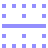
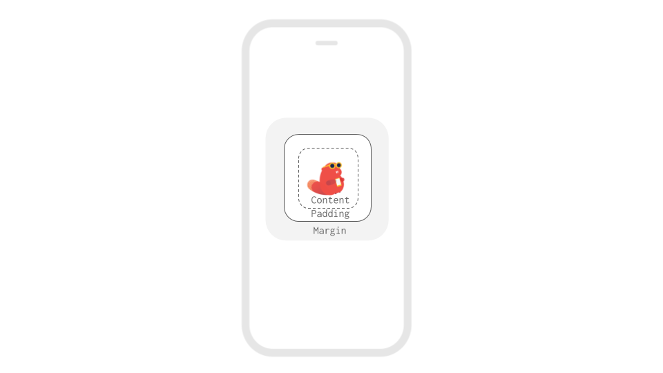

# Intro to Spacing

Since mobile phones and tablets are made in all different shapes and sizes, it's not possible to simply drag and drop elements on a screen so that they are positioned on a screen like you would in a Google Slides document, which is set to a fixed height and width.

To position elements of an app in Thunkable, you'll have to manage the spacing between elements with a few powerful properties. You will also find some helpful examples in the [sample apps](sample-apps.md) section.

* [Spacing within a Screen, Row or Column](intro-to-spacing.md#spacing-within-a-screen-row-or-column)
* [Spacing around Visible Components within a Screen, Row or Column](intro-to-spacing.md#spacing-around-visible-components-within-a-screen-row-or-column)

## Spacing within a Screen, Row or Column

You can space elements within a Screen, Row or Column using two powerful properties:`Horizontal Alignment` and `Vertical Alignment`.

`Horizontal Alignment` in a Screen, Row or Column

`Vertical Alignment` in a Screen, Row or Column

## Spacing around Visible Components within a Screen, Row or Column

To create space around a visible component like an Image, you can use the `margin` and `padding` that are found in the Advanced section of the component properties. In most cases, you can add a margin OR padding to create space around an element -- they are interchangeable and can be set both in pixels and percent of the height or width. The fastest way to see what makes the most sense is to [live test](get-started/live-test.md) on your phone.

