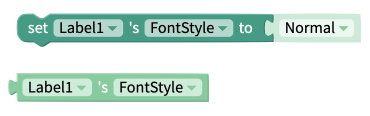
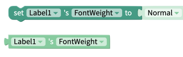
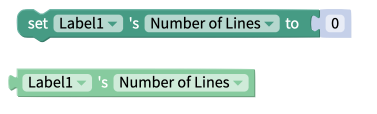
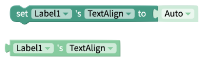

# Label


The Label component currently has centering issues on larger screens, such as tablets or computer screens.   
If this behavior is affecting your project, we recommend displaying your text on a [Button](button.md), which can be styled to look like a Label.


## Style the Label

You can customize your label using the following properties: 

### Properties

* **Text:** Text that appears on the label
* **Font:** Choose between [Open Sans](https://fonts.google.com/specimen/Open+Sans), [Roboto](https://fonts.google.com/specimen/Roboto), [Oswald](https://fonts.google.com/specimen/Oswald), [Lato](https://fonts.google.com/specimen/Lato) and [Ubuntu](https://fonts.google.com/specimen/Ubuntu)
* **Font Size:** Size of the text that appears on the label
* **Color:** Color of the text that appears on the label
* **Background Color:** Sets the background color of the label
* **Text Align**
  * **Auto -** Aligns the text automatically
  * **Left -** Displays the text starting from the left of the label
  * **Right -** Displays the text starting from the right of the label
  * **Center -** Displays the text starting from the middle of the label
  * **Justify -** Aligns both the right and left side of the text equally
* **Font Style**
  * **Normal:** Default text display
  * **Italic:** Display the text in italics
* **Font Weight:** Select how bold the text on the label will be
* **Number of Lines:** set a maximum amount of lines of text that your Label will display

### Advanced Properties

* **Letter Spacing \(iOS and web only\):** increase spacing between letters of your Label
* **Text Decoration Line:** add a line through, underline, or both with underline line-through
* **Text Decoration Style \(iOS and web only\):** set your Text Decoration line to be solid, dotted, dashed, or double
* **Text Decoration Color \(iOS and web only\):** set the color of your Text Decoration Line
* **Writing Direction \(iOS and web only\):** set the writing direction of your Label's text

### **Layout**

* **X:** set the location of your Label on the X-axis in pixels
* **Y:** set the location of your Label on the Y-axis in pixels
* **Height:** set the Height of your Label in pixels
* **Width:** set the Width of your Label in pixels
* **Visible:** To see the label in your app, set the switch to true

### Style

* **Background Color:** set the color of your Label's background
* **Border Width:** Enter how wide you want the border outline of the label to be
* **Border** **Radius:** Enter how round you want the edges of the border for the label to be
* **Border Color:** Pick a color for the border of the label
* **Border Style:** Select if you want the border of the label to be a dotted, dashed or solid line

## Edit size and position

You can drag and drop your component into position, and set its size.   
You can set exact values for the component's Height and Width, and X and Y coordinates, in its properties.

**Height:** Height of Button in pixels  
**Width:** Width of Button in pixels

**X:** position of top left corner of Button on X-axis  
**Y:** position of top right corner of component on Y-axis

## Events

### Click

This event will fire when the user clicks on the label.

## Properties

### Background Color 

The get and set background color properties work with the color of the label itself i.e. the region behind the label text. Best practice is to use one of the [color blocks](color.md) to set this value but HEX or RGB values may be used too.

### Color 

The get and set color properties can be used to work with the color of the text that is displayed in the label. Best practice is to use one of the [color blocks](color.md) to set this value but HEX or RGB values may be used too. 

### Font Size 

The get and set font size blocks are used to work with the size of the text that is displayed in the label. This value must be a number.

### Font Style 

The font style property can be either "Normal" or "_Italic"._

### Font Weight 

The font weight value can be either; "Normal", "**Bold**" or a a value from 100 to 900

### Height 

The set and get height blocks work with the Height property of the label component. Acceptable input values are. 

* Number of Pixels
* Percentage Height
* "Fit Contents"
* "Fill Container"

The `Computed Height` block returns the on-screen dimensions of the label, after it has been rendered on-screen. The value returned is an integer, representing the size of the label in pixels.

### Number of Lines 

The get and set number of lines property is used to work with the maximum number of lines of text that should be displayed in a label before that label starts to scroll.

### Text 

This property corresponds to the text that is displayed in the label component.

### Text Align

Text Align can be any of the following values:

* Auto
* Left
* Right
* Center
* Justify

### Visible

The set and get visible blocks are used to show or hide the entire image component. Acceptable values are:

* True
* False

### Width 

The set and get width blocks work with the Width property of the label component. Acceptable values are.‌

* Number of Pixels
* Percentage Width
* "Fit Contents"
* "Fill Container"

The `Computed Width` block returns the on-screen dimensions of the label, after it has been rendered on-screen. The value returned is an integer, representing the size of the label in pixels.

