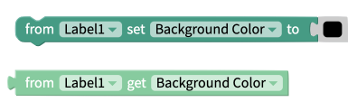
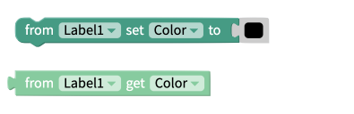
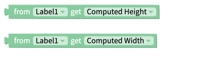
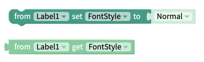
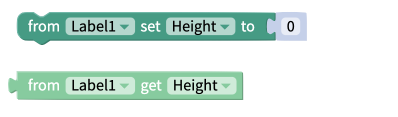
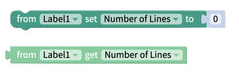
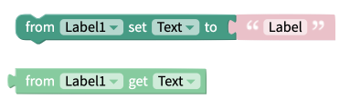
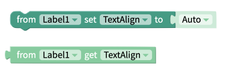
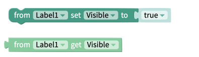
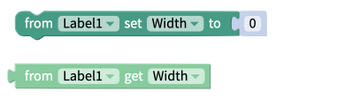

# Label

* [Style the Label](label.md#style-the-label)
* [Edit the Label size](label.md#edit-the-label-size)
* [Add spacing](label.md#add-spacing)
* [Event Blocks](label.md#events)
* [Property Blocks](label.md#properties)

## Style the Label

You can customize your label using the following properties: 

* **Text:** Text that appears on the label
* **Font Size:** Size of the text that appears on the label
* **Color:** Color of the text that appears on the label
* **Background Color:** Sets the background color of the label
* **Font Style**
  * **Normal:** Default text display
  * **Italic:** Display the text in italics
* **Font Weight:** Select how bold the text on the label will be
* **Text Align**
  * **Auto -** Aligns the text automatically
  * **Left -** Displays the text starting from the left of the label
  * **Right -** Displays the text starting from the right of the label
  * **Center -** Displays the text starting from the middle of the label
  * **Justify -** Aligns both the right and left side of the text equally
* **Visible:** To see the label in your app, set the switch to true
* **Border**
  * **Width:** Enter how wide you want the border outline of the label to be
  * **Color:** Pick a color for the border of the label
  * **Style:** Select if you want the border of the label to be a dotted, dashed or solid line
  * **Radius:** Enter how round you want the edges of the border for the label to be

## Edit the Label size

You can set how tall the label is using the height property and set how wide the label is using the width property.

**Height**

* **Fill container -** The label fills the entire screen vertically
* **Fit contents -** The  label’s height changes to be the size of the contents it contains
* **Relative size -** The label fills the specified percentage of the screen
* **Absolute size -** Sizes the label to a specified number of pixels

**Width**

* **Fill container -** The label fills the entire screen horizontally
* **Fit contents -** The  label’s width changes to be the size of the contents it contains
* **Relative size -** The label fills the specified percentage of the screen
* **Absolute -** Sizes the label to a specified number of pixels

_Note: If the text in your label is more than a single line, we recommend that you set the Height to `Fit contents`_

## Add spacing

You change the spacing and positioning of the label with the Margin and Padding properties. 

**Margin**

* You can specify how much space you want between the edges of the label and the screen using either pixel or percent values.

**Padding**

* You can specify how much space you want between the border and contents of the label using either pixel or percent values.

## Events

### Click

This event will fire when the user clicks on the label.

## Properties

### Background Color 

The get and set background color properties work with the color of the lable itself i.e. the region behind the label text. Best practice is to use one of the [color blocks](colour.md) to set this value.

### Color 

The get and set color properties of the can be used to work with the color of the text that is displayed in the label. Best practice is to use one of the [color blocks](colour.md) to set this value.

### Computed Dimensions 

The `Computed Height` and `Computed Width` blocks return the on-screen dimensions of the label, after it has been rendered on-screen. The value returned is an integer, representing the size of the label in pixels.

### Font Size 

The get and set font size blocks are used to work with the size of the text that is displayed in the label. This value must be a number.

### Font Style 

The font style property can be either "Normal" or "_Italic"._

### Font Weight 

The font weight value can be either; "Normal", "**Bold**" or a a value from 100 to 900

### Height 

The set and get height blocks work with the Height property of the label component. Acceptable input values are. 

* Number of Pixels
* Percentage Height
* "Fit Contents"
* "Fill Container"

### Number of Lines 

The get and set number of lines property is used to work with the maximum number of lines of text that should be displayed in a label before that label starts to scroll.

### Text 

This property corresponds to the text that is displayed in the label component.

### Text Align

Text Align can be any of the following values:

* Auto
* Left
* Right
* Center
* Justify

### Visible

The set and get visible blocks are used to show or hide the entire image component. Acceptable values are:

* True
* False

### Width 

The set and get width blocks work with the Width property of the label component. Acceptable values are.‌

* Number of Pixels
* Percentage Width
* "Fit Contents"
* "Fill Container"

### 

