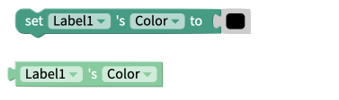

# Label


The Label component currently has centering issues on larger screens, such as tablets or computer screens. \
If this behavior is affecting your project, we recommend displaying your text on a [Button](button.md), which can be styled to look like a Label.


## Style the Label

You can customize your label using the following properties:&#x20;

### Properties

| Property                    | Description                                                  | Data Type        |
| --------------------------- | ------------------------------------------------------------ | ---------------- |
| Text                        | Text that appears on the label                               | Text             |
| Font                        | Font used to display Label's text                            | Select from menu |
| Custom Font (mobile only)\* | Font used to display Label's text                            | OTF or TTF file  |
| Font Size                   | Size of the text that appears on the label                   | Number           |
| Color                       | Color of the text that appears on the label                  | Color            |
| Background Color            | Sets the background color of the label                       | Color            |
| Text Align                  | Set alignment of the text relative to the Label's outline    | Select from menu |
| Font Style                  | Set whether font should be bolded or italicized              | Select from menu |
| Font Weight                 | Set thickness of font                                        | Number           |
| Number Of Lines             | Maximum amount of lines of text that your Label will display | Number           |


Uploading a custom font is available on Thunkable's Business and Enterprise plans.\
[Read more about our pricing plans here.](https://thunkable.com/#/pricing)


### Advanced Properties

| Property                                 | Description                                            | Data Type                                                          |
| ---------------------------------------- | ------------------------------------------------------ | ------------------------------------------------------------------ |
| Letter Spacing (iOS and web only)        | Spacing between letters of your Label                  | Number                                                             |
| Text Decoration Line                     | Set whether your text contains line-through, underline | Select from menu (line-through, underline, underline line-through) |
| Text Decoration Style (iOS and web only) | Style of Text Decoration line                          | Select from menu (solid, dotted, dashed, double)                   |
| Text Decoration Color (iOS and web only) | Color of your Text Decoration Line                     | Color                                                              |
| Writing Direction (iOS and web only)     | Writing direction of your Label's text                 | Select from menu (left-to-right, right-to-left)                    |

### **Layout**

| Property | Description                                    | Data Type  |
| -------- | ---------------------------------------------- | ---------- |
| X        | Location of your Label on the X-axis in pixels | Number     |
| Y        | Location of your Label on the Y-axis in pixels | Number     |
| Height   | Height of your Label in pixels                 | Number     |
| Width    | Width of your Label in pixels                  | Number     |
| Visible  | Toggle visibility of your Label                | True/False |

### Style

| Property         | Description                       | Data Type                                |
| ---------------- | --------------------------------- | ---------------------------------------- |
| Background Color | Color of your Label's background  | Color                                    |
| Border Width     | Width of border outline in pixels | Number                                   |
| Border Radius    | Radius of corners of Label        | Number                                   |
| Border Color     | Color of the Label's Border       | Color                                    |
| Border Style     | Style of Label's Border           | Select from menu (solid, dotted, dashed) |

## Blocks

### Events

#### Click

This event will fire when the user clicks on the label.

### Properties

#### Background Color&#x20;

.png>)

The get and set background color properties work with the color of the label itself i.e. the region behind the label text. Best practice is to use one of the [color blocks](color.md) to set this value but HEX or RGB values may be used too.

#### Color&#x20;

The get and set color properties can be used to work with the color of the text that is displayed in the label. Best practice is to use one of the [color blocks](color.md) to set this value but HEX or RGB values may be used too.&#x20;

#### Font Size&#x20;

.png>)

The get and set font size blocks are used to work with the size of the text that is displayed in the label. This value must be a number.

#### Font Style&#x20;

The font style property can be either "Normal" or "_Italic"._

#### Font Weight&#x20;

The font weight value can be either; "Normal", "**Bold**" or a a value from 100 to 900

#### Height&#x20;

.png>)

The set and get height blocks work with the Height property of the label component. Acceptable input values are.&#x20;

* Number of Pixels
* Percentage Height
* "Fit Contents"
* "Fill Container"

The `Computed Height` block returns the on-screen dimensions of the label, after it has been rendered on-screen. The value returned is an integer, representing the size of the label in pixels.

#### Number of Lines&#x20;

The get and set number of lines property is used to work with the maximum number of lines of text that should be displayed in a label before that label starts to scroll.

#### Text&#x20;

.png>)

This property corresponds to the text that is displayed in the label component.

#### Text Align

Text Align can be any of the following values:

* Auto
* Left
* Right
* Center
* Justify

#### Visible

.png>)

The set and get visible blocks are used to show or hide the entire image component. Acceptable values are:

* True
* False

#### Width&#x20;

.png>)

The set and get width blocks work with the Width property of the label component. Acceptable values are.‌

* Number of Pixels
* Percentage Width
* "Fit Contents"
* "Fill Container"

The `Computed Width` block returns the on-screen dimensions of the label, after it has been rendered on-screen. The value returned is an integer, representing the size of the label in pixels.

