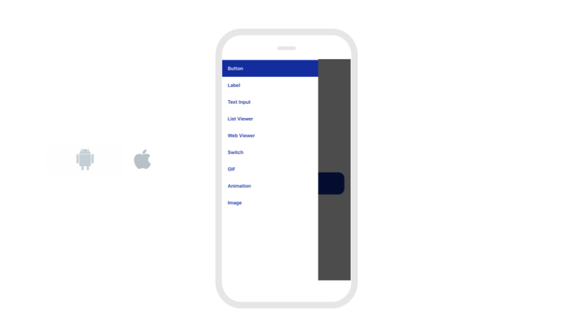

# Layout: Getting Started

## From Idea to App 

To go from an idea to app, we strongly recommend that you sketch out your vision using the below app templates. It's important to first create a roadmap for how people will interact with your app. 

## Arrange Screens with Navigators

Most apps navigate through screens using navigators. Click [here](https://www.youtube.com/watch?v=Z9R_kg4ew2M) to watch a tutorial on how to use each navigator. 

Here are three examples of navigators that you can use on Thunkable.

1. \*\*\*\*[**Bottom**](https://docs.thunkable.com/bottom-tab-navigator) **and** [**Top Tab**](https://docs.thunkable.com/top-tab-navigator) **Navigators** - These navigators allow you to change screens by clicking on icons at the top or bottom of the screen. 

**2.** [**Drawer Navigators**](https://docs.thunkable.com/drawer-navigator) - A navigator that pulls out a side menu of different options to choose from. 

**3.** [**Stack Navigators**](https://docs.thunkable.com/stack-navigator) - Navigators that allow you to stack screens on top of other screens.

