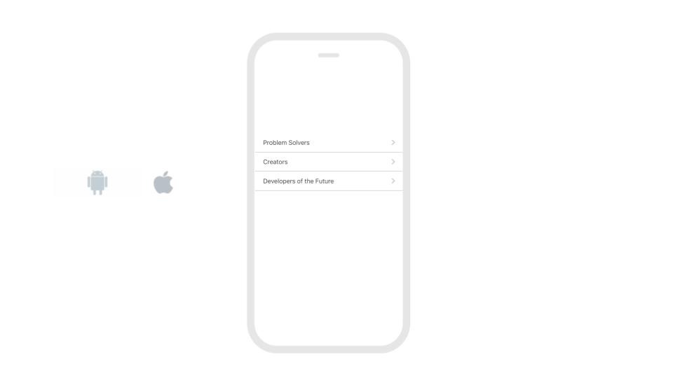
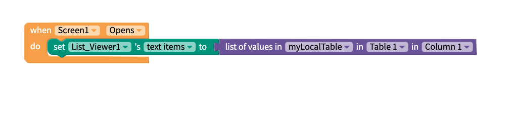
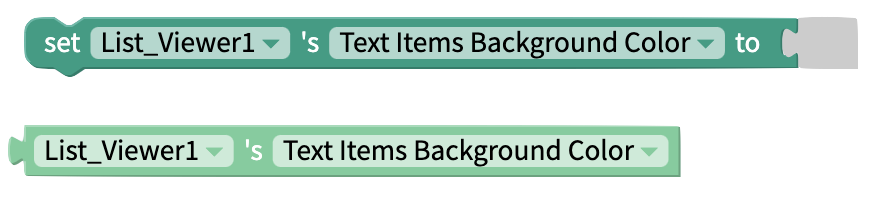
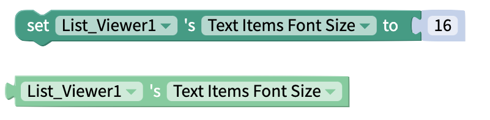
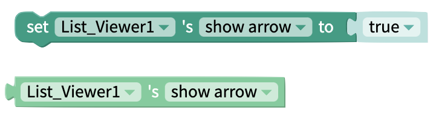
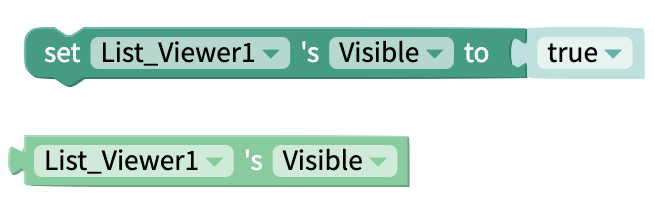

# Simple List Component

## Simple List Overview

## Properties

You can customize the Simple List with the following properties:

### Simple List

| Property                      | Description                                           | Data Type          |
| ----------------------------- | ----------------------------------------------------- | ------------------ |
| Text Items                    | Set text items of Simple List                         | List of text items |
| Color                         | Set font color of Text Items                          | Color              |
| Background Color (text items) | Set background color for the items in the Simple List | Color              |
| Font Size                     | Set font size of Text Items                           | Number             |
| Show Arrow                    | Toggle whether arrow is shown beside text items       | True/False         |

### Advanced Properties

| Property                                 | Description                                            | Data Type                           |
| ---------------------------------------- | ------------------------------------------------------ | ----------------------------------- |
| Writing Direction (iOS and web app only) | Set writing direction of text items                    | Select from list `[auto, ltr, rtl]` |
| Background Color (container)             | Set the background color of the Simple List container. | Color                               |

### Layout

| Property    | Description                                                  | Data Type                                    |
| ----------- | ------------------------------------------------------------ | -------------------------------------------- |
| X           | Set the location of your Simple List on the X-axis in pixels | Number                                       |
| Y           | Set the location of your Simple List on the Y-axis in pixels | Number                                       |
| Height      | Set the Height of your Simple List in pixels                 | Number                                       |
| Width       | Set the Width of your Simple List in pixels                  | Number                                       |
| Resize Mode | Define dimensions of the Simple List component/container     | Select from list `[Stretch, Float in Place]` |

### Style

| Property       | Description                                                                   | Data Type                                  |
| -------------- | ----------------------------------------------------------------------------- | ------------------------------------------ |
| Visible        | Toggle whether your end users can see the Simple List                         | True/False                                 |
| Border Style   | Set style of Simple List's border                                             | Select from list `[solid, dotted, dashed]` |
| Border Color   | Set color of Simple List's border                                             | Color                                      |
| Border Width   | Set width of Simple List's border in pixels                                   | Number                                     |
| Border Radius  | Set radius of corners for Simple List's border in pixels                      | Number                                     |
| Shadow Color   | Color of Simple List's shadow                                                 | Color                                      |
| Shadow Opacity | Opacity of Simple List's shadow                                               | Number between 0 and 100                   |
| Shadow Radius  | Radius of corners of Simple List's shadow in pixels                           | Number                                     |
| Shadow Offset  | How far Simple List's shadow should be offset, in Height and Width, in pixels | Number                                     |

## Blocks


**Note:** The blocks in your project are titled "Simple\_List." The blocks in the images below are titled "List\_Viewer." The component was recently renamed and these images will be updated soon. Thank you for your patience. &#x20;


### Functions

#### When Item Click

Performs an action when the user clicks on an item of the Simple List.

**Outputs**

| Name  | Description                                       | Data Type |
| ----- | ------------------------------------------------- | --------- |
| Item  | Text of selected item                             | String    |
| Index | Position of item in Simple List (starting with 1) | Number    |

### Properties

Set and get [properties](list-viewer.md#properties) of the Simple List.

#### Text Items

Set the text items displayed in your Simple List. Works with [list](lists.md) blocks:

This block also works with blocks to retrieve columns from [Data Sources](getting-started/data-sources.md):

.png>)

Choosing Airtable or Google Sheets allows you to create a dynamic Simple List. This is where the information displayed to the user changes whenever you change your cloud-based data in Airtable or Google Sheets. Either of these options are ideal for when you need to store thousands of items, or you need to work with items that change frequently.&#x20;

Performs an action when the user clicks on any one of the list items.

#### Text Items Color

Set and get font color of the Simple List's text items.

#### Text Items Background Color

Set and get background color of the Simple List's text items.

#### Text Items Font Size

Set and get font size of the Simple List's text items.

#### Show Arrow

Choose whether or not the arrow is displayed next to every item in the Simple List.

#### Height

The `Computed Height`block returns the height of the Simple Listin pixels after it has been rendered on-screen.

#### Width

The `Computed Width`block returns the width of the Simple List in pixels after it has been rendered on-screen.

#### Visible

Set and get the visibility of the Simple List.


**Have feedback on this doc?** Please take a moment to share your feedback here: [Thunkable Docs Feedback](https://form.asana.com/?k=UQqJPrAV\_0n0bK6mskl2SA\&d=114052394876887). Your valuable insights will help us improve and better serve you in the future.

