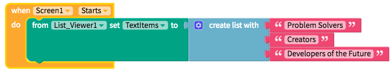
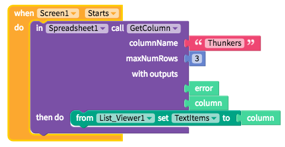
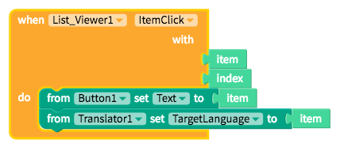

# List Viewer

* [Add items to a List Viewer](list-viewer.md#add-items-to-a-list-viewer)
* [Select item from a List Viewer](list-viewer.md#select-item-from-a-list-viewer)
* [Style the List Viewer](list-viewer.md#style-the-list-viewer)
* [Edit the List Viewer height](list-viewer.md#edit-the-listviewer-height)
* [Add spacing](list-viewer.md#add-spacing)

## Add Items to a List Viewer

We recommend adding a short list of items within the app itself as the Screen starts

For longer lists, we recommend using the [Spreadsheet](spreadsheet.md) component

| Property | Description |
| :--- | :--- |
| Text Items | Default \(`none`\); items must be in list format |

## Select Item from a List Viewer

| Property | Description |
| :--- | :--- |
| Item Click | Returns an `item` value and a numeric `index` number when an item is selected |

## Style the List Viewer

You can customize the List Viewer with the following properties:

* **Show Arrow:** To see an arrow beside each item in the list, set the switch to true
* **Visible:** To see the text input in your app, set the switch to true
* **Border**
  * **Width:** Enter how wide you want the border outline of the List Viewer to be
  * **Color:** Pick a color for the border of the List Viewer
  * **Style:** Select if you want the border to be a dotted, dashed or solid line
  * **Radius:** Enter how round you want the edges of the border for the List Viewer to be
* **Background Colour \(Advanced\):** Sets the background color of the List Viewer

## Edit the ListViewer Height

A List Viewer automatically fill 100% of the Screen width

You can set how tall the List Viewer is using the height property.

**Height**

* **Fill container -** The List Viewer fills the entire screen vertically
* **Fit contents -** The List Viewer’s height changes to fit the contents it contains
* **Relative size -** The List Viewer fills the specified percentage of the screen
* **Absolute size -** Sizes the List Viewer to a specified number of pixels

## Add Spacing

You change the spacing and positioning of the List Viewer with the Margin and Padding properties.

**Margin**

* You can specify how much space you want between the border and the contents of List Viewer using either pixel or percent values.

**Padding**

* You can specify how much space you want between the edges of the List Viewer and the screen using either pixel or percent values.

