# Lists

* [Create a list](lists.md#create-a-list)
* [Sort list](lists.md#sort-list)
* [Select from a list](lists.md#select-from-a-list)
* [Analyze list](lists.md#analyze-list)
* [Modify list](lists.md#modify-list)
* [Shuffle list](lists.md#shuffle-list)

## Create a List

You can create a list of variable lengths with the blocks below

### Empty List

Creates an empty list

### List of Specific Items

Allows you to specify what items in what order you want in your list

### List of item repeated X Times

Creates a list of a given item repeated a specified number of times.

### Make List from Text

This block lets you create a list from text and even lets you set delimiters i.e. ","

You can also use this block to make text from a list with a given delimiter

## Sort List

If you are importing a list from a Spreadsheet or other data source, it may be helpful to sort it in your app. You can sort a list alphabetically or numerically, ascending or descending

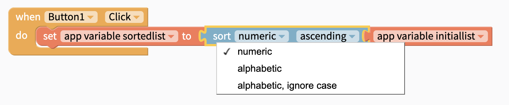

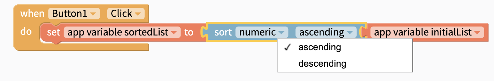

## Analyze List

The following blocks analyze a list in different ways

### Length of List

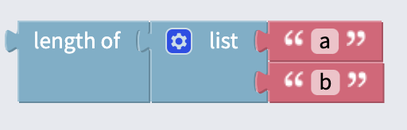

Returns the length of a list.

### Is List Empty

Checks if a list is empty. Returns **true** or **false**.

### Find First/Last Occurrence

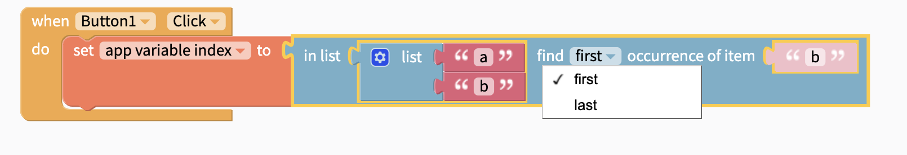

Returns the position of the first or last occurrence of an item, where the index of the first item is 1. Returns 0 if the item is not in the list.

### Get Sublist

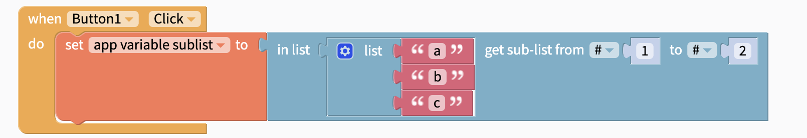

Returns a sub-list of items between two positions in a longer list.

### Does List contains Item

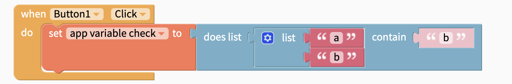

Checks if a given list contains a given item. Returns **true** or **false**.

### Sum, Min, Max, Averages, Standard Deviation, Random Item

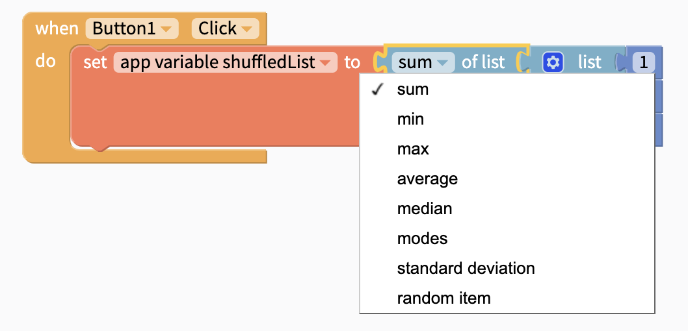

Returns the result of the chosen operation on a list of numbers. Returns **NaN** if the operation cannot be performed on the given list of values.

## Select from a List

Items in a list have an index number, the first item is 1, second is 2 and so on. Not only can you `select` an item from a list by number from the `front` but also from the `back`, the `first`, the `last` and also a `random` item. You can but `remove` it after you have selected it

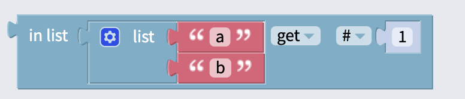

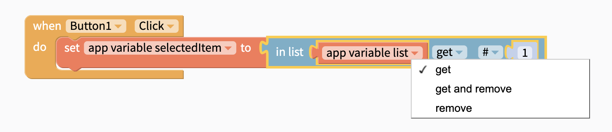

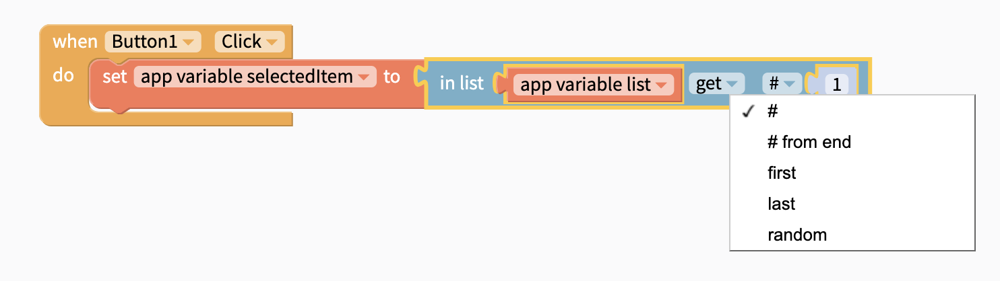

## Modify List

You can change an item in your list with the blocks below

### Insert At/Set

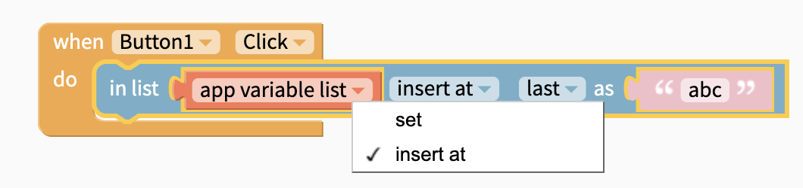

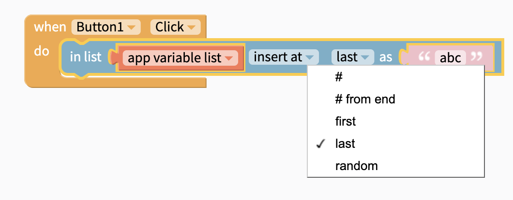

This block will either **insert** an item at the specified location, or **set** the item at the specified location to the new value.

### Remove Item from List

Removes the item at the specified position from a list

## Shuffle List

Get a copy of a list with the items shuffled in a random order.

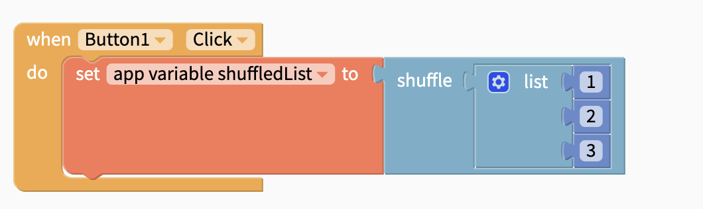

