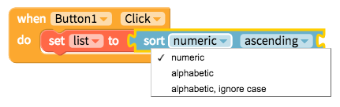
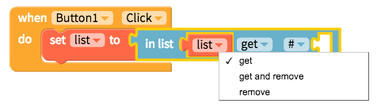
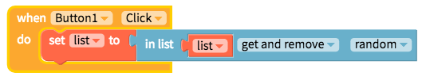

# Lists

* [Create a list](lists.md#create-a-list)
* [Sort list](lists.md#sort-list)
* [Select from a list](lists.md#select-from-a-list)
* [Analyze list](lists.md#analyze-list)
* [Modify list](lists.md#modify-list)
* [Shuffle list](lists.md#shuffle-list)

## Create a list

You can create a list of variable lengths with the blocks below

This block lets you create a list from text and even lets you set delimiters i.e. ","

## Sort list

If you are importing a list from a Spreadsheet or other data source, it may be helpful to sort it in your app. You can sort a list alphabetically or numerically, ascending or descending

|  |
| :--- |

## Select from a list

Items in a list have an index number, the first item is 1, second is 2 and so on. Not only can you `select` an item from a list by number from the `front` but also from the `back`, the `first`, the `last` and also a `random` item. You can but `remove` it after you have selected it

|  |  |
| :--- | :--- |

## Analyze list

The following blocks analyze a list in different ways

## Modify list

You can change an item in your list with the block below

## Shuffle list

Get a copy of a list with the items shuffled in a random order.

\[Picture of Shuffle block TBD\]

