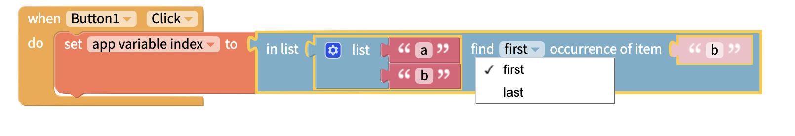

# Lists Blocks

## Create a List

You can create a list of variable lengths with the blocks below

### Empty List

Creates an empty list

### List of Specific Items

Allows you to specify what items in what order you want in your list

### List of item repeated X Times

Creates a list of a given item repeated a specified number of times.

### List of numbers from X to Y

Create a list between two numbers, with a chosen increment.

Eg. list of 1 to 5 by 1 is `[1, 2, 3, 4, 5]`. List of 2 to 10 by 2 is `[2, 4, 6, 8, 10]`

### Make List from Text

This block lets you create a list from text and even lets you set delimiters i.e. ","

You can also use this block to make text from a list with a given delimiter

## Sort List

If you are importing a list from a Spreadsheet or other data source, it may be helpful to sort it in your app. You can sort a list alphabetically or numerically, ascending or descending

## Analyze List

The following blocks analyze a list in different ways

### Length of List

Returns the length of a list as a number.

### Is List Empty

Checks if a list is empty. Returns **true** or **false**.

### Find First/Last Occurrence

Returns the position of the first or last occurrence of an item, where the index of the first item is 1. Returns 0 if the item is not in the list.

### Does List contain Item

Checks if a given list contains a given item. Returns **true** or **false**.

### Sum, Min, Max, Averages, Standard Deviation, Random Item

Returns the result of the chosen operation on a list of numbers. Returns **NaN** if the operation cannot be performed on the given list of values.

## Select from a List

### Get

Items in a list have an index number. \
The first item is 1, second is 2 and so on. \
You can get:

* Item at position X
* Item X items from the end of the list
* The first item
* The last item
* A random item

### Get and Remove

Behaves the same as the Get block, except the chosen item is removed from the list.

### Random item

Returns random item of list.

### Get Sub-list

Returns a sub-list of items between two positions in a longer list.

### Get Shuffled List

Get a copy of a list with the items shuffled in a random order.

## Modify List

You can change an item in your list with the blocks below

### Insert At/Set

This block will either **insert** an item at the specified location, or **set** the item at the specified location to the new value.

### Remove Item from List

Removes the item at the specified position from a list
