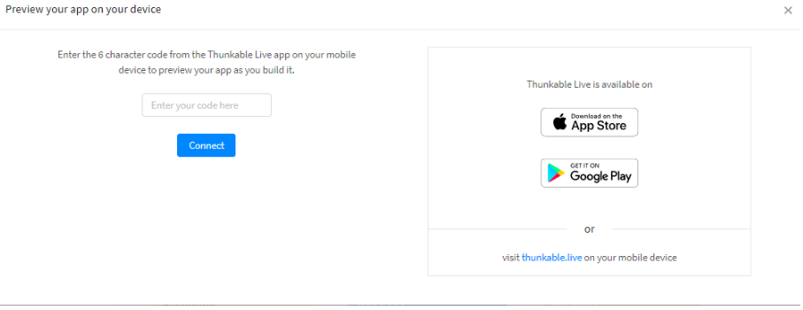

# Thunkable Live

## **What is Thunkable Live?**

Thunkable Live is an app that connects the projects in your web browser directly to your mobile device. It allows you to do two things:

1. You can [**Live Test**](file:///@thunkable/s/thunkable-docs/~/edit/drafts/-LnCeo225SCFice-kzC9/live-test#live-test) your project. Any changes you make in your browser are displayed on your device, while you are working.
2. You can [**Live Preview**](file:///@thunkable/s/thunkable-docs/~/edit/drafts/-LnCeo225SCFice-kzC9/live-test#live-preview) any of your projects, directly on your device, without the need to be logged in to your computer.

## **Download Thunkable Live**

The Thunkable app allows you to live test your app on your device, in real-time, while you are building it. Not even hard core developers have this super power. You can also preview all your app projects from the comfort of your mobile device.

| [**Download for Android**](https://play.google.com/store/apps/details?id=com.thunkable.live) | [**Download for iOS**](http://appstore.com/thunkablelive) |
| :--- | :--- |

If you don't have an iOS or Android device, you can also [set up an emulator](file:///@thunkable/s/thunkable-docs/~/edit/drafts/-LnCeo225SCFice-kzC9/emulators) on your computer that will mimic what you would see on an actual device.‌

With Thunkable Live installed on your device, you are now ready to live test or to live preview.‌

## **Live Test**

While live testing, any changes that you make to your project should be reflected in your app. Bear in mind that the Thunkable Live app doesn't check your project for errors. Some changes that you make may crash the app. If this happens simply exit out of the app and re-open it.

### **Getting started**

From any of your Thunkable projects, click on the **Live Test** button at the top of the screen to begin live testing.

‌The next pop-up you see depends on [if you are signed in with Google](file:///@thunkable/s/thunkable-docs/~/edit/drafts/-LnCeo225SCFice-kzC9/live-test#if-you-are-signed-in-with-google) or [if you are signed in by email](file:///@thunkable/s/thunkable-docs/~/edit/drafts/-LnCeo225SCFice-kzC9/live-test#if-you-are-signed-in-by-email).‌

### **If you are signed in with Google:**

Clicking on the Live Test button will remind you to open Thunkable Live on your device.

Sign in with the same Google account in Thunkable Live to preview your projects directly on your device.

### **If you are signed in by Email:**

When you click the Live Test button you will be prompted to enter a code into your computer.

To find this code, open Thunkable Live on your device and click **Need a code? Click Here.**

Enter this code into the first prompt and you will be able to live test your app.

## **Live Preview**

For the first time, you can live preview all your app projects from the comfort of your mobile device. Simply login and you should see a list of all your projects on your Thunkable Live app.

## Troubleshooting

Common issues

### **You see a blank / white screen when you live test \(even if there are items in your app\)**

* If you have a Navigator as the first item in your tree, make sure your screen is dropped within it
* Your have unconnected blocks
* You have an event triggered by a Screen.Start which may be causing the screen to crash
* Your app and desktop may not be logged into the same account

### **App is crashing because of a bug on our end; we are trying to fix it as soon as we can**

* \(Android only\) You are trying to set the value of a Slider in your blocks 
* \(Android only\) You are trying to set the latitude and longitude of a Map in your blocks

### **Image is not showing up on your phone**

* The height or width of the image may be set to 'Fit contents'

