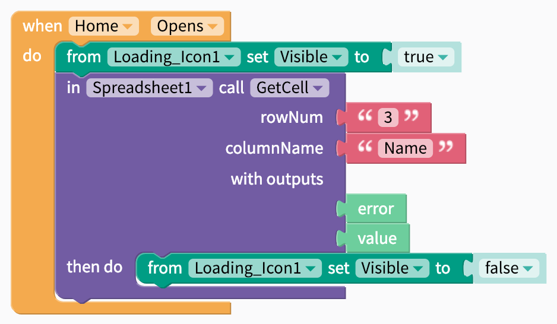

# Loading Icon

## Video Tutorial



## Overview

For activities that take more than a few seconds, loading icons can be helpful to tell your app users that an activity is happening in the background, such as retrieving or uploading data.

## Style the Loading Icon 

| Property | Description |
| :--- | :--- |
| Color | The color of the loading icon |
| Size | `Small` or `large` |

## Showing and Hiding the Loading Icon

The loading icon should be displayed when the app is performing an activity in the background and hidden when it is not. 

One way to show and hide the icon is to use the `visible` property of the component.

When the visibility is set to true, the loading icon will be seen on the app screen. If set to false, the loading icon will not be seen on the app screen.

