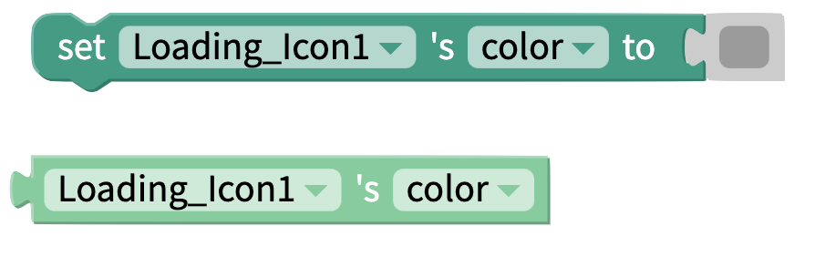
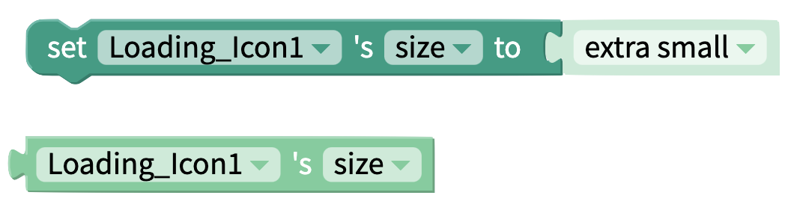
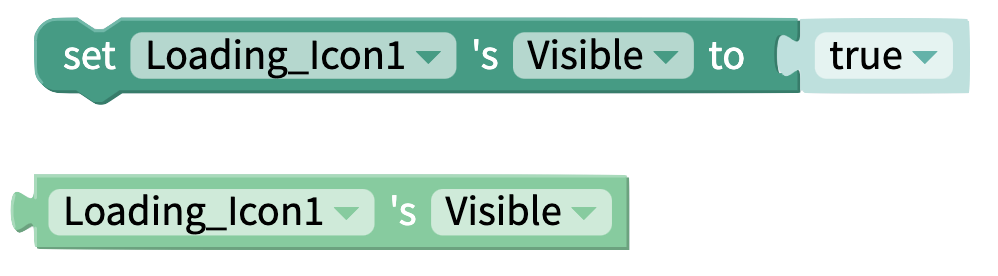

# Loading Icon

## Loading Icon Overview

For activities that take more than a few seconds, loading icons can be helpful to tell your app users that an activity is happening in the background, such as retrieving or uploading data.

## Properties&#x20;

### Loading Icon

| Property | Description                   | Data Type |
| -------- | ----------------------------- | --------- |
| Color    | The color of the Loading Icon | Color     |

### Layout

| Property    | Description                                                                            | Data Type                                    |
| ----------- | -------------------------------------------------------------------------------------- | -------------------------------------------- |
| X           | Location of top left corner of Loading Icon on X-axis, where the left hand side is X=0 | Number                                       |
| Y           | Location of top left corner of Loading Iconon Y-axis, where the top side is Y=0        | Number                                       |
| Height      | Height of Loading Icon in pixels                                                       | Number                                       |
| Width       | Width of Loading Icon in pixels                                                        | Number                                       |
| Resize Mode | Define dimensions of the loading icon component/container                              | Select from list `[Stretch, Float in Place]` |

### **Style**

| Property       | Description                                                                             | Data Type                                  |
| -------------- | --------------------------------------------------------------------------------------- | ------------------------------------------ |
| Visible        | Toggle whether your end users can see the Loading Icon                                  | True/False                                 |
| Border Style   | Set whether border style is solid, dotted or dashed  (only visible if border width > 0) | Select from list `[solid, dotted, dashed]` |
| Border Color   | Color of border (only visible if border width > 0)                                      | Color                                      |
| Border Width   | Width of border around Loading Icon in pixels                                           | Number                                     |
| Border Radius  | Radius of corners of border on Loading Icon in degrees                                  | Number                                     |
| Shadow Color   | Color of loading icon's shadow                                                          | Color                                      |
| Shadow Opacity | Opacity of loading icon's shadow                                                        | Number between 0 and 100                   |
| Shadow Radius  | Radius of corners of loading icon's shadow in pixels                                    | Number                                     |
| Shadow Offset  | How far loading icon's shadow should be offset, in Height and Width, in pixels          | Number                                     |

## Blocks

### Properties

Set and get [properties](loading-icon.md#properties) of the Loading Icon component.

#### Color&#x20;

#### Size&#x20;

Select a size for the Loading Icon. Can choose between `extra small, small, middle, large,` or `extra large`.

#### Computed Height&#x20;

Returns the height of the Loading Icon on the device screen in pixels.

#### Computed Width

Returns the width of the Loading Icon on the device screen in pixels.

#### Visible&#x20;

## Demo: Showing and Hiding the Loading Icon

The loading icon should be displayed when the app is performing an activity in the background and hidden when it is not.&#x20;

One way to show and hide the icon is to use the `visible` property of the component.

In the following example the loading icon shows up when the app opens but disappears after data is retrieved from Airtable.

When the visibility is set to true, the loading icon will be seen on the app screen. If set to false, the loading icon will not be seen on the app screen.

## See Also

If you want to show different styles of animations in your app as content loads, check out the [Animation](lottie.md) component.
