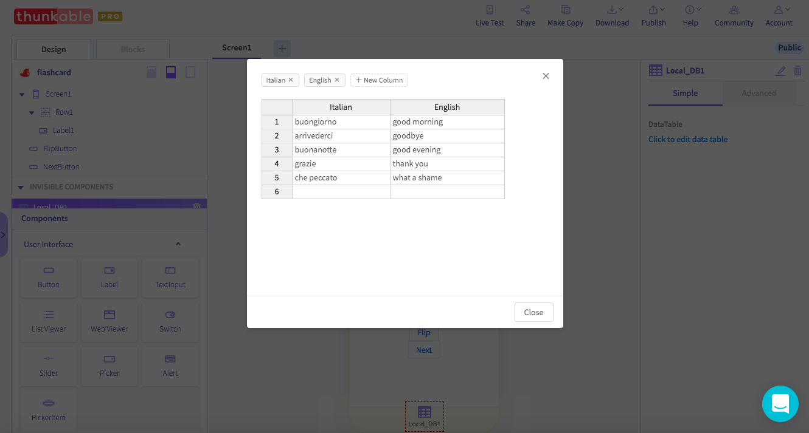
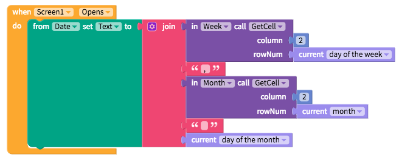

# Local DB

## Local DB Overview

Many apps require a simple table of data to perform a number of essential tasks. One way to add this data is through a Local DB, short for database.

## Add a Table of Data to Your App

The first thing you want to do after you add the component is to edit the data table.

## Get data from your table

| Event | Description |
| :--- | :--- |
| Get Cell \(`column, row number)` | Gets the data in a cell based on the `column` and `row number` |
| Get Column \(`column)` | Gets the data in a column formatted as a list based on the `column number` |
| Get Row \(`row number)` | Gets the data in a row formatted as a list based on the `row number` |
| Number of Rows | Gets the number of rows |

## Update data in your table

You may want to update the data in your Local DB from the app itself. At the moment, you can only update a specific cell. We are hoping to add the ability to add and delete an entire row. Any updates you make to the table from the app will only be seen by the specific user of the app. To make changes that will be reflected across all apps, we suggest you use the [Airtable](spreadsheet.md) component where data is stored n the cloud.

| Event | Description |
| :--- | :--- |
| Set Cell \(`column, row number, value)` | Updates the data in a specified `column` and `row` with a `value` |

At present, changes made to your Local DB data will not be stored across app sessions. If you want the changes to your data to be stored across app sessions, you can use an Airtable component, whose data is stored in the cloud, or use [stored variables](variables.md#stored-variables) to store data locally, either as strings of text or as [objects](objects.md) with multiple properties. Date stored with the [Data Sources](data-sources.md) component is also persistent across app sessions.

